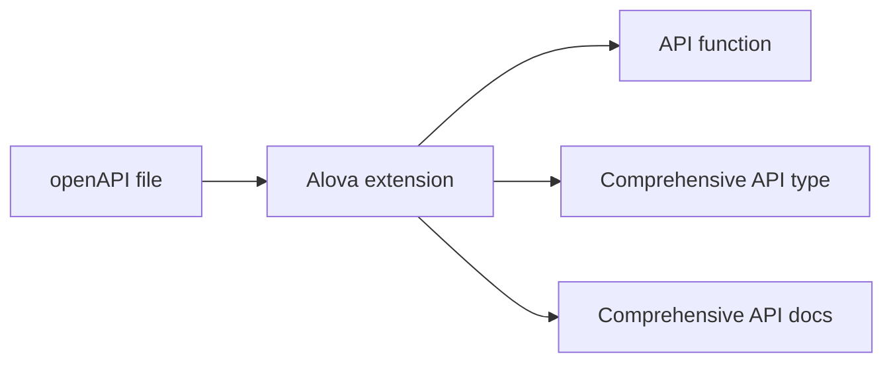
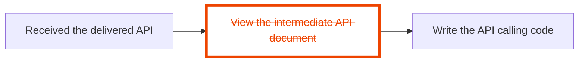

import Link from '@docusaurus/Link';
import NavCard from '@site/src/components/NavCard';
import Examples from '@site/src/components/Examples';
import SupportList from '@site/src/components/SupportList';
import tts from '@site/static/audio/tts.mp3';
import AudioPlayer from '@site/src/components/AudioPlayer';
import IconFont from '@site/src/components/IconFont';
import Tabs from '@theme/Tabs';
import TabItem from '@theme/TabItem';

## What is alova?

Alova (pronounced as `/əˈləʊva/` <AudioPlayer src={tts} />) is a workflow-streamlined next-generation request tool. It can extremely streamline your API integration workflow from 7 steps to 1 step, and you just select the API what you need.


Different from `@tanstack/react-request`, `swrjs`, `ahooks's useRequest`, etc. library, `alova` is a comprehensive request tool, alova makes your request integration very simple and maintains more efficient Client-Server data interaction. In addition, you can use it in client and server environments (including SSR).

Here is a detailed comparison [with other request libraries](/about/comparison).

In addition, alova also has the following features:

- API design similar to axios, with lower learning cost;
- High-performance client and server request strategies, making the application smoother;
- High flexibility, alova can be used in any js environment with any UI framework, and provides a unified user experience and perfect code migration;
- Multi-level cache mode and request sharing mechanism to improve request performance and reduce server-side pressure;
- High aggregation of api code organization, the request parameters, cache behavior, response data conversion, etc. of each API will be gathered in the same code block, which is a great advantage for managing a large number of APIs;

## How to do it?

Alova provides a comprehensive solution for complex request scenarios, which we call **request strategy**. they include client request strategies and server request strategies.

### Client request strategy

On the client side, request strategies are implemented in the form of hooks, interceptors, and middleware. Use different request strategies to handle different requests scenarios. They provide comprehensive stateful parameters, events, and actions for each request scenario. With just one line of code to quickly implement various complex request logics, which can not only help you improve development efficiency, but also help you improve the running efficiency of the App, and reduce the pressure on the server.

The following are some clients For an introduction and examples of request strategies, please expand them which you are interested in.

<details>
<summary>Watching request strategy</summary>

The Watching request strategy is used in scenarios where re-requests are made as data changes, such as fuzzy search, tab bar switching, etc.

```javascript
const {
  // Responsive states
  loading,
  error,
  data,

  // Events
  onSuccess,
  onError,
  onComplete,

  // actions
  send,
  update

  // ...
} = useWatcher(
  () =>
    alova.Get('/api/user', {
      params: {
        type: activeTab
      }
    }),
  [activeTab]
);
```

See [Watcher Request Strategy](/tutorial/client/strategy/use-watcher) for details.

</details>

<details>
<summary>Pagination request strategy</summary>

The pagination request strategy helps you quickly implement comprehensive paging data request scenarios, including page turning, conditional query, pre-fetching of next page data, insert/replac/remov data items, refresh and reset list.

```javascript
const {
  // Responsive states
  loading,
  error,
  data,
  page,
  pageSize,
  total,

  // Events
  onSuccess,
  onFetchSuccess,
  onError,
  onFetchError,

  // Actions
  refresh,
  insert,
  replace,
  remove,
  reload,
  send,
  abort,
  update

  // ...
} = usePagination(
  (page, size) =>
    alova.Get('/api/user/list', {
      params: { page, size }
    }),
  {
    preloadNextPage: true,
    watchingStates: [username, sex],
    debounce: 500
  }
);
```

See [Pagination Request Strategy](/tutorial/client/strategy/use-pagination) for details.

</details>

<details>
<summary>Token authentication strategy</summary>

Token authentication strategy provides global interceptors that can help you maintain all the codes of token authentication, including login, logout, token attachment, token refresh, etc., and supports seamless token refresh.

```javascript
const { onAuthRequired, onResponseRefreshToken } = createServerTokenAuthentication({
  refreshTokenOnError: {
    isExpired: res => res.status === 401,
    refrshTokenOnError: async () => {
      const { token, refresh_token } = await refreshToken();
      localStorage.setItem('token', token);
      localStorage.setItem('refresh_token', refresh_token);
    }
  }
});
const alovaInstance = createAlova({
  beforeRequest: onAuthRequired(),
  responded: onResponseRefreshToken()
});
```

See [Token Authentication Interceptor](/tutorial/client/strategy/token-authentication) for details.

</details>

<details>
<summary>Form submission strategy</summary>

Through the form submission strategy, you can quickly implement form drafts and multi-page (multi-step) forms. In addition, it also provides common functions such as form reset.

```javascript
const {
  // Responsive states
  loading: submiting,
  error,
  form,

  // Events
  onSuccess,
  onError,
  onComplete,

  // Actions
  send: submit,
  updateForm,
  abort

  // ...
} = useForm(formData => alova.Post('/user/profile', formData), {
  initialForm: {
    name: '',
    age: '',
    avatar: null
  },
  resetAfterSubmiting: true,
  store: true
});
```

See [Form Submission Strategy](/tutorial/client/strategy/use-form) for details.

</details>

<details>
<summary>Data Fetching Strategy</summary>

By fetching necessary data in advance, users no longer need to wait for the data to load, thus improving the user experience.

```javascript
const {
  // Response states
  loading,
  error,

  // Events
  onSuccess,
  onError,
  onComplete,

  // actions
  fetch,
  update,
  abort

  // ...
} = useFetcher();

const handleItemClick = itemId => {
  fetch(
    alova.Get('/ api/user/detail', {
      params: {
        id: itemId
      }
    })
  );
};
```

See [Data Fetching Strategy](/tutorial/client/strategy/use-fetcher) for details.

</details>

<details>
<summary>Seamless Data interaction Strategy</summary>

Seamless data interaction means that when users interact with an application, relevant content can be displayed immediately without waiting, or the results of operations can be displayed without waiting when submitting information, just like interacting with local data. This greatly improves the smoothness of the application and prevents users from noticing the lag caused by data transmission.

```javascript
const {
  // Responsive states
  data,
  loading,
  error,

  // Events
  onSuccess,
  onError,
  onComplete,
  onBeforePushQueue,
  onPushedQueue,
  onFallback,

  // Actions
  send: submit,
  abort,
  update

  // ...
} = useSQRequest(() => alova.Get('/api/todo/add'), {
  behavior: 'silent',
  queue: 'queue-demo',
  silentDefaultResponse: () => {
    return {
      id: '--'
    };
  }
});
```

See [Seamless Data Interaction](/tutorial/client/strategy/seamless-data-interaction) for details.

</details>

<details>
<summary>Cross-component request triggering middleware</summary>

Cross-component request triggering middleware can help you eliminate the limitations of component levels and quickly trigger any request actions in any component.

<Tabs className="file-tabs">
<TabItem value="1" label="ComponentA">

```javascript
useRequest(alova.Get('/api/todo/list'), {
  // ...
  middleware: actionDelegationMiddleware('action:todoList')
});
```

</TabItem>
<TabItem value="2" label="ComponentB">

```javascript
accessAction('action:todoList', delegatedActions => {
  delegatedActions.send();
  delegatedActions.abort();
});
```

</TabItem>
</Tabs>

See [Cross-component request trigger](/tutorial/client/strategy/action-delegation-middleware) for details.

</details>

<details>
<summary>Captcha strategy</summary>

Quickly implement captcha sending.

```javascript
const mobile = ref('');
const {
  // Responsive states
  loading: sending,
  countdown,
  error,

  // Events
  onSuccess,
  onError,
  onComplete,

  // Actions
  send,
  abort,
  update

  // ...
} = useCaptcha(
  () =>
    alova.Post('/api/captcha', {
      mobile: mobile
    }),
  {
    initialCountdown: 60
  }
);
```

See [Verification code strategy](/tutorial/client/strategy/use-captcha) for details.

</details>

alova provides total 15+ client request strategies based on the [RSM](/about/RSM) specification. Please refer [Request Strategy List](/tutorial/client/strategy) to see all client request strategies.

### Server Request Strategy

alova can not only be used in server environments such as `nodejs/deno/bun`, but also provides server request strategies such as request retry, calling API to send captcha, request rate limit, etc. We call them **server hooks**, which all support cluster mode.

A simplest server request example is as follows:

```javascript
const response = await alova.Get('/api/user');
```

You can decorate the request function with `server hooks` to get corresponding features. It's so simple.

```javascript
const response = await serverHookFunction(alova.Get('/api/user'));
```

The following are introductions and examples of several server-side request strategies. please expand them which you are interested in.

<details>
<summary>Request Retry strategy</summary>

Retry the request if it fails.

```javascript
const response = await retry(alova.Get('/api/user'), {
  retry: 5
});
```

See [Request retry strategy](/tutorial/server/strategy/retry) for details.

</details>

<details>
<summary>Request Rate Limit Strategy</summary>

Limit the number of requests within a certain period of time, support cluster mode.

```javascript
const limit = createRateLimiter({
  points: 4,
  duration: 60 * 1000
});
const orderRes = await limit(alova.Get('/api/order'));
```

See [Request Rate Limit Strategy](/tutorial/server/strategy/rate-limit) for details.

</details>

### More modern openAPI solution

1. alova's devtools can generate API calling code, as well as TypeScript types and detailed documentation for each API, so you can enjoy full API type hints even in JavaScript projects.



2. In the past, when the backend developer delivered the API to you, you had to open the intermediate API docs to query and copy the key information into your project, and you had to constantly switch between the intermediate API docs and your editor. But now, alova's devtools can eliminate the intermediate API docs for you, shortening the collaboration distance between the frontend and the backend like a wormhole. Through it, you can quickly find the required API in the editor and display the comprehensive document of this API, and quickly comprehensive parameter transfer by referring to the API parameter table, giving you a different API integration experience.



> For a detailed introduction to alova devtools, please refer to [Integrated Editor Extension](/tutorial/getting-started/extension-integration).

## Building Client-Server Interaction Layer

With the various features of alova, you can also build a Client-Server interaction layer(CSIL) for your project. The CSIL will distribute response data to various components by merging same requests. Additionally, the CSIL also manages response data and the responsive states created by useHooks. You can access and modify the datas in CSIL in any UI component, as well as refresh the data in CSIL.

> If you want to build a CSIL, please refer to [Building Client-Server Interaction Layer](/tutorial/project/best-practice/csil)

## Run in any JS environment

Not only that, Alova is very flexible, you can use it with different request tools in any of the following JS environments (the gray part will be gradually supported in the future).

<SupportList showStatus></SupportList>

## Online trial

<Examples />

## Migration Guide

- [Migration from v2 to v3](/tutorial/project/migration/v2-to-v3)
- [Guide to low-cost migration from axios to alova](/tutorial/project/migration/from-axios)

## Join alova community

import ImgDiscord from '@site/static/img/discord.svg';
import ImgX from '@site/static/img/x.svg';
import ImgWechat from '@site/static/img/wechat.svg';
import wechatQrcode from '@site/static/img/wechat_qrcode.jpg';

<NavCard list={[
{
Image: <ImgDiscord />,
title: 'Discord',
desc: 'The community\'s GPT robot will answer your questions',
link: 'https://discord.gg/S47QGJgkVb',
target: '__blank'
},
{
Image: <ImgWechat />,
title: 'WeChat',
desc: 'Communicate in group chat and get responses faster',
link: wechatQrcode,
target: '__blank'
},
{
Image: <ImgX />,
title: 'X',
desc: 'Follow us and continue to receive the latest news',
link: 'https://x.com/alovajs',
target: '__blank'
}
]}></NavCard>

## Welcome to contribute

Before contributing, please be sure to read the [Contribution Guide](/contributing/overview) in detail to ensure your effective contribution.

## Let's get started

Next, we will start with the simplest request, then explain the request strategy, understand how alova simplifies your work, and then go into the advanced guide and the best practices summarized in actual projects.

Let’s start learning alova!

<NavCard list={[
{
Image: <IconFont name="shipin" />,
title: 'tutorial in 5 minutes video',
desc: 'Learn alova in 5 minutes',
link: '/video-tutorial',
},
{
Image: <IconFont name="wenjian" />,
title: 'Quick start documentation',
desc: 'Learn alova in more detail and learn on your own time',
link: '/tutorial/getting-started/quick-start',
}
]}></NavCard>
