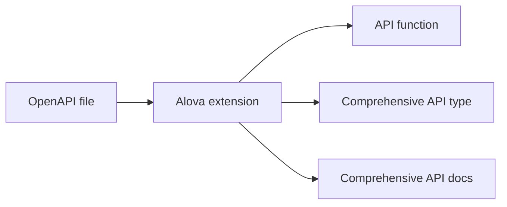
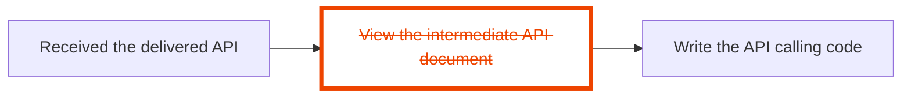

import Link from '@docusaurus/Link';
import NavCard from '@site/src/components/NavCard';
import Examples from '@site/src/components/Examples';
import SupportList from '@site/src/components/SupportList';
import tts from '@site/static/audio/tts.mp3';
import AudioPlayer from '@site/src/components/AudioPlayer';
import IconFont from '@site/src/components/IconFont';
import Tabs from '@theme/Tabs';
import TabItem from '@theme/TabItem';

## What is alova?

alova​​ (pronounced /əˈləʊva/<AudioPlayer src={tts} />) is a request toolkit design for API integrating with ​​ultimate efficiency. it seamlessly works with your favorite HTTP clients and UI frameworks, accelerating business logic development for both client and server apps, while enabling interactive API information within your code. bridging the backend collaboration gap like a wormhole.

Learn about our story in [why built alova](/about/faqs), and explore how we differ in our detailed [comparison with other request libraries](/about/comparison).

## Features

- ​​Easy to use, [watching video](/video-tutorial) to get started in 5 mins.
- ​​Full compatibility​​ with your favorite technology stack.
- ​​20+ high-performance business modules​​ for building faster apps.
- ​​Advanced OpenAPI solution​​ for efficient APIs information interaction within your code.
- Request sharing and response cache to improve app performance.
- Type safety.

<SupportList showStatus></SupportList>

## Live Demo

We've prepared a rich set of examples to help you quickly explore alova's capabilities.

<Examples />

## How It Works?

alova provides comprehensive solutions for complex request scenarios, which we call **Request Strategy** , encompassing both client-side and server-side request strategies.

### Client request strategy

On the client-side, request strategies are implemented through hooks, interceptors, and middleware, allowing you to tackle different request scenarios with precision. These strategies provide comprehensive, stateful parameters, events, and operational functions for every request scenario, enabling you to implement complex request logic with just a single line of code. Not only do they boost your development efficiency, but they also optimize your app's performance and reduce server-side load.

Below are introductions and examples of some client-side request strategies. Feel free to explore the ones that catch your interest.

<details>
<summary>Watching request strategy</summary>

The Watching request strategy is used in scenarios where re-requests are made as data changes, such as fuzzy search, tab bar switching, etc.

```javascript
const {
  // Responsive states
  loading,
  error,
  data,

  // Events
  onSuccess,
  onError,
  onComplete,

  // actions
  send,
  update

  // ...
} = useWatcher(
  () =>
    alova.Get('/api/user', {
      params: {
        type: activeTab
      }
    }),
  [activeTab]
);
```

See [Watcher Request Strategy](/tutorial/client/strategy/use-watcher) for details.

</details>

<details>
<summary>Pagination request strategy</summary>

The pagination request strategy helps you quickly implement comprehensive paging data request scenarios, including page turning, conditional query, pre-fetching of next page data, insert/replac/remov data items, refresh and reset list.

```javascript
const {
  // Responsive states
  loading,
  error,
  data,
  page,
  pageSize,
  total,

  // Events
  onSuccess,
  onFetchSuccess,
  onError,
  onFetchError,

  // Actions
  refresh,
  insert,
  replace,
  remove,
  reload,
  send,
  abort,
  update

  // ...
} = usePagination(
  (page, size) =>
    alova.Get('/api/user/list', {
      params: { page, size }
    }),
  {
    preloadNextPage: true,
    watchingStates: [username, sex],
    debounce: 500
  }
);
```

See [Pagination Request Strategy](/tutorial/client/strategy/use-pagination) for details.

</details>

<details>
<summary>Token authentication strategy</summary>

Token authentication strategy provides global interceptors that can help you maintain all the codes of token authentication, including login, logout, token attachment, token refresh, etc., and supports seamless token refresh.

```javascript
const { onAuthRequired, onResponseRefreshToken } = createServerTokenAuthentication({
  refreshTokenOnError: {
    isExpired: res => res.status === 401,
    handler: async () => {
      const { token, refresh_token } = await refreshToken();
      localStorage.setItem('token', token);
      localStorage.setItem('refresh_token', refresh_token);
    }
  }
});
const alovaInstance = createAlova({
  beforeRequest: onAuthRequired(),
  responded: onResponseRefreshToken()
});
```

See [Token Authentication Interceptor](/tutorial/client/strategy/token-authentication) for details.

</details>

<details>
<summary>Form submission strategy</summary>

Through the form submission strategy, you can quickly implement form drafts and multi-page (multi-step) forms. In addition, it also provides common functions such as form reset.

```javascript
const {
  // Responsive states
  loading: submiting,
  error,
  form,

  // Events
  onSuccess,
  onError,
  onComplete,

  // Actions
  send: submit,
  updateForm,
  abort

  // ...
} = useForm(formData => alova.Post('/user/profile', formData), {
  initialForm: {
    name: '',
    age: '',
    avatar: null
  },
  resetAfterSubmiting: true,
  store: true
});
```

See [Form Submission Strategy](/tutorial/client/strategy/use-form) for details.

</details>

<details>
<summary>Data Fetching Strategy</summary>

By fetching necessary data in advance, users no longer need to wait for the data to load, thus improving the user experience.

```javascript
const {
  // Response states
  loading,
  error,

  // Events
  onSuccess,
  onError,
  onComplete,

  // actions
  fetch,
  update,
  abort

  // ...
} = useFetcher();

const handleItemClick = itemId => {
  fetch(
    alova.Get('/ api/user/detail', {
      params: {
        id: itemId
      }
    })
  );
};
```

See [Data Fetching Strategy](/tutorial/client/strategy/use-fetcher) for details.

</details>

<details>
<summary>Seamless Data interaction Strategy</summary>

Seamless data interaction means that when users interact with an application, relevant content can be displayed immediately without waiting, or the results of operations can be displayed without waiting when submitting information, just like interacting with local data. This greatly improves the smoothness of the application and prevents users from noticing the lag caused by data transmission.

```javascript
const {
  // Responsive states
  data,
  loading,
  error,

  // Events
  onSuccess,
  onError,
  onComplete,
  onBeforePushQueue,
  onPushedQueue,
  onFallback,

  // Actions
  send: submit,
  abort,
  update

  // ...
} = useSQRequest(() => alova.Get('/api/todo/add'), {
  behavior: 'silent',
  queue: 'queue-demo',
  silentDefaultResponse: () => {
    return {
      id: '--'
    };
  }
});
```

See [Seamless Data Interaction](/tutorial/client/strategy/seamless-data-interaction) for details.

</details>

<details>
<summary>Cross-component request triggering middleware</summary>

Cross-component request triggering middleware can help you eliminate the limitations of component levels and quickly trigger any request actions in any component.

<Tabs className="file-tabs">
<TabItem value="1" label="ComponentA">

```javascript
useRequest(alova.Get('/api/todo/list'), {
  // ...
  middleware: actionDelegationMiddleware('action:todoList')
});
```

</TabItem>
<TabItem value="2" label="ComponentB">

```javascript
accessAction('action:todoList', delegatedActions => {
  delegatedActions.send();
  delegatedActions.abort();
});
```

</TabItem>
</Tabs>

See [Cross-component request trigger](/tutorial/client/strategy/action-delegation-middleware) for details.

</details>

<details>
<summary>Captcha strategy</summary>

Quickly implement captcha sending.

```javascript
const mobile = ref('');
const {
  // Responsive states
  loading: sending,
  countdown,
  error,

  // Events
  onSuccess,
  onError,
  onComplete,

  // Actions
  send,
  abort,
  update

  // ...
} = useCaptcha(
  () =>
    alova.Post('/api/captcha', {
      mobile: mobile
    }),
  {
    initialCountdown: 60
  }
);
```

See [Verification code strategy](/tutorial/client/strategy/use-captcha) for details.

</details>

alova provides total 15+ client request strategies based on the [RSM](/about/RSM) specification. Please refer [Request Strategy List](/tutorial/client/strategy) to see all client request strategies.

### Server Request Strategy

On the server-side, such as in `nodejs/deno/bun`, alova also provides server-side request strategies, which we call **server hooks**, all of which support cluster mode.

Below are introductions and examples of some server-side request strategies. Feel free to explore the ones that catch your interest.

<details>
<summary>Request Retry strategy</summary>

Retry the request if it fails.

```javascript
const response = await retry(alova.Get('/api/user'), {
  retry: 5
});
```

See [Request retry strategy](/tutorial/server/strategy/retry) for details.

</details>

<details>
<summary>Request Rate Limit Strategy</summary>

Limit the number of requests within a certain period of time, support cluster mode.

```javascript
const limit = createRateLimiter({
  points: 4,
  duration: 60 * 1000
});
const orderRes = await limit(alova.Get('/api/order'));
```

See [Request Rate Limit Strategy](/tutorial/server/strategy/rate-limit) for details.

</details>

### More modern OpenAPI solution

1. alova's devtools can simultaneously generate API call code, TypeScript types for each API, and comprehensive API documentation, allowing you to enjoy full API type hints even in JavaScript projects.



2. In the past, when backend developers delivered APIs, you had to open the intermediate API documentation, search for and copy key information into your project, constantly switching between the API docs and your editor. Now, Alova's development tools can eliminate this intermediary documentation, bridging the frontend and backend collaboration like a wormhole. Through this tool, you can quickly find the APIs you need directly in your editor, display the API's complete documentation, and rapidly complete parameter passing by referencing the API parameter table - offering you an entirely new API integration experience.



> For a detailed introduction to alova devtools, please refer to [OpenAPI Extension](/tutorial/getting-started/openapi-integration).

## Building Client-Server Interaction Layer

With the various features of alova, you can also build a Client-Server interaction layer(CSIL) for your project. The CSIL will distribute response data to various components by merging same requests. Additionally, the CSIL also manages response data and the responsive states created by useHooks. You can access and modify the datas in CSIL in any UI component, as well as refresh the data in CSIL.

> To learn how to build a CS Interaction Layer, refer to [Building the Client-Server Interaction Layer](/tutorial/project/best-practice/csil)

## Migration Guide

- [Migration from v2 to v3](/tutorial/project/migration/v2-to-v3)
- [Guide to low-cost migration from axios to alova](/tutorial/project/migration/from-axios)

## Join alova community

import ImgDiscord from '@site/static/img/discord.svg';
import ImgX from '@site/static/img/x.svg';
import ImgWechat from '@site/static/img/wechat.svg';
import wechatQrcode from '@site/static/img/wechat_qrcode.jpg';

<NavCard list={[
{
Image: <ImgDiscord />,
title: 'Discord',
desc: 'The community\'s GPT robot will answer your questions',
link: 'https://discord.gg/S47QGJgkVb',
target: '__blank'
},
{
Image: <ImgWechat />,
title: 'WeChat',
desc: 'Communicate in group chat and get responses faster',
link: wechatQrcode,
target: '__blank'
},
{
Image: <ImgX />,
title: 'X',
desc: 'Follow us and continue to receive the latest news',
link: 'https://x.com/alovajs',
target: '__blank'
}
]}></NavCard>

## Welcome to contribute

Before contributing, please be sure to read the [Contribution Guide](/contributing/overview) in detail to ensure your effective contribution.

## Let's get started

Next, we will start with the simplest request, then explain the request strategy, understand how alova simplifies your work, and then go into the advanced guide and the best practices summarized in actual projects.

Let’s start learning alova!

<NavCard list={[
{
Image: <IconFont name="shipin" />,
title: 'tutorial in 5 minutes video',
desc: 'Learn alova in 5 minutes',
link: '/video-tutorial',
},
{
Image: <IconFont name="wenjian" />,
title: 'Quick start documentation',
desc: 'Learn alova in more detail and learn on your own time',
link: '/tutorial/getting-started/quick-start',
}
]}></NavCard>
