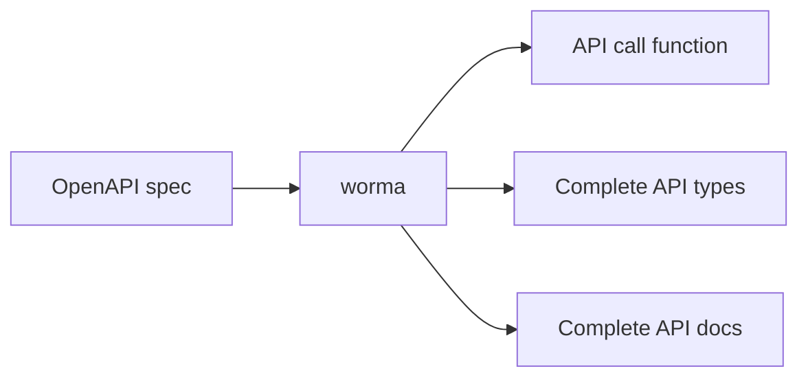
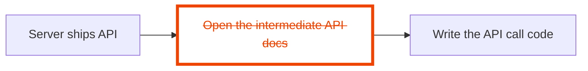

import Link from '@docusaurus/Link';
import NavCard from '@site/src/components/NavCard';
import Examples from '@site/src/components/Examples';
import SupportList from '@site/src/components/SupportList';
import tts from '@site/static/audio/tts.mp3';
import AudioPlayer from '@site/src/components/AudioPlayer';
import IconFont from '@site/src/components/IconFont';
import Tabs from '@theme/Tabs';
import TabItem from '@theme/TabItem';
import SponsorStrip from '@site/src/components/SponsorStrip';

## What is alova?

alova (pronounced /əˈləʊva/<AudioPlayer src={tts} />) is the **request strategy layer** for JavaScript. Instead of hand-writing pagination, forms, uploads and retries over and over, you reach for 20+ ready-made request strategies that cut your request code by up to 70%. It works seamlessly with your favorite HTTP clients and UI frameworks, so you can focus on business logic on both the client and the server.

You don't have to throw away the axios or fetch you already know. alova builds right on top of the request library you're using and takes over the repetitive request logic you keep rewriting. The same API set runs across React, Vue, Svelte, Solid, mini-programs and the server, so you learn it once and ship everywhere.

Learn about our story in [why built alova](/about/faqs), and explore how we differ in our detailed [comparison with other request libraries](/about/comparison).

## Features

Rather than listing what alova *is*, here is what it *does for you* — each scenario mapped to the concrete gain:

| Scenario you're tired of | What alova gives you |
| --- | --- |
| Hand-writing pagination, forms, uploads, SSE state | `usePagination` / `useForm` / `useUploader` / `useSSE` — up to 70% less boilerplate |
| Server-side rate limiting & retry (incl. distributed) | `alova/server` — capabilities React Query / SWR simply don't cover |
| Rebuilding the same logic for every framework | One API set across React / Vue / Svelte / Solid / mini-programs |
| Manual cache invalidation | Multi-level cache (L1/L2) + declarative auto-invalidation via `hitSource` |
| Copy-pasting API info between docs and editor | [worma](https://worma.js.org) — API hints and docs right inside your editor |

And of course: easy to use ([watch the 5-min video](/video-tutorial)), full compatibility with your favorite technology stack, request sharing, response cache, and end-to-end type safety.

<SupportList showStatus></SupportList>

## When should you use alova?

alova is honest about where it shines and where a simpler tool is enough:

| Your scenario | Recommendation |
| --- | --- |
| Simple CRUD with caching | React Query / SWR is perfectly fine |
| Complex admin panels / forms / pagination / uploads | ✅ alova is a clear step ahead |
| Cross-platform (Web + mini-program / uni-app / Taro) | ✅ one API set for all of them |
| Server-side request governance (rate limit / retry / distributed) | ✅ alova is effectively the only option |
| OpenAPI → type-safe code + AI-friendly API knowledge | ✅ pair it with [worma](https://worma.js.org) (works out of the box with alova) |

## worma: write one API spec, and let it do the rest

You know the drill: the backend ships an API, and you're stuck bouncing between the API docs and your editor — copying parameters, hand-writing call code. worma is built to end that.

Point it at a single OpenAPI spec and it generates, in one pass: type-safe call code, TypeScript types for every endpoint, complete API documentation, and **API knowledge your AI coding assistant can actually read** — so your agent stops guessing and finds the right endpoint directly.


```mermaid
flowchart LR
R1[OpenAPI spec] --> S1[worma] --> W1[API call function]
S1[worma] --> W2[Complete API types]
S1[worma] --> W3[Complete API docs]
```

In the old flow you'd open the intermediate docs, look up the parameters, then go back to the editor and hand-write the code. worma removes that middle step: right inside your editor you find the endpoint you need, read its full docs, and fill in parameters against the parameter table — making frontend-backend collaboration feel like passing through a wormhole.


```mermaid
flowchart LR
A[Server ships API] --> B[<s>Open the intermediate API docs</s>] --> C[Write the API call code]

class B redNode;
classDef redNode fill:transparent,stroke:#ee4400,color:#ee4400,stroke-width:4px;
```

And if you're already using alova, it gets even easier — worma works out of the box. Install it and you get those API hints, hover docs and one-click code insertion without any extra wiring.

> Learn more at [worma.js.org](https://worma.js.org), or see how to wire it up in the [OpenAPI integration](/tutorial/getting-started/openapi-integration) guide.

## Live Demo

We've prepared a rich set of examples to help you quickly explore alova's capabilities.

<Examples />

## Request Strategies in Action

Here are a few of the most common request strategies so you can get a feel for the actual code — just expand any item you like.

### Client request strategy

Below are introductions and examples of some client-side request strategies. Feel free to explore the ones that catch your interest.

<details>
<summary>Watching request strategy</summary>

Re-request as your data changes — e.g. fuzzy search or tab switching.

```javascript
const {
  // Responsive states
  loading,
  error,
  data,

  // Events
  onSuccess,
  onError,
  onComplete,

  // actions
  send,
  update

  // ...
} = useWatcher(
  () =>
    alova.Get('/api/user', {
      params: {
        type: activeTab
      }
    }),
  [activeTab]
);
```

See [Watcher Request Strategy](/tutorial/client/strategy/use-watcher) for details.

</details>

<details>
<summary>Pagination request strategy</summary>

Full pagination coverage: page turning, conditional query, next-page pre-fetch, insert/replace/remove, refresh and reset.

```javascript
const {
  // Responsive states
  loading,
  error,
  data,
  page,
  pageSize,
  total,

  // Events
  onSuccess,
  onFetchSuccess,
  onError,
  onFetchError,

  // Actions
  refresh,
  insert,
  replace,
  remove,
  reload,
  send,
  abort,
  update

  // ...
} = usePagination(
  (page, size) =>
    alova.Get('/api/user/list', {
      params: { page, size }
    }),
  {
    preloadNextPage: true,
    watchingStates: [username, sex],
    debounce: 500
  }
);
```

See [Pagination Request Strategy](/tutorial/client/strategy/use-pagination) for details.

</details>

<details>
<summary>Token authentication strategy</summary>

Global interceptors that centralize login, logout, token attachment and seamless token refresh.

```javascript
const { onAuthRequired, onResponseRefreshToken } = createServerTokenAuthentication({
  refreshTokenOnError: {
    isExpired: res => res.status === 401,
    handler: async () => {
      const { token, refresh_token } = await refreshToken();
      localStorage.setItem('token', token);
      localStorage.setItem('refresh_token', refresh_token);
    }
  }
});
const alovaInstance = createAlova({
  beforeRequest: onAuthRequired(),
  responded: onResponseRefreshToken()
});
```

See [Token Authentication Interceptor](/tutorial/client/strategy/token-authentication) for details.

</details>

<details>
<summary>Form submission strategy</summary>

Quickly build form drafts and multi-step forms, with built-in reset and other common helpers.

```javascript
const {
  // Responsive states
  loading: submiting,
  error,
  form,

  // Events
  onSuccess,
  onError,
  onComplete,

  // Actions
  send: submit,
  updateForm,
  abort

  // ...
} = useForm(formData => alova.Post('/user/profile', formData), {
  initialForm: {
    name: '',
    age: '',
    avatar: null
  },
  resetAfterSubmiting: true,
  store: true
});
```

See [Form Submission Strategy](/tutorial/client/strategy/use-form) for details.

</details>

<details>
<summary>Data Fetching Strategy</summary>

Fetch data ahead of time so users never wait for loading — a smoother experience.

```javascript
const {
  // Response states
  loading,
  error,

  // Events
  onSuccess,
  onError,
  onComplete,

  // actions
  fetch,
  update,
  abort

  // ...
} = useFetcher();

const handleItemClick = itemId => {
  fetch(
    alova.Get('/api/user/detail', {
      params: {
        id: itemId
      }
    })
  );
};
```

See [Data Fetching Strategy](/tutorial/client/strategy/use-fetcher) for details.

</details>

<details>
<summary>Seamless Data interaction Strategy</summary>

Respond as instantly as local data — both content display and submission happen without waiting, eliminating perceived lag.

```javascript
const {
  // Responsive states
  data,
  loading,
  error,

  // Events
  onSuccess,
  onError,
  onComplete,
  onBeforePushQueue,
  onPushedQueue,
  onFallback,

  // Actions
  send: submit,
  abort,
  update

  // ...
} = useSQRequest(() => alova.Get('/api/todo/add'), {
  behavior: 'silent',
  queue: 'queue-demo',
  silentDefaultResponse: () => {
    return {
      id: '--'
    };
  }
});
```

See [Seamless Data Interaction](/tutorial/client/strategy/seamless-data-interaction) for details.

</details>

<details>
<summary>Cross-component request triggering middleware</summary>

Break free of component hierarchy — trigger any request action from any component.

<Tabs className="file-tabs">
<TabItem value="1" label="ComponentA">

```javascript
useRequest(alova.Get('/api/todo/list'), {
  // ...
  middleware: actionDelegationMiddleware('action:todoList')
});
```

</TabItem>
<TabItem value="2" label="ComponentB">

```javascript
accessAction('action:todoList', delegatedActions => {
  delegatedActions.send();
  delegatedActions.abort();
});
```

</TabItem>
</Tabs>

See [Cross-component request trigger](/tutorial/client/strategy/action-delegation-middleware) for details.

</details>

<details>
<summary>Captcha strategy</summary>

Quickly implement captcha sending.

```javascript
const mobile = ref('');
const {
  // Responsive states
  loading: sending,
  countdown,
  error,

  // Events
  onSuccess,
  onError,
  onComplete,

  // Actions
  send,
  abort,
  update

  // ...
} = useCaptcha(
  () =>
    alova.Post('/api/captcha', {
      mobile: mobile
    }),
  {
    initialCountdown: 60
  }
);
```

See [Verification code strategy](/tutorial/client/strategy/use-captcha) for details.

</details>

alova ships 15+ client request strategies built on the [RSM](/about/RSM) specification. See the full [Request Strategy List](/tutorial/client/strategy).

### Server Request Strategy

On the server (nodejs/deno/bun), alova also provides server-side request strategies we call **server hooks**, all with cluster-mode support.

Below are introductions and examples of some server-side request strategies. Feel free to explore the ones that catch your interest.

<details>
<summary>Multi-process Atomic Requests</summary>

In cluster mode, this ensures that only one process initiates the request at a time.

```javascript
const tokenRes = await atomize(alova.Get('/api/access_token'));
```

Go to [Atomic requests](/tutorial/server/strategy/atomize) for details.

</details>

<details>
<summary>Request Retry strategy</summary>

Retry the request if it fails.

```javascript
const response = await retry(alova.Get('/api/user'), {
  retry: 5
});
```

See [Request retry strategy](/tutorial/server/strategy/retry) for details.

</details>

<details>
<summary>Request Rate Limit Strategy</summary>

Limit the number of requests within a certain period of time; supports cluster mode.

```javascript
const limit = createRateLimiter({
  points: 4,
  duration: 60 * 1000
});
const orderRes = await limit(alova.Get('/api/order'));
```

See [Request Rate Limit Strategy](/tutorial/server/strategy/rate-limit) for details.

</details>

## Write alova with an AI Agent (Agent Skills)

Developing with an AI coding assistant? Install alova's [Agent Skills](/tutorial/getting-started/agent-skills) so your agent writes code following official best practices.

## Building Client-Server Interaction Layer

With the various features of alova, you can also build a Client-Server Interaction Layer (CSIL) for your project. The CSIL distributes response data to various components by merging identical requests. Additionally, it manages response data and the reactive states created by useHooks. You can access and modify the data in the CSIL from any UI component, as well as refresh it.

> To learn how to build a CS Interaction Layer, refer to [Building the Client-Server Interaction Layer](/tutorial/project/best-practice/csil)

## Migration Guide

- [Migration from v2 to v3](/tutorial/project/migration/v2-to-v3)
- [Guide to low-cost migration from axios to alova](/tutorial/project/migration/from-axios)

## Join alova community

import ImgDiscord from '@site/static/img/discord.svg';
import ImgX from '@site/static/img/x.svg';
import ImgWechat from '@site/static/img/wechat.svg';
import wechatQrcode from '@site/static/img/wechat_qrcode.jpg';

<NavCard list={[
{
Image: <ImgDiscord />,
title: 'Discord',
desc: 'The community\'s GPT robot will answer your questions',
link: 'https://discord.gg/S47QGJgkVb',
target: '__blank'
},
{
Image: <ImgWechat />,
title: 'WeChat',
desc: 'Communicate in group chat and get responses faster',
link: wechatQrcode,
target: '__blank'
},
{
Image: <ImgX />,
title: 'X',
desc: 'Follow us and continue to receive the latest news',
link: 'https://x.com/alovajs',
target: '__blank'
}
]}></NavCard>

<SponsorStrip hideSection />

## Welcome to contribute

Before contributing, please be sure to read the [Contribution Guide](/contributing/overview) in detail to ensure your effective contribution.

## Let's get started

Next, we will start with the simplest request, then explain the request strategy, understand how alova simplifies your work, and then go into the advanced guide and the best practices summarized in actual projects.

Let’s start learning alova!

<NavCard list={[
{
Image: <IconFont name="shipin" />,
title: 'tutorial in 5 minutes video',
desc: 'Learn alova in 5 minutes',
link: '/video-tutorial',
},
{
Image: <IconFont name="wenjian" />,
title: 'Quick start documentation',
desc: 'Learn alova in more detail and learn on your own time',
link: '/tutorial/getting-started/quick-start',
}
]}></NavCard>
