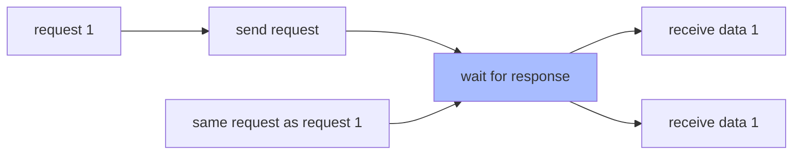

In the previous chapter, we tried to send a request and get the response data. In fact, `alovaInstance.Get(...)` is not a function that initiates a request, but creates a method instance, which is a PromiseLike instance. You can send a request through the `then, catch, finally` method or `await`, just like a Promise object.

```javascript
const userMethodInstance = alovaInstance.Get('/api/user');

userMethodInstance.then(response => {
  // ...
});

userMethodInstance.catch(error => {
  // ...
});

userMethodInstance.finally(() => {
  // ...
});

try {
  await userMethodInstance;
} catch (error) {
  // ...
} finally {
  // ...
}
```

Simple way to write:

```javascript
const response = await alovaInstance.Get('/api/user');
```

Each method instance describes the type of each request, request url, request header, request parameters, etc. In addition, you can also define request behavior on the method instance to control how the method handles the request.

## Request type

alova provides 7 request types: GET, POST, PUT, DELETE, HEAD, OPTIONS, and PATCH.

| Instance creation function | Parameters                                    |
| -------------------------- | --------------------------------------------- |
| GET                        | `alovaInstance.Get(url[, config])`            |
| POST                       | `alovaInstance.Post(url[, data[, config]])`   |
| PUT                        | `alovaInstance.Put(url[, data[, config]])`    |
| DELETE                     | `alovaInstance.Delete(url[, data[, config]])` |
| HEAD                       | `alovaInstance.Head(url[, config])`           |
| OPTIONS                    | `alovaInstance.Options(url[, config])`        |
| PATCH                      | `alovaInstance.Patch(url[, data[, config]])`  |

Parameter description:

- `url` is the request path;
- `data` is the request body data;
- `config` is the request configuration object, which includes the request header, params parameters, request behavior parameters and other configurations;

You can also create your own custom method instance, which is useful when dynamically specifying the request type.

```javascript
import { Method } from 'alova';

const method = new Method('GET', alovaInstance, '/api/users', {
  params: {
    ID: 1
  }
});
```

Next, let's take a look at how to define request parameters, which should be familiar to you.

## Request parameters

### URL parameters

Use params to pass in URL parameters, and the params parameters will be concatenated after the url in the form of ?.

```javascript
alovaInstance.Get('/todo/list', {
  params: {
    userId: 1
  }
});
```

Of course, you can also concatenate directly after the url, and the effect is the same.

```javascript
alovaInstance.Get('/todo/list?userId=1');
```

### Request body

When sending **POST, PUT, DELETE, PATCH requests**, data can be sent through the request body. At this time, the second parameter passed in is the request body. It is worth noting that the POST request can also pass in the params parameter.

```javascript
alovaInstance.Post(
  '/todo',
  // The second parameter is the request body
  {
    title: 'test todo',
    time: '12:00'
  },
  // The third parameter is the configuration
  {
    params: {
      userId: 1
    }
  }
);
```

### Request header

Specify the request header through headers.

```javascript
alovaInstance.Get('/user', {
  headers: {
    'Content-Type': 'application/json;charset=UTF-8'
  }
});
```

### Parameters supported by other request adapters

In addition to request headers, params parameters, etc., it also supports configuring parameters supported by the corresponding request adapter. When using `alova/fetch` as the request adapter of alova, you can configure any parameters supported by `fetch API` on the method instance, and these parameters will be passed to the `fetch` function when requesting.

```javascript
alovaInstance.Get('/todo/list', {
  // ...
  // highlight-start
  credentials: 'same-origin',
  referrerPolicy: 'no-referrer',
  mode: 'cors'
  // highlight-end
});
```

When the above method instance sends a request through `fetch`, it will request with the following parameters.

```javascript
fetch('/todo/list', {
  // ...
  // highlight-start
  credentials: 'same-origin',
  referrerPolicy: 'no-referrer',
  mode: 'cors'
  // highlight-end
});
```

> For more details please refer to [fetch adapter](/resource/request-adapter/fetch).

If you use other request adapters, you can also pass the parameters they support.

## Request behavior

In [RSM](/about/RSM), request behavior is used to describe how the request will be processed.

### Timeout

Set the request timeout.

```javascript
// Request timeout at request level
alovaInstance.Get('/todo/list', {
  // ...
  // highlight-start
  timeout: 10000
  // highlight-end
});
```

### Request sharing

We always encounter this situation. When a request is sent but not responded, the same request is sent again, which causes request waste or repeated submission problems, such as the following three scenarios:

1. A component will obtain initialization data when it is created. When a page renders multiple components at the same time, multiple identical requests will be sent at the same time;

2. The submit button is not disabled, and the user clicks the submit button multiple times;

3. When the preload page is entered before the preload is completed, multiple identical requests will be sent;

4. Prevent repeated requests in react's StrictMode;

Shared requests are used to solve these problems. It can not only improve the fluency of the application, but also reduce the pressure on the server.



Request sharing is enabled by default. If you want to turn off sharing requests on a specific request, you can do this:

```javascript
alovaInst.Get('/todo', {
  // ...
  // highlight-start
  shareRequest: false
  // highlight-end
});
```

:::warning How to identify the same request

The request method, request url, request header, url parameter, and request body of the method instance are used as unique identifiers. Identical identifiers indicate the same request, rather than comparing the reference address of the method instance.

:::

### Transform response data

Sometimes we need to uniformly transform response data. We can set the `transform` function for the method instance to transform the response data into the required structure.

```javascript
alovaInstance.Get('/todo/list', {
  // The function accepts the response data and response header data, and requires the transformed data to be returned.
  transform(rawData, headers) {
    return rawData.list.map(item => {
      return {
        ...item,
        statusText: item.done ? 'Completed' : 'In progress'
      };
    });
  }
});
```

### Response cache

Response cache allows you to better utilize server-side data multiple times without sending a request to obtain data every time. The GET request will set a memory cache time of 5 minutes by default. If you don't need it, you can turn off the cache for the current request in the following way.

```ts
alovaInstance.Get('/todo/list', {
  // Set to 0 or null to turn off the default response cache
  cacheFor: 0
});
```

For details, please refer to [Response Cache](/tutorial/cache/mode)

## Interrupt request

Call the `abort` of the method instance to interrupt the request.

```javascript
const userMethod = alovaInstance.Get('/api/user');
userMethod.then(res => {
  // ...
});

const handleCancel = () => {
  // highlight-start
  userMethod.abort();
  // highlight-end
};
```

## Listen for upload and download progress

By binding the upload progress event through the `onUpload` of the method instance, and the download progress event through the `onDownload`, it will return the unbinding function.

```javascript
const uploadMethod = alovaInstance.Post('/todo/uploadfile', formData);
const offUploadEvent = uploadMethod.onUpload(event => {
  console.log('File size:', event.total);
  console.log('Uploaded:', event.loaded);
});

uploadMethod.then(res => {
  // ...
});

// Unbind upload callback
const handleOffEvent = () => {
  offUploadEvent();
};
```

```javascript
const downloadMethod = alovaInstance.Get('/todo/downloadfile');
const offDownloadEvent = downloadMethod.onDownload(event => {
  console.log('File size:', event.total);
  console.log('Downloaded:', event.loaded);
});

downloadMethod.then(res => {
  // ...
});

// Unbind download callback
const handleOffEvent = () => {
  offDownloadEvent();
};
```

:::warning Use `alova/fetch` adapter to pay attention to

Due to the limitation of fetch api, the one provided by alova `alova/fetch` adapter does not support upload progress. If you need upload progress, please use [XMLHttpRequest adapter](/resource/request-adapter/xhr) or [axios adapter](/resource/request-adapter/axios).

You can also write your own request adapter, see [Writing a request adapter](/tutorial/advanced/custom/http-adapter) for details.

:::

**Upload/download progress type**

```typescript
type Progress = {
  /** Total amount of data uploaded or downloaded */
  total: number;
  /** Completed data */
  loaded: number;
};
```
