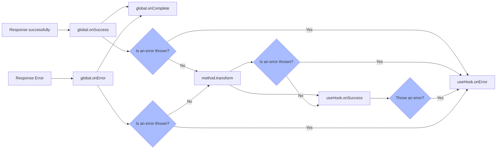

import Tabs from '@theme/Tabs';
import TabItem from '@theme/TabItem';
import CodeBlock from '@theme/CodeBlock';
import EmbedSandpack from "@site/src/components/EmbedSandpack";

import useRequestVue from '!!raw-loader!@site/codesandbox@3/01-getting-started/07-combine-framework/vueComposition-useRequest.en.vue';
import useRequestReact from '!!raw-loader!@site/codesandbox@3/01-getting-started/07-combine-framework/react-useRequest.en.jsx';
import useRequestSvelte from '!!raw-loader!@site/codesandbox@3/01-getting-started/07-combine-framework/svelte-useRequest.en.svelte';
import useRequestSolid from '!!raw-loader!@site/codesandbox@3/01-getting-started/07-combine-framework/solid-useRequest.en.jsx';

Next, we will learn how to use it in conjunction with the client UI framework, which can allow alova to exert its true power. When used in the UI framework, not only can alova automatically manage the responsive request status, but also automatically control when the request should be sent through certain rules.

`alova` provides 15+ client request strategies, which help you implement complex requests in a simple and elegant way. Let's continue to look down!

## Set statesHook

Alova's useHook request strategy can run in all UI frameworks supported by Alova. You only need to set the statesHook of the corresponding UI framework on the Alova instance, which will tell Alova which UI framework should be used to create states.

<Tabs groupId="framework">

<TabItem value="1" label="vue">

```js
import { createAlova } from 'alova';
import VueHook from 'alova/vue';

export const alovaInstance = createAlova({
  // ...
  // highlight-start
  statesHook: VueHook
  // highlight-end
});
```

</TabItem>

<TabItem value="2" label="react">

```js
import { createAlova } from 'alova';
import ReactHook from 'alova/react';

export const alovaInstance = createAlova({
  // ...
  // highlight-start
  statesHook: ReactHook
  // highlight-end
});
```

</TabItem>
<TabItem value="3" label="svelte">

```js
import { createAlova } from 'alova';
import SvelteHook from 'alova/svelte';

export const alovaInstance = createAlova({
  // ...
  // highlight-start
  statesHook: SvelteHook
  // highlight-end
});
```

</TabItem>
<TabItem value="4" label="solid">

```js
import { createAlova } from 'alova';
import SolidHook from 'alova/solid';

export const alovaInstance = createAlova({
  // ...
  // highlight-start
  statesHook: SolidHook
  // highlight-end
});
```

</TabItem>
<TabItem value="5" label="vue-demi">

```js
import { createAlova } from 'alova';
import VueDemiHook from 'alova/vue-demi';

// support vue@2.7+ composition api
export const alovaInstance = createAlova({
  // ...
  // highlight-start
  statesHook: VueDemiHook
  // highlight-end
});
```

</TabItem>
</Tabs>

In addition, alova also provides the following statesHooks:

- [statesHook for vue options style](/resource/framework/vue-options), which means you can use alova's usehooks in vue2's options style components.

## Automatically manage request status

`useRequest` is our most commonly used request strategy. It can help us create and maintain responsive states of requests, such as `loading/data/error`, etc. You can use these responsive states directly in the view. When they change, the view will also change accordingly.

useRequest means sending a request. By default, a request will be sent when called.

<Tabs groupId="framework">
<TabItem value="1" label="vue">

<EmbedSandpack template="vue" mainFile={useRequestVue} editorHeight={400} />

</TabItem>
<TabItem value="2" label="react">

<EmbedSandpack template="react" mainFile={useRequestReact} editorHeight={400} />

</TabItem>
<TabItem value="3" label="svelte">

<CodeBlock language="html">{useRequestSvelte}</CodeBlock>

</TabItem>
<TabItem value="4" label="solid">

<EmbedSandpack template="solid" mainFile={useRequestSolid} editorHeight={400} />

</TabItem>
</Tabs>

[When to use useRequest and when to send a request via `await alovaInstance.Get`](/tutorial/project/best-practice/skills).

:::warning useHook usage specification

Please note that `useRequest` can only be used to send requests within a component. Outside a component, you can send requests directly through a method instance, and the use of `useRequest` must comply with the use hook usage rules, that is, it can only be called at the outermost level of a function.

**❌❌❌ It is not recommended to call it in a loop, conditional judgment, or sub-function**. For example, the following example of use in a click callback, when used in a callback function, although the request can be initiated normally, the responsive data returned by the use hook cannot be used in the view, and the same is true for loops and conditional judgments.

```javascript
// ❌ bad
const handleClick = () => {
  const { loading, data } = useRequest(getter);
};

// -------
// ✅ good
const { loading, data, send } = useRequest(getter, {
  immediate: false
});
const handleClick = () => {
  send();
};
```

:::

## Submit data

When you need to submit a new todo item, you can first turn off the default send request, switch to manual trigger request, and receive the `send` function in useRequest for manual request sending. The `send` function will return a Promise instance with response data, which will be changed to resolve state after the request response.

At this time, in order to receive the parameters passed in by the `send` function, you can set the first parameter of `useRequest` to a function, which we call **method handler**.

```javascript
const {
  // ...
  // Function for manual sender request, send request after calling
  send: addTodo

  // Parameters of send function will be received here
} = useRequest(newTodo => alovaInstance.Post('/todo', newTodo), {
  // When immediate is false, it is not sent by default
  immediate: false
});

// Send request manually
const handleAddTodo = () => {
  const newTodo = {
    title: 'New todo item',
    time: new Date().toLocaleString()
  };
  // The send function returns a Promise object, which can receive response data
  addTodo(newTodo)
    .then(result => {
      console.log('Add todo item successfully, response data is:', result);
    })
    .catch(error => {
      console.log('Add todo item failed, error message is:', error);
    });
};
```

The `send` function allows you to freely repeat requests.

> In react, the send function uses the `useCallback` package, and it is not restricted by the closure trap. You can use it directly in the event without worrying about performance problems.

## Process Response

After the request is completed, the response data will be processed through multiple processes before the final data is obtained at the location where the request was sent. The process is as follows:



When no error is thrown, the next node receives the return value of the previous node.

### Transform response data

In [method detailed explanation](/tutorial/getting-started/basic/method), we have already learned about `transform`, which is also very useful when used in useHook. It allows useHook's data to receive the transformed data without transform again.

```javascript
const todoListGetter = alovaInstance.Get('/todo/list', {
   // The function accepts raw data and response header objects, and requires the transformed data to be returned, which will be assigned to the data state.
   // Note: rawData is the data filtered by the global response interceptor (if it is set). For the configuration of the response interceptor, please refer to the [Setting the Global Response Interceptor] chapter.
   transform(rawData, headers) {
     return rawData.list.map(item => ({
       ...item,
       statusText: item.done ? 'Completed' : 'In progress'
     });
   }
});
```

```javascript
const { data } = useRequest(todoListGetter);
const { data } = useWatcher(() => todoListGetter, [userInfo]);
```

The data value will receive the transformed data format.

```typescript
type data = {
  // ...
  statusText: 'Completed' | 'In progress';
}[];
```

:::warning note

When used in usehooks, throwing an error in `transform` will also trigger `onError`;

:::

### Bind response callback

If you need to set a request callback, you can also receive the callback setting function in the return parameter of useHooks, as follows:

```javascript
const {
  // ...

  //Successful callback binding
  onSuccess,

  // Failure callback binding
  onError,

  // Complete the callback binding, the callback will be called on success or failure
  onComplete
} = useRequest(todoListGetter);
onSuccess(event => {
  console.log('The request was successful, the response data is:', event.data);
  console.log('The method instance of this request is:', event.method);
  console.log('Whether the response data comes from the cache:', event.fromCache);
});
onError(event => {
  console.log('The request failed, the error message is:', event.error);
  console.log('The method instance of this request is:', event.method);
});
onComplete(event => {
  // event.status is success when it succeeds and error when it fails.
  console.log('The request is completed, the status is: ', event.status);
  console.log('The method instance of this request is:', event.method);
  console.log('Whether the response data comes from the cache:', event.fromCache);
  if (event.data) {
    console.log('Request data:', event.data);
  } else if (event.error) {
    console.log('Error message:', event.error);
  }
});
```

We also support the chain call of binding functions in all useHooks。

```js
const { data, loading, error, onSuccess, onError, onComplete } = useRequest(todoListGetter)
  .onSuccess(event => {
    // ...
  })
  .onError(event => {
    // ...
  })
  .onComplete(event => {
    // ...
  });
```

:::note Hint

Throwing an error in `onSuccess` will trigger `onError`.

:::

## End

The above is the basic use of our most commonly used `useRequest`. Other commonly used request strategies include:

1. useWatcher: monitor data changes and automatically request
2. useForm: form data submission and management
3. useAutoRequest: automatically request according to rules such as timed polling, browser focus, network reconnection, etc.
4. ...

For complete usage or other client request strategies, please move to [Client Strategy](/tutorial/client/strategy) to view all client request strategies provided by alova.
