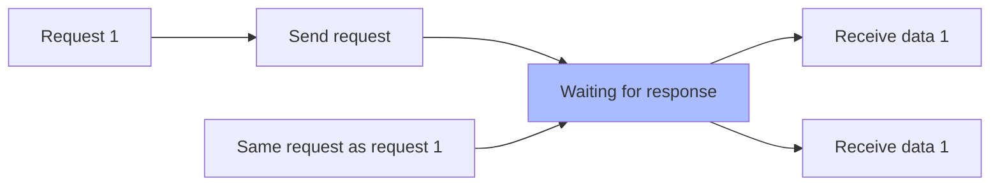

In the previous chapter we tried to send a request and obtain the response data. In fact, `alovaInstance.Get(...)` is not a function that initiates a request, but creates a method instance, which is a PromiseLike instance. You can use `then, catch, finally` methods or `await` Send the request just like a Promise object.

```javascript
const userMethodInstance = alovaInstance.Get('/api/user');

userMethodInstance.then(response => {
  // ...
});

userMethodInstance.catch(error => {
  // ...
});

userMethodInstance.finally(() => {
  // ...
});

try {
  await userMethodInstance;
} catch (error) {
  // ...
} finally {
  // ...
}
```

Simple way to write:

```javascript
const response = await alovaInstance.Get('/api/user');
```

Each method instance describes the type of each request, request url, request headers, request parameters, etc. In addition, you can define request behavior on the method instance to control how the method handles the request.

## Request type

alova provides a total of 7 request types: GET, POST, PUT, DELETE, HEAD, OPTIONS, and PATCH.

| Instance creation function | Parameters                                    |
| -------------------------- | --------------------------------------------- |
| GET                        | `alovaInstance.Get(url[, config])`            |
| POST                       | `alovaInstance.Post(url[, data[, config]])`   |
| PUT                        | `alovaInstance.Put(url[, data[, config]])`    |
| DELETE                     | `alovaInstance.Delete(url[, data[, config]])` |
| HEAD                       | `alovaInstance.Head(url[, config])`           |
| OPTIONS                    | `alovaInstance.Options(url[, config])`        |
| PATCH                      | `alovaInstance.Patch(url[, data[, config]])`  |

Parameter Description:

- `url` is the request path;
- `data` is the request body data;
- `config` is the request configuration object, which includes configurations such as request headers, params parameters, request behavior parameters, etc.;

Next, let’s take a look at how to define request parameters, which should seem familiar to you.

## Request parameters

### URL parameters

Pass in the URL parameters through params, and the params parameters will be spliced in the form of ? after the url.

```javascript
alovaInstance.Get('/todo/list', {
  params: {
    userId: 1
  }
});
```

Of course, you can also directly splice it behind the url, and the effect will be the same.

```javascript
alovaInstance.Get('/todo/list?userId=1');
```

### Request body

When sending **POST, PUT, DELETE, PATCH request**, you can send data through the request body. At this time, the second parameter is passed in the request body. It is worth noting that the POST request can also pass in the params parameter.

```javascript
alovaInstance.Post(
  '/todo',
  //The second parameter is the request body
  {
    title: 'test todo',
    time: '12:00'
  },
  // The third parameter is configuration
  {
    params: {
      userId: 1
    }
  }
);
```

### Request header

Specify request headers via headers.

```javascript
alovaInstance.Get('/user', {
  headers: {
    'Content-Type': 'application/json;charset=UTF-8'
  }
});
```

### Other parameters supported by the request adapter

In addition to request headers, params parameters, etc., it also supports configuring parameters supported by the corresponding request adapter. When using `GlobalFetch` as the request adapter of alova, you can configure any `fetch API` supported parameters on the `method` instance. These Parameters will be passed to the `fetch` function during request.

```javascript
alovaInstance.Get('/todo/list', {
  // ...
  // highlight-start
  credentials: 'same-origin',
  referrerPolicy: 'no-referrer',
  mode: 'cors'
  // highlight-end
});
```

When the above `method` instance sends a request through `fetch`, it will be requested with the following parameters.

```javascript
fetch('/todo/list', {
  // ...
  // highlight-start
  credentials: 'same-origin',
  referrerPolicy: 'no-referrer',
  mode: 'cors'
  // highlight-end
});
```

> In addition to passing Object, the request body can also pass request body parameters supported by the request adapter. For example, GlobalFetch supports passing `string | FormData | Blob | ArrayBuffer | URLSearchParams | ReadableStream` parameters.

If you use other request adapters, you can also pass the parameters they support.

## Request behavior

In [RSM](/tutorial/others/RSM), request behavior is used to describe how the request will be handled.

### overtime time

Set request timeout.

```javascript
// Request timeout at request level
alovaInstance.Get('/todo/list', {
  // ...
  // highlight-start
  timeout: 10000
  // highlight-end
});
```

### Request sharing

We will always encounter this situation. When a request is issued but has not yet been responded to, the same request is issued again, resulting in a waste of requests or repeated submission of problems, such as the following three scenarios:

1. A component will obtain initialization data when it is created. When a page renders multiple components at the same time, multiple identical requests will be issued at the same time;
2. The submit button is not disabled and the user clicks the submit button multiple times;
3. When the preloading page is entered before preloading is completed, multiple identical requests will be initiated;
4. Prevent repeated requests from being sent under react’s StrictMode;

Shared requests are used to solve these problems. It can not only improve application fluency, but also reduce server pressure.



Request sharing is enabled by default. If you wish to turn off request sharing on a specific request, you can do this:

```javascript
alovaInst.Get('/todo', {
  // ...
  // highlight-start
  shareRequest: false
  // highlight-end
});
```

:::warning How to identify identical requests

The request method, request URL, request header, URL parameters, and request body of the method instance are used as a unique identifier. If the identifier is the same, it means the same request, instead of comparing the reference address of the method instance.

:::

### Convert response data

Sometimes we need to uniformly transform the response data. We can set the `transformData` function for the method instance to convert the response data into the required structure.

```javascript
alovaInstance.Get('/todo/list', {
  // The function accepts response data and response header data, and requires the converted data to be returned.
  transformData(rawData, headers) {
    return rawData.list.map(item => {
      return {
        ...item,
        statusText: item.done ? 'Completed' : 'In progress'
      };
    });
  }
});
```

### Response cache

Response caching allows you to better utilize server-side data multiple times without having to send a request to obtain the data every time it is requested. GET requests will set a memory cache time of 5 minutes by default, which we will explain in detail in the [Response Caching](/tutorial/cache/mode) section later.

## Abort request

`[2.6.2+]` calls the `abort` of the method instance to abort the request.

```javascript
const userMethod = alovaInstance.Get('/api/user');
userMethod.then(res => {
  // ...
});

const handleCancel = () => {
  // highlight-start
  userMethod.abort();
  // highlight-end
};
```

## Monitor upload and download progress

**[v2.17.0+]** Bind the upload progress event through `onUpload` of the method instance, and bind the download progress event through `onDownload`, which will return the unbinding function.

```javascript
const uploadMethod = alovaInstance.Post('/todo/uploadfile', formData);
const offUploadEvent = uploadMethod.onUpload(event => {
  console.log('File size:', event.total);
  console.log('Uploaded:', event.loaded);
});

uploadMethod.then(res => {
  // ...
});

// Unbind upload callback
const handleOffEvent = () => {
  offUploadEvent();
};
```

```javascript
const downloadMethod = alovaInstance.Get('/todo/downloadfile');
const offDownloadEvent = downloadMethod.onDownload(event => {
  console.log('File size:', event.total);
  console.log('Downloaded:', event.loaded);
});

downloadMethod.then(res => {
  // ...
});

// Unbind download callback
const handleOffEvent = () => {
  offDownloadEvent();
};
```

:::warning Things to note when using the `GlobalFetch` adapter

Due to fetch api limitations, the **GlobalFetch** adapter provided by alova does not support upload progress. If you need to upload progress, please use [XMLHttpRequest Adapter](/tutorial/request-adapter/alova-adapter-xhr) or [axios Adapter](/tutorial/request-adapter/alova-adapter-axios).

You can also write your own request adapter, see [Writing Request Adapter](/tutorial/custom/custom-http-adapter) for details.

:::

**Upload/Download Status Type**

```typescript
type Progress = {
  /** Total amount of data uploaded or downloaded */
  total: number;
  /** Completed data */
  loaded: number;
};
```
