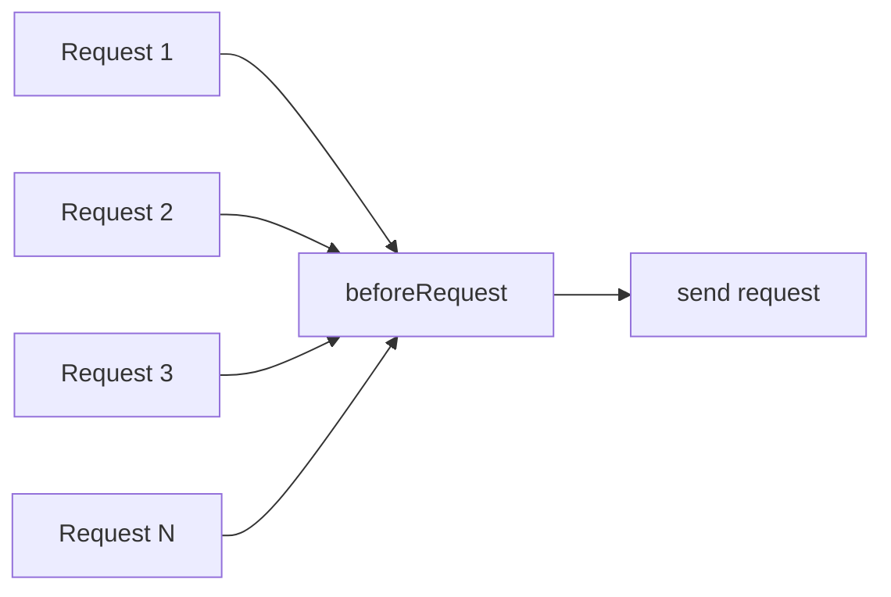
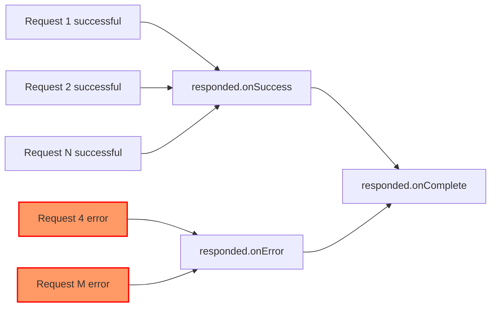

import Tabs from '@theme/Tabs';
import TabItem from '@theme/TabItem';

## Global before request interceptor

Usually, we need to use the same configuration for all requests, such as adding token and timestamp to the request header. `alova` provides us with a global request interceptor, which will be triggered before the request. We can use this interceptor Set the request parameters in a unified way.



```javascript
const alovaInstance = createAlova({
  //...
  // The function parameter is a method instance, including request data such as url, params, data, headers, etc.
  // You are free to modify these data
  // highlight-start
  beforeRequest(method) {
    // Suppose we need to add token to the request header
    method.config.headers.token = 'token';
  }
  // highlight-end
});
```

You can also make beforeRequest an async function.

```javascript
const alovaInstance = createAlova({
  //...
  // highlight-start
  async beforeRequest(method) {
    // perform some asynchronous tasks
    //...
  }
  // highlight-end
});
```

## Global response interceptor

When we want to uniformly parse response data, uniformly handle errors, and uniformly handle request completion, we can specify a global response interceptor when creating an alova instance. The response interceptor includes an interceptor for successful requests and an interceptor for error requests. and request completion interceptors.



```javascript
const alovaInstance = createAlova({
  //...
  // Use two items of the array to specify the interceptor for successful request and the interceptor for failed request
  responded: {
    // highlight-start
    // request success interceptor
    // When using the GlobalFetch request adapter, the first parameter receives the Response object
    // The second parameter is the method instance of the current request, you can use it to synchronize the configuration information before and after the request
    onSuccess: async (response, method) => {
      if (response.status >= 400) {
        throw new Error(response.statusText);
      }
      const json = await response.json();
      if (json.code !== 200) {
        // This request will throw an error when an error is thrown or a Promise instance in the reject state is returned
        throw new Error(json.message);
      }

      // The parsed response data will be passed to the transformData hook function of the method instance, and these functions will be explained later
      return json.data;
    },
    // highlight-end

    // highlight-start
    // Interceptor for request failure
    // This interceptor will be entered when the request is wrong.
    // The second parameter is the method instance of the current request, you can use it to synchronize the configuration information before and after the request
    onError: (err, method) => {
      alert(error.message);
    },
    // highlight-end

    // highlight-start
    // Interceptor for request completion
    // When you need logic that needs to be executed whether the request succeeds, fails, or hits the cache, you can specify a global `onComplete` interceptor when creating an `alova` instance, such as hiding request loading.
    // Receive the method instance of the current request
    onComplete: async method => {
      // Process request completion logic
    }
    // highlight-end
  }
});
```

If you don't need to set the interceptor for request error or complete, you can directly pass in the interceptor function for successful request instead of setting the callback through the object.

```javascript
const alovaInstance = createAlova({
  //...
  // highlight-start
  async responded(response, method) {
    // request success interceptor
  }
  // highlight-end
});
```

:::info Instruction for interceptors triggering

When you use the `GlobalFetch` as the requestAdapter, due to the characteristics of `window.fetch`, the `onError` interceptor will only be triggered when the connection times out or breaks, and other cases will trigger the `onSuccess` interceptor, [for more details here](https://developer.mozilla.org/docs/Web/API/fetch)

:::

:::warning special attention

1. `onSuccess`, `onError` and `onComplete` can be set as synchronous function or asynchronous function.
2. The `onError` callback is a capture function for request errors. it will not emit `onError` when throw error in `onSuccess`. When an error is caught but no error is thrown or a Promise instance in the reject state is returned, the request will be considered successful and no response data will be obtained.
3. In 2.0.x and previous versions, `responded` was misspelled as `responsed`, and the two have been made compatible in 2.1.0. It is recommended to use `responded` instead of `responsed` in subsequent versions.

:::
