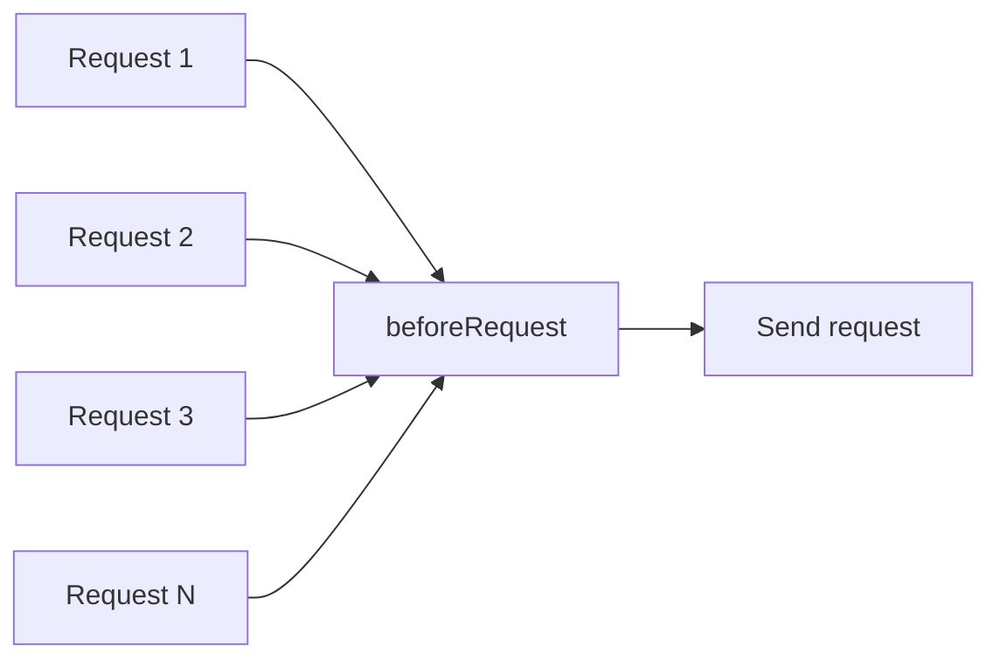
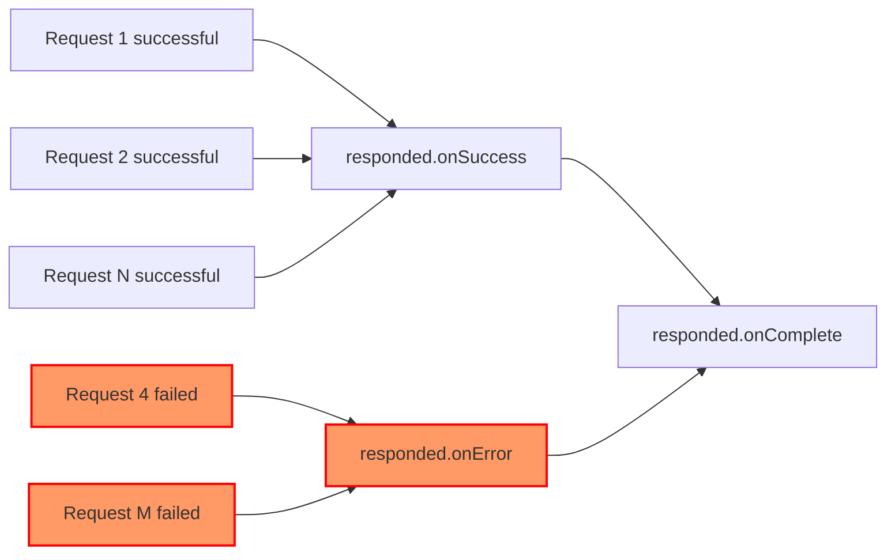

import Tabs from '@theme/Tabs';
import TabItem from '@theme/TabItem';

## Global request interceptor

Usually, we need to use the same configuration for all requests, such as adding token and timestamp to the request header. At this time, we can set a global request interceptor, which will be triggered before all requests. We can set this interceptor Set request parameters uniformly.



```javascript
const alovaInstance = createAlova({
  // ...
  //The function parameter is a method instance, including request data such as url, params, data, headers, etc.
  // You can modify these data freely
  // highlight-start
  beforeRequest(method) {
    // Suppose we need to add token to the request header
    method.config.headers.token = 'token';
  }
  // highlight-end
});
```

You can also set beforeRequest as an asynchronous function.

```javascript
const alovaInstance = createAlova({
  // ...
  // highlight-start
  async beforeRequest(method) {
    //Perform some asynchronous tasks
    // ...
  }
  // highlight-end
});
```

## Global response interceptor

When we want to uniformly parse response data, uniformly handle errors, and uniformly handle request completion, we can specify a global response interceptor when creating an alova instance. The response interceptor includes an interceptor for successful requests and an interceptor for failed requests. and request completion interceptors.



```javascript
const alovaInstance = createAlova({
  // ...
  //Use two items of the array to specify the interceptor for successful request and the interceptor for failed request respectively.
  responded: {
    // highlight-start
    // Interceptor for successful request
    // When using the GlobalFetch request adapter, the first parameter receives the Response object
    // The second parameter is the method instance of the current request. You can use it to synchronize the configuration information before and after the request.
    onSuccess: async (response, method) => {
      if (response.status >= 400) {
        throw new Error(response.statusText);
      }
      const json = await response.json();
      if (json.code !== 200) {
        // This request will throw an error when an error is thrown or a Promise instance with reject status is returned.
        throw new Error(json.message);
      }

      //The parsed response data will be passed to the transformData hook function of the method instance. These functions will be explained later.
      return json.data;
    },
    // highlight-end

    // highlight-start
    // Interceptor for request failure
    // This interceptor will be entered when a request error occurs.
    // The second parameter is the method instance of the current request. You can use it to synchronize the configuration information before and after the request.
    onError: (err, method) => {
      alert(error.message);
    },
    // highlight-end

    // highlight-start
    //Interceptor for request completion
    // When you need to execute logic whether the request succeeds, fails, or hits the cache, you can specify a global `onComplete` interceptor when creating an alova instance, such as turning off the request loading state.
    // Receive the method instance of the current request
    onComplete: async method => {
      // Process request completion logic
    }
    // highlight-end
  }
});
```

If you do not need to set an interceptor for request failure or completion, you can directly pass in the interceptor function for successful request, instead of setting a callback through an object.

```javascript
const alovaInstance = createAlova({
  // ...
  // highlight-start
  async responded(response, method) {
    // Interceptor for successful request
  }
  // highlight-end
});
```

:::info Interceptor triggering instructions

When you use `GlobalFetch` to request the adapter, due to the characteristics of `window.fetch`, the `onError` interceptor will only be triggered when the connection times out or the connection is interrupted. In other cases, the `onSuccess` interceptor will be triggered. [For details, please Check here](https://developer.mozilla.org/docs/Web/API/fetch)

:::

:::warning Special attention

1. `onSuccess`, `onError` and `onComplete` can be set as synchronous functions and asynchronous functions.
2. The `onError` callback is a capture function for request errors. An error thrown in `onSuccess` will not trigger `onError`. When an error is caught but no error is thrown or a Promise instance that returns reject status is used, the request will be considered successful and no response data will be obtained.
3. In 2.0.x and previous versions, `responded` was incorrectly spelled as `responsed`. In 2.1.0, the two have been made compatible. It is recommended to use `responded` instead of `responsed` in subsequent versions. .

:::
