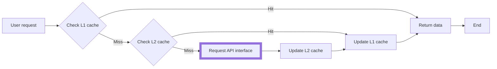

As mentioned in the previous [Quick Start](/tutorial/getting-started/quick-start), alova can be used in server-side environments such as `nodejs/deno/bun`. You can use all functions except client request strategies on the server. In addition, alova also provides good support for server-side environments.

```js
import { createAlova } from 'alova';
import fetchAdapter from 'alova/fetch';

const alovaInstance = createAlova({
requestAdapter: fetchAdapter()
});

alovaInstance.Get(...);
alovaInstance.Post(...);
```

## Server hooks

On the server, we also have different request scenarios, such as request retries, calling APIs to send verification codes, etc., which we call `Server hooks`. They are decorated functions of method instances, and multiple `Server hooks` can be used in combination.

The following is an example that combines `retry` and `sendCaptcha`, which implements sending verification codes by retrying after failure:

```js
const { retry, sendCaptcha } = require('alova/server');

const email = 'xxx@xxx.com';
// Create a method instance for sending verification codes
const captchaMethod = alovaInstance.Post('/api/captcha', {
  email,
  content: 'captcha content'
});

// Use retry hook to wrap captchaMethod
const retringMethod = retry(captchaMethod, {
  retry: 3,
  backoff: {
    delay: 2000
  }
});
// Use sendCaptcha hook to wrap retringMethod, and send the request and get the response result through await
const result = await sendCaptcha(retringMethod, {
  key: email
});
```

You can also use multiple `server hooks` to wrap method instances directly.

```ts
const result = await sendCaptcha(
  retry(
    alovaInstance.Post('/api/captcha', {
      email,
      content: 'captcha content'
    }),
    {
      retry: 3,
      backoff: {
        delay: 2000
      }
    }
  ),
  {
    key: email
  }
);
```

> For more `Server hooks`, please visit [Server Strategy](/xxx).

## Multi-level Cache

alova provides a complete and simple cache function. Not only that, it also supports multi-level cache to provide the fastest request experience for your server application. You can freely choose to use single-level cache or multi-level cache. Their operating mechanisms are as follows:



Some application scenarios are as follows:

1. High access frequency and low latency requirements: such as popular news and product details, which can further reduce network overhead and maintain faster response when the network is unstable.
2. Reduce the pressure on downstream servers, such as services with peak access periods, and the upper-level cache can effectively reduce the pressure on the backend database and microservices.
3. Integrate data merging and processing of multiple downstream servers. Multiple serial requests may lead to longer response time and may consume performance due to complex data conversion. The converted data can be cached.
4. API rate limit and billing. Weather forecast service API updates weather information every hour, geographic location data API, etc.

The following is an example of using an inter-process memory sharing adapter plus lru cache as the first-level cache and redis as the second-level cache:

```js
const { createPSCAdapter, NodeSyncAdapter } = require('@alova/psc');
const { LRUCache } = require('lru-cache');
const { createRedisAdapter } = require('@alova/redis');

function lRUCache(options = {}) {
  const cache = new LRUCache(options);
  return {
    set(key, value) {
      return cache.set(key, value);
    },

    get(key) {
      return cache.get(key);
    },

    remove(key) {
      return cache.delete(key);
    },

    clear() {
      return cache.clear();
    }
  };
}

const alovaInstance = createAlova({
  baseURL: 'https://api.alovajs.dev',

  // Inter-process shared cache adapter
  l1Cache: createPSCAdapter(
    NodeSyncAdapter(),
    lRUCache({
      max: 1000,
      ttl: 1000 * 60 * 10
    })
  ),

  // redis cache adapter
  l2Cache: createRedisAdapter({
    host: 'localhost',
    port: 6379,
    username: 'default',
    password: 'my-top-secret',
    db: 0
  })
});
```

> For a deeper understanding of response caching, please visit [In-depth Response Cache](/xxx).
