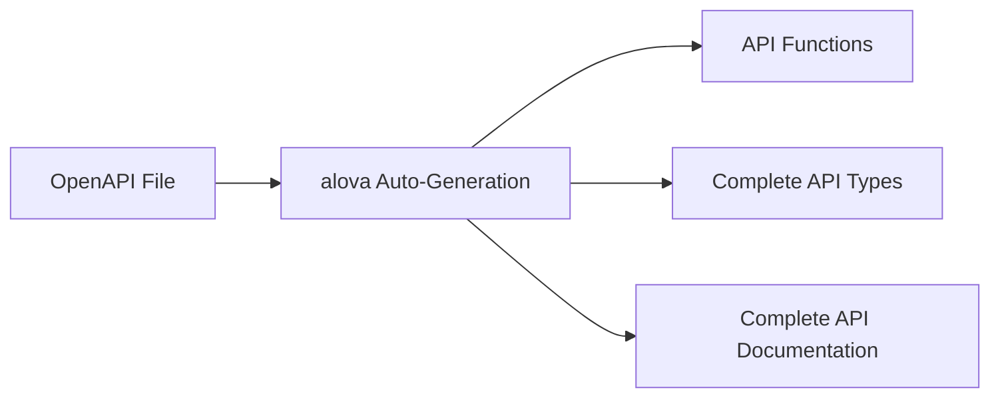
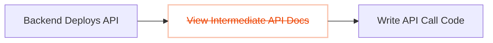

alova's devtool can unleash its full potential.

1. Automatically generate request code and response data types, enabling intelligent hints for interface data even in JavaScript projects.
2. Embed API documentation directly into the code, allowing you to view detailed information for each API right in the editor.
3. Periodically update APIs and proactively notify frontend developers, eliminating reliance on backend developers for updates.



This revolutionizes the traditional development workflow. Previously, after backend developers delivered APIs, you had to open intermediate API documentation to query and copy key information into your project, constantly switching between the documentation and the editor. Now, alova's devtool eliminates the need for intermediate API documentation. With it, you can quickly locate the required API in the editor, display its complete documentation, and reference the API parameter table to swiftly complete parameter passing—bridging the collaboration gap between frontend and backend like a wormhole.



## Demo Video

import vscodeDemoVideo from '@site/static/video/vscode-demo-video-chinese.mp4';

<video width="100%" controls controlsList="nodownload" src={vscodeDemoVideo} />

## Installation

Install `@alova/wormhole` and the VSCode extension. `@alova/wormhole` provides auto-generation features, while the VSCode extension allows you to quickly leverage `@alova/wormhole`'s capabilities, browse API documentation in the editor, and use shortcuts to find interface documentation.

<a className="button button--primary" style={{marginBottom: '20px'}} href="vscode:extension/Alova.alova-vscode-extension">Install VSCode Extension</a>

Alternatively, search for "alova" in the extension marketplace. Supports Swagger-v2 and OpenAPI-v3 specifications.

import Tabs from '@theme/Tabs';
import TabItem from '@theme/TabItem';

<Tabs>
<TabItem value="1" label="npm">

```bash
npm install @alova/wormhole --save-dev
```

</TabItem>
<TabItem value="2" label="yarn">

```bash
yarn add @alova/wormhole --dev
```

</TabItem>
<TabItem value="3" label="pnpm">

```bash
pnpm add @alova/wormhole -D
```

</TabItem>
</Tabs>

:::info WebStorm Editor Note

Non-VSCode editors like WebStorm currently do not support the editor extension. You can use [@alova/wormhole commands](/api/wormhole#commands) to auto-generate API call functions, complete TypeScript types for APIs, and API documentation.

:::

## Configuration

When using the extension, you need to specify the input source for the OpenAPI file and the output directory, among other settings. You can create a configuration file in the project root directory, which supports the following formats:

1. `alova.config.cjs`: A CommonJS configuration file using `module.exports` to export settings.
2. `alova.config.js`: An ESModule configuration file using `export default` to export settings.
3. `alova.config.ts`: A TypeScript configuration file using `export default` to export settings.

You can also use the `alova init` command provided by the `@alova/wormhole` devtool to quickly create a configuration template.

Below is an example of the configuration parameters and their explanations, using CommonJS as an example.

```js
import { defineConfig } from '@alova/wormhole';
import { rename } from '@alova/wormhole/plugin';

module.exports = defineConfig({
  // An array of API generation settings, where each item represents an auto-generation rule, including input/output directories, specification file paths, etc.
  generator: [
    // Server 1
    {
      // Input parameter 1: URL of the OpenAPI JSON file
      input: 'http://localhost:3000/openapi.json',

      // Configure one or more plugins, each generator item can have its own settings
      plugin: [
        rename({
          style: 'camelCase'
        })
      ],

      // Input parameter 2: Local path relative to the project
      // input: 'openapi/api.json'

      // Input parameter 3: When not directly pointing to an OpenAPI file, this is a documentation URL, and you must specify the documentation type using the `platform` parameter
      // input: 'http://192.168.5.123:8080'

      // (Optional) `platform` specifies the OpenAPI platform, currently only supports Swagger. Default is empty.
      // When this parameter is specified, the `input` field only needs to point to the documentation URL, not the OpenAPI file.
      platform: 'swagger',

      // Output path for interface and type files. Addresses must not be duplicated across multiple generators to avoid code overwrites.
      output: 'src/api',

      // (Optional) Specify the media type for generated response data, used to generate TypeScript types for 2xx status codes. Default is `application/json`.
      responseMediaType: 'application/json',

      // (Optional) Specify the media type for generated request body data, used to generate TypeScript types for the request body. Default is `application/json`.
      bodyMediaType: 'application/json',

      // (Optional) Specify the API version to generate. Default is `auto`, which determines the version based on the installed alova version in the project. You can also manually specify it if needed.
      version: 'auto',

      /**
       * (Optional) Type of generated code. Options: `auto`, `ts`, `typescript`, `module`, `commonjs`. Default is `auto`, which determines the type based on project rules. You can manually specify it if needed:
       * `ts`/`typescript`: Same meaning, generates TypeScript type files.
       * `module`: Generates ESModule-compliant files.
       * `commonjs`: Generates CommonJS-compliant files.
       */
      type: 'auto',

      /**
       * Global API export name. Use this name to access auto-generated APIs globally. Default is `Apis`. Required when configuring multiple generators, and must be unique.
       */
      global: 'Apis',

      /**
       * Host object for global API mounting. Default is `globalThis` (represents `window` in browsers and `global` in Node.js).
       */
      globalHost: 'globalThis',

      /**
       * (Optional) Filter or transform generated API interface functions. Return a new `apiDescriptor` to generate API call functions. If not specified, the `apiDescriptor` object remains unchanged.
       *
       * The `apiDescriptor` type matches the API item in the OpenAPI file.
       * @see https://spec.openapis.org/oas/v3.1.0.html#operation-object
       */
      handleApi: apiDescriptor => {
        // Return a falsy value to filter this API
        if (!apiDescriptor.path.startsWith('/user')) {
          return;
        }

        apiDescriptor.parameters = (apiDescriptor.parameters || []).filter(
          param => param.in === 'header' && param.name === 'token'
        );
        delete apiDescriptor.requestBody.id;
        apiDescriptor.url = apiDescriptor.url.replace('/user', '');
        return apiDescriptor;
      }
    },

    // Server 2
    {
      // ...
    }
  ],

  // (Optional) Whether to auto-update APIs. Default is `true`, checking every 5 minutes. Set to `false` to disable.
  autoUpdate: true

  /* Alternatively, configure more detailed parameters:
  autoUpdate: {
    // Update when the editor launches. Default is `false`.
    launchEditor: true,
    // Auto-update interval in milliseconds.
    interval: 5 * 60 * 1000
  }
  */
});
```

## The `handleApi` Hook

Note that the `handleApi` hook allows you to customize any API configuration, such as modifying parameter names, types, or return types. This is particularly useful when the OpenAPI file is incorrect or lacks detail.

It is called before generating each API, receiving the `apiDescriptor` and returning the modified `apiDescriptor`. It contains information for each API in the OpenAPI file. For details, refer to [OpenAPI Spec Operation Object](https://spec.openapis.org/oas/v3.1.0.html#operation-object).

Here are a few examples.

### Modify API Function Names

```javascript
// Convert snake_case to camelCase
const handleApi = apiDescription => {
  apiDescription.operationId = apiDescription.operationId.replace(
    /_([a-z])/g,
    function (match, group) {
      return group.toUpperCase();
    }
  );
  return apiDescription;
};
```

### Modify Tags

```javascript
const handleApi = apiDescription => {
  if (apiDescription.url.includes('/user')) {
    apiDescription.tags = ['userTag'];
  }
  return apiDescription;
};
```

### Modify Response Data Generation

Generate types for `response.data`.

```javascript
const handleApi = apiDescription => {
  apiDescriptor.responses = apiDescriptor.responses?.properties?.data;
  return apiDescriptor;
};
```

## Plugins

To simplify the logic of modifying generated data, alova's devtool also supports configuring `plugin`. Currently, the following preset plugins are available:

1. **[rename](/resource/devtool-plugins/rename)**: Renames API call functions and parameter names, supporting camelCase and snake_case, as well as custom modifications.
2. **[tagModifier](/resource/devtool-plugins/tag-modifier)**: Modifies the tag names of APIs.
3. **[payloadModifier](/resource/devtool-plugins/payload-modifier)**: Adds, deletes, or modifies API parameter types.
4. **[filterApi](/resource/devtool-plugins/filter-api)**: Filters APIs based on URL and tag matching.
5. **[apifox](/resource/devtool-plugins/apifox)**: Automatically imports projects from Apifox, eliminating the need for manual exports.
6. **[importType](/resource/devtool-plugins/import-type)**: Excludes types that require customization, allowing users to use their own custom types.

You can configure `plugin` in the `generator` to use these plugins, and they will be executed in the order they are configured.

```javascript
export default defineConfig({
  generator: [
    {
      // ...
      plugin: [
        rename(...),
        tagModifier(...),
      ]
    }
  ]
})
```

If you need to create custom plugins, refer to the [Plugin Development Guide](/resource/devtool-plugins).

## Usage

The generated API code can be accessed via the `Apis` variable, which can be customized in the configuration file using the `global` field. You can quickly view detailed information for each API in the editor.


Here, `pet` is the API's tag, and the API name corresponds to the `operationId`.


You can access `Apis` in two ways:

### Global Mounting (Default)

Import the `index.[js/ts]` file from the auto-generated directory in the `main.[js/ts]` entry file.

```js title="main.js"
import './your-generating-api-folder';
```

### Import

Import the `Apis` variable in the files where it is needed.

```js
import { Apis } from './your-generating-api-folder';
```

In this case, you need to remove `mountApis(Apis)` from the `your-generating-api-folder/index.[js/ts]` file to prevent it from being globally mounted.

### Accessing APIs

When using an API, you can specify request parameters via `params`, `pathParams`, `data`, or `headers`. It will intelligently prompt the required parameters for the API. Additionally, you can specify other config parameters for the method instance.

```js
useRequest(() =>
  Apis.user.changeProfile({
    // (Optional) Query parameters
    params: {
      id: 12
    },
    // (Optional) Path parameters
    pathParams: {
      id2: 20
    },
    // (Optional) Body parameters
    data: {
      name: 'alova',
      age: 18
    },
    // (Optional) Header parameters
    headers: {
      'Content-Type': 'application/json'
    },

    // Other config options supported by the method
    cacheFor: 100 * 1000,
    transform: response => response.detail
  })
);
```

## Quick API Lookup

You can quickly locate the target API using keywords from its `description` or `url`. Use the shortcut `Ctrl+Alt+P` to open the API search box or trigger the quick lookup with the keyword **`a->`**.

### Searching by URL


### Searching by Description


### Referencing the Parameter Table

By default, when accessing an API function via **`a->`**, the necessary parameters for the API will be automatically provided. When passing parameters to the API function, the VSCode editor will also automatically display the API documentation for reference.


If you accidentally close the API documentation popup, you can place the cursor on the API function and use the shortcut `Shift+Ctrl+Space` (or `Shift+Command+Space` on Mac) to reopen it.

## Configuring alova Parameters

Typically, we set global parameters in `createAlova`. In the auto-generated code, you can configure these in `${output}/index.[js/ts]`, where `${output}` is the `output` directory specified in the configuration file. This file will not be overwritten when regenerating the code.

The `index` file looks like this:

```js
import { createAlova } from 'alova';
import GlobalFetch from 'alova/GlobalFetch';
import VueHook from 'alova/vue';
import { createApis, withConfigType, mountApis } from './createApis';

// The alova instance for the current API. You can modify parameters here.
export const alovaInstance = createAlova({
  baseURL: 'server parameter from the OpenAPI file',
  statesHook: VueHook,
  requestAdapter: GlobalFetch(),
  beforeRequest: method => {},
  responded: res => {
    return res.json();
  }
});

// Reusable method parameter configurations
export const $$userConfigMap = withConfigType({});

/**
 * @type {APIS}
 */
const Apis = createApis(alovaInstance, $$userConfigMap);
mountApis(Apis);

export default Apis;
```

You can write interceptors or change request adapters in `createAlova` as usual.

Note: Since method instances are auto-generated, you cannot directly set method parameters like `transform` or `cacheFor` during creation. To achieve the same effect, specify these parameters in `withConfigType({})`.

Here’s a comparison:

```js
// Manually defined call function
export const useProfile = () =>
  alovaInstance.Get('/user/profile', {
    cacheFor: 100 * 1000,
    transform(data) {
      return data.detail;
    }
  });
```

```js
// Setting method parameters for auto-generated code
export const $$userConfigMap = withConfigType({
  'user.profile': {
    cacheFor: 100 * 1000,
    transform(data) {
      return data.detail;
    }
  }
});
```

Here, `user` is the tag, and `profile` is the `operationId`. You can view all API paths in `${output}/apiDefinitions.[js/ts]`.

## Migrating Legacy Projects

If you want to integrate the VSCode extension into an existing alova project, follow these steps:

1. First, generate the code based on the OpenAPI specification file.
2. Replace the alova instance in `${output}/index.[js/ts]` with your original alova instance code.
3. In the project's existing API call functions, update the import path for the alova instance to `${output}/index.[js/ts]`.

This allows you to integrate auto-generated code without altering the original codebase.

## Notes

1. In TypeScript projects, if VSCode fails to provide correct intellisense, set `"strictNullChecks": true` in `tsconfig.json`.
2. If an API is incorrectly typed as `any`, try the following:
   - First, ensure the API is imported in the entry file.
   - Second, restart VSCode.
