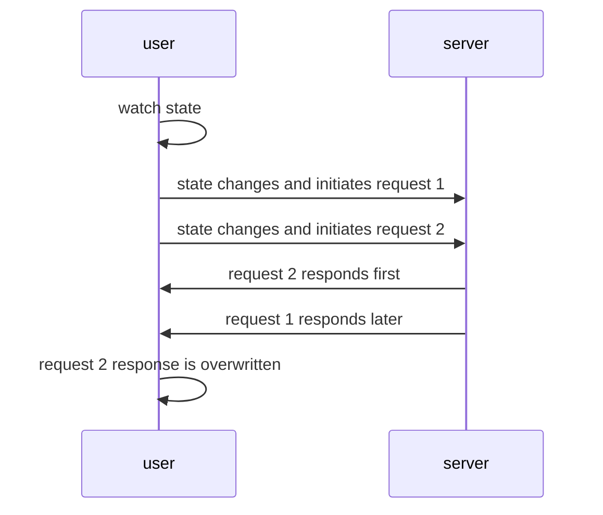

import Tabs from '@theme/Tabs';
import TabItem from '@theme/TabItem';
import EmbedSandpack from "@site/src/components/EmbedSandpack";
import CodeBlock from '@theme/CodeBlock';
import useWatcherSearchVue from '!!raw-loader!@site/codesandbox@3/02-client/02-use-watcher/vueComposition-search.en.vue';
import useWatcherSearchReact from '!!raw-loader!@site/codesandbox@3/02-client/02-use-watcher/react-search.en.jsx';
import useWatcherSearchSvelte from '!!raw-loader!@site/codesandbox@3/02-client/02-use-watcher/svelte-search.en.svelte';

:::info Strategy type

use hook

:::

In some scenarios where you need to re-request as data changes, such as paging, data filtering, fuzzy search, tab bar switching, etc., you can use `useWatcher` to listen to the specified state change and send a request immediately.

## Example

Next, let's take the search for todo items as an example and try to change the options in the selection box to see how the todo list changes.
<Tabs groupId="framework">
<TabItem value="1" label="vue composition">

<EmbedSandpack template="vue" mainFile={useWatcherSearchVue} editorHeight={800} />

</TabItem>
<TabItem value="2" label="react">

<EmbedSandpack template="react" mainFile={useWatcherSearchReact} editorHeight={800} />

</TabItem>
<TabItem value="3" label="svelte">

<CodeBlock language="html">{useWatcherSearchSvelte}</CodeBlock>

</TabItem>
</Tabs>

## Usage

:::tip Usage Tips

useWatcher supports all the features of useRequest. For details, please see [useRequest](/next/tutorial/client/strategy/use-request). The following are the unique uses of useWatcher.

:::

### Send request immediately

Unlike `useRequest`, the `immediate` property of `useWatcher` defaults to `false`.

```javascript
const { send } = useWatcher(() => getTodoList(currentPage), [currentPage], {
  // highlight-start
  immediate: true
  // highlight-end
});
send();
```

### Request debounce

Usually we write debounce code at the level of frequently triggered events. This time we implemented the debounce function at the request level, which means you no longer need to implement debounce yourself in the fuzzy search function, and the usage is also very simple.

:::info What is debounce?

Debounce means that after an event is triggered, a function can only be executed once within n seconds. If another event is triggered within n seconds after the event is triggered, the function execution delay time will be recalculated (distinguished from throttling here. Throttling means that the event cannot be triggered again within a period of time after the event is triggered)

:::

**Set the debounce for all watching states**

```javascript
const { loading, data, error } = useWatcher(
  () => filterTodoList(keyword, date),
  [keyword, date],
  {
    // highlight-start
    // Setting debounce to a number means the debounce time for all watching states in milliseconds
    // For example, this means that when one or more of the states keyword and date change, the request will be sent after 500ms
    debounce: 500
    // highlight-end
  }
);
```

**Set the debounce for a single watching state**

In many scenarios, we only need to debounce a few frequently changing watching states, such as the state change triggered by `onInput` of the text box. This can be done as follows:

```javascript
const { loading, data, error } = useWatcher(
  () => filterTodoList(keyword, date),
  [keyword, date],
  {
    // highlight-start
    // Set the debounce time in the order of the array of watching states. 0 or no transmission means no debounce
    // The order of the watching states here is [keyword, date], and the debounce array is set to [500, 0], which means that only the keyword is set to debounce
    debounce: [500, 0]
    // You can also set it as follows:
    // debounce: [500],
    // highlight-end
  }
);
```

### Request sequence

Sometimes when the state watched by `useWatcher` changes continuously and causes continuous requests to be initiated, the latter request gets a response before the previous request, but when the previous request gets a response, it will overwrite the response of the latter request, resulting in a response that does not match the state; for example, if a state `state` changes and request `1` is issued, and then the `state` value is changed before request `1` is responded, and request `2` is issued, if request `1` returns after request `2`, the final response data will remain in request `1`.
Therefore, we designed the `abortLast` parameter, which is used to mark whether to interrupt the last unresponsive request when the next request is sent. The default value is `true`, so that only the last request sent by `useWatcher` is valid.



```javascript
useWatcher(
  () => getTodoList($currentPage),
  // Array of watched states, these state changes will trigger a request
  [state],
  {
    // highlight-start
    abortLast: true // Whether to interrupt the last unresponsive request, the default is true
    // highlight-end
  }
);
```

:::warning Notes

`abortLast` defaults to `true`. Under normal circumstances, you don't need to pay attention to this parameter. If it is changed to `false`, it may cause problems with state and response mismatch.

:::

## API

Please refer to [API-useWatcher](/next/api/core-hooks#usewatcher).
