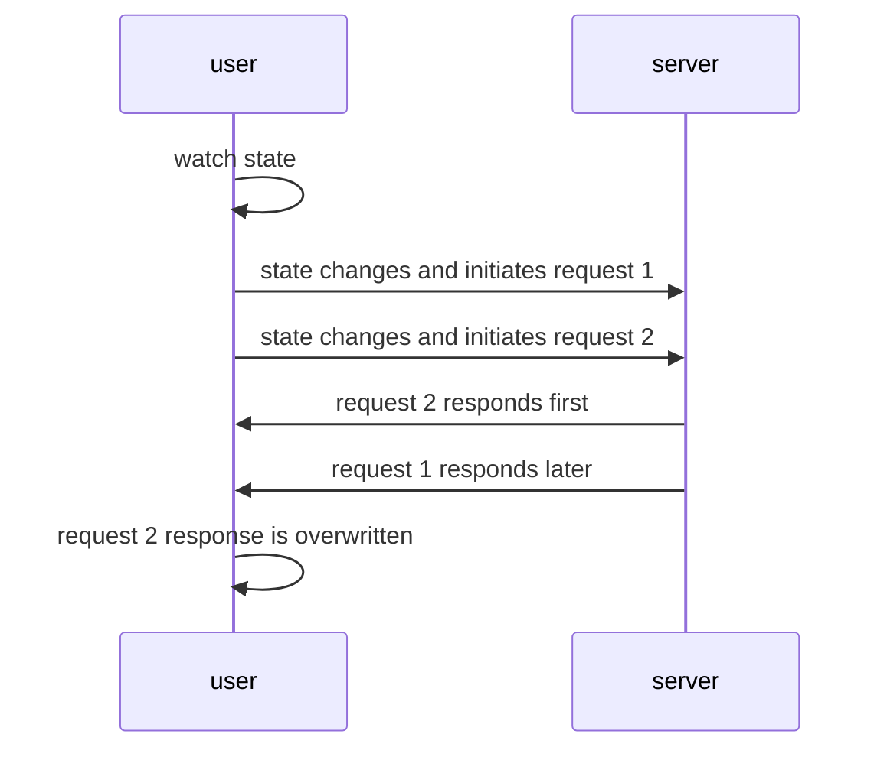

import Tabs from '@theme/Tabs';
import TabItem from '@theme/TabItem';
import EmbedSandpack from "@site/src/components/EmbedSandpack";
import CodeBlock from '@theme/CodeBlock';
import useWatcherSearchVue from '!!raw-loader!@site/codesandbox@3/02-client/02-use-watcher/vueComposition-search.en.vue';
import useWatcherSearchReact from '!!raw-loader!@site/codesandbox@3/02-client/02-use-watcher/react-search.en.jsx';
import useWatcherSearchSvelte from '!!raw-loader!@site/codesandbox@3/02-client/02-use-watcher/svelte-search.en.svelte';
import useWatcherSearchSolid from '!!raw-loader!@site/codesandbox@3/02-client/02-use-watcher/solid-search.en.jsx';

:::info Strategy type

use hook

:::

In scenarios where you need to re-request as data changes — such as pagination, filtering, fuzzy search, or switching tabs — you can use `useWatcher` to watch a state and send a request as soon as it changes.

## Example

Let's use searching for todo items as an example: change the options in the dropdown and watch the todo list update.
<Tabs groupId="framework">
<TabItem value="1" label="vue">

<EmbedSandpack template="vue" mainFile={useWatcherSearchVue} editorHeight={800} />

</TabItem>
<TabItem value="2" label="react">

<EmbedSandpack template="react" mainFile={useWatcherSearchReact} editorHeight={800} />

</TabItem>
<TabItem value="3" label="svelte">

<CodeBlock language="html">{useWatcherSearchSvelte}</CodeBlock>

</TabItem>
<TabItem value="4" label="solid">

<EmbedSandpack template="solid" mainFile={useWatcherSearchSolid} editorHeight={800} />

</TabItem>
</Tabs>

## Usage

:::tip Usage Tips

useWatcher supports all the features of useRequest. For details, please see [useRequest](/tutorial/client/strategy/use-request). The following are the unique uses of useWatcher.

:::

### Send request immediately

Unlike `useRequest`, the `immediate` property of `useWatcher` defaults to `false`.

```javascript
const { send } = useWatcher(() => getTodoList(currentPage), [currentPage], {
  // highlight-start
  immediate: true
  // highlight-end
});
send();
```

### Request debounce

Usually you would debounce at the event level. Here, debouncing happens at the request level, so you no longer need to debounce the fuzzy-search input yourself — and the usage stays simple.

:::info What is debounce?

Debounce means that after an event is triggered, a function can only be executed once within n seconds. If another event is triggered within n seconds after the event is triggered, the function execution delay time will be recalculated (distinguished from throttling here. Throttling means that the event cannot be triggered again within a period of time after the event is triggered)

:::

**Set the debounce for all watching states**

```javascript
const { loading, data, error } = useWatcher(
  () => filterTodoList(keyword, date),
  [keyword, date],
  {
    // highlight-start
    // Setting debounce to a number means the debounce time for all watching states in milliseconds
    // For example, this means that when one or more of the states keyword and date change, the request will be sent after 500ms
    debounce: 500
    // highlight-end
  }
);
```

**Set the debounce for a single watching state**

In many scenarios, we only need to debounce a few frequently changing watching states, such as the state change triggered by `onInput` of the text box. This can be done as follows:

```javascript
const { loading, data, error } = useWatcher(
  () => filterTodoList(keyword, date),
  [keyword, date],
  {
    // highlight-start
    // Set the debounce time in the order of the array of watching states. 0 or no transmission means no debounce
    // The order of the watching states here is [keyword, date], and the debounce array is set to [500, 0], which means that only the keyword is set to debounce
    debounce: [500, 0]
    // You can also set it as follows:
    // debounce: [500],
    // highlight-end
  }
);
```

### Request sequence

Sometimes a watched state changes repeatedly and triggers a series of requests. A later request may respond before an earlier one, and when the earlier one finally responds it overwrites the later result, leaving data that no longer matches the state. For example, suppose `state` changes and fires request 1; then it changes again before request 1 responds and fires request 2. If request 1 returns after request 2, the final data will be request 1's.
This is why we added the `abortLast` parameter: when the next request is sent, it cancels the previous unresponded request. It defaults to `true`, so only the latest `useWatcher` request stays valid.


```mermaid
sequenceDiagram
  participant U as user
  participant S as server
  U ->> U: watch state
  U ->> S: state changes and initiates request 1
  U ->> S: state changes and initiates request 2
  S ->> U: request 2 responds first
  S ->> U: request 1 responds later
  U ->> U: request 2 response is overwritten
```

```javascript
useWatcher(
  () => getTodoList($currentPage),
  // Array of watched states, these state changes will trigger a request
  [state],
  {
    // highlight-start
    abortLast: true // Whether to interrupt the last unresponsive request, the default is true
    // highlight-end
  }
);
```

:::warning Notes

`abortLast` defaults to `true`. Under normal circumstances, you don't need to pay attention to this parameter. If it is changed to `false`, it may cause problems with state and response mismatch.

:::

## API

Please refer to [API-useWatcher](/api/core-hooks#usewatcher).
