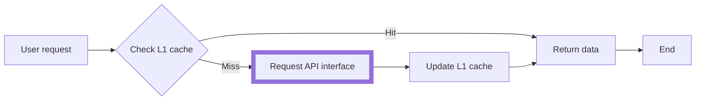
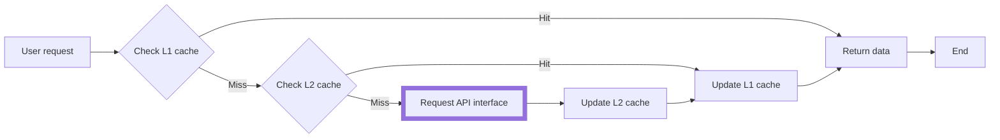

import MemoryCache from '@site/example-links/MemoryCache';
import StoragePlaceholder from '@site/example-links/StoragePlaceholder';
import StorageRestore from '@site/example-links/StorageRestore';

Cache mode can be set at different granularities, such as global or request level. When set globally, all method instances created by the same alova instance will inherit the setting.

:::info Note

Whether to use cache mode and which cache mode to use depends on the scenario. The following will mention their usage scenarios when introducing different cache modes separately.

:::

## Memory Mode (Default)

Memory mode belongs to the single-level cache (L1 cache) mode. By default, the cache is placed in memory. It is the most commonly used cache mode.



By default, GET request has a memory cache time of 300000ms (5 minutes). Developers can also customize the cache setting. Please continue reading.

### Client

In the client, refreshing the page cache will invalidate it. The memory mode is generally used to solve the performance consumption caused by frequent requests for the same data in a short period of time (several minutes or seconds). For example, when you are writing a todo detail page, you may think that users will frequently click to view details in the todo list. If the user repeatedly views a certain detail, the interface will no longer be requested repeatedly, and the data can be returned immediately, which improves the response speed and reduces the server pressure. At this time, we can set the response data cache for a todo detail method instance.

```javascript
alovaInstance.GET('/todo/list', {
  // ...
  // highlight-start
  cacheFor: {
    // Set the cache mode to memory mode
    mode: 'memory',

    // Unit is milliseconds
    // When set to `Infinity`, it means that the data will never expire. When set to 0 or a negative number, it means that it will not be cached
    expire: 60 * 10 * 1000
  }
  // highlight-end
});
```

Memory mode is the default mode. You can shorten it like this

```javascript
alovaInstance.GET('/todo/list', {
  // ...
  // highlight-start
  cacheFor: 60 * 10 * 1000
  // highlight-end
});
```

### Server

In the service, it is usually used in scenarios where the interface requires high access frequency and low latency to reduce the pressure on the downstream server. The usage method is the same as the client.

Note when using it on the server:

1. Too much cache will always consume server memory. You can use [lru-cache](https://www.npmjs.com/package/lru-cache) to control memory consumption.

2. If you need to share cache in a single-machine nodejs cluster environment, you can use [@alova/psc](https://www.npmjs.com/package/@alova/psc) to create a cache solution for shared memory between processes.

```js
const { createPSCAdapter, NodeSyncAdapter } = require('@alova/psc');
const { LRUCache } = require('lru-cache');

function lRUCache(options = {}) {
  const cache = new LRUCache(options);
  return {
    set(key, value) {
      return cache.set(key, value);
    },

    get(key) {
      return cache.get(key);
    },

    remove(key) {
      return cache.delete(key);
    },

    clear() {
      return cache.clear();
    }
  };
}

const alovaInstance = createAlova({
  baseURL: 'https://api.alovajs.dev',

  // Inter-process shared cache adapter
  l1Cache: createPSCAdapter(
    NodeSyncAdapter(),
    lRUCache({
      max: 1000,
      ttl: 1000 * 60 * 10
    })
  )
});
```

Memory cache mode corresponds to l1 cache. Here we replace the cache adapter with lru-cache shared between processes. You can also [customize the storage adapter](/tutorial/advanced/custom/storage-adapter). For example, when you only need a single-level cache, you can also directly set the l1 cache to the redis adapter.

## Restore mode

Restore mode corresponds to multi-level cache, namely L1 and L2 cache. After the restore mode is turned on, the response data will be stored in both L1 and L2 caches. When the L1 cache fails, the data will be read from the L2 cache and then the L1 cache will be updated. The interface will be requested again when the L2 cache also fails.



### Client

In the client, when the cache has not expired, it will not be invalidated even if the page cache is refreshed. It is generally used for some data that requires server-side management but is basically unchanged, such as the specific dates of holidays each year are different, but will not change again. In this scenario, we only need to set the cache expiration time to the last minute of this year.

When using alova in the client, `localStorage` is used as the L2 storage adapter by default. You can also [customize the storage adapter](/tutorial/advanced/custom/storage-adapter).

Set on the method instance:

```javascript
const todoListGetter = alovaInstance.Get('/todo/list', {
  // ...
  // highlight-start
  cacheFor: {
    // Set cache mode to persistence mode
    mode: 'restore',
    // Cache time
    expire: 60 * 10 * 1000
  }
  // highlight-end
});
```

#### What to do if data changes?

When the method instance is set to restore mode, it may be necessary to allow users to re-cache the changed data after publishing the application due to changes in interface data or changes in the logic of front-end processing response data. At this time, you can set the cache tag through the `tag` attribute. Each piece of persistent data contains a `tag` identifier. When the `tag` changes, the original persistent data will become invalid, and new data will be obtained again and identified with a new `tag`.

```javascript
const todoListGetter = alovaInstance.Get('/todo/list', {
  // ...
  cacheFor: {
    mode: 'restore',
    expire: 60 * 10 * 1000,

    // highlight-start
    // Add or modify tag parameters, cached data will become invalid
    // It is recommended to use version number management
    tag: 'v1'
    // highlight-end
  }
});
```

### Server

Generally used for multi-level cache, using L1 as memory cache and L2 as persistent cache, such as redis and memcached.

Some application scenarios are as follows:

1. High access frequency and low latency requirements: such as hot news and product details, which can further reduce network overhead and maintain faster response when the network is unstable.

2. Reduce the pressure on downstream servers, such as services with peak access periods, and the upper-level cache can effectively reduce the pressure on the backend database and microservices.
3. Integrate data merging and processing of multiple downstream servers. Multiple serial requests may lead to longer response time, and may also consume performance due to complex data conversion. The converted data can be cached.
4. API rate limit and billing, weather forecast service API updates weather information once an hour, geographic location data API, etc.

When using alova on the server, there is no L2 storage adapter by default. The implementation of file storage adapter and redis adapter are provided in [Server-side L2 storage practice](/tutorial/project/best-practice/l2-storage). You can also [customize storage adapter](/tutorial/advanced/custom/storage-adapter), for example, use MongoDB, MySQL and other databases as storage adapters for response data.

:::warning Note

When the request body is special data such as **FormData**, **Blob**, **ArrayBuffer**, **URLSearchParams**, **ReadableStream**, it will be considered that you have the intention to communicate with the server, and no caching will be performed in this case.

:::

## Set alova id

Each cache key contains the namespace of the alova instance, in the following format:

```
cacheKey = [prefix][alova-id][method-json-string]
```

By default, [alova-id] increments in the order in which alova is created. When using persistent cache in a server environment, it is strongly recommended to set the namespace of the alova id fixed cache key. **This is particularly important**, otherwise the order in which multiple alova instances are created may change, resulting in the inability to match the corresponding cache.

```js
const userAlova = createAlova({
  // ...
  id: 'user'
});

const orderAlova = createAlova({
  // ...
  id: 'order'
});
```

## Set cache mode globally

If you need to set the cache mode globally, you can do it as follows:

```javascript
const alovaInstance = createAlova({
  // ...
  // highlight-start
  cacheFor: {
    // Set the cache mode for POST uniformly
    POST: {
      mode: 'restore',
      expire: 60 * 10 * 1000
    },
    // Set the cache mode for HEAD requests uniformly
    HEAD: 60 * 10 * 1000
  }
  // highlight-end
});
```

After this, method instances created through the `alovaInstance` instance will use this cache setting by default, and you can also override it in the method instance.

## Globally turn off cache mode

If you don't want to use anyIf you want to use any request cache, you can turn it off globally. If you want to use it only for a few specific requests, you can also turn it off globally and set it in the specified method instance.

```javascript
const alovaInstance = createAlova({
  // ...
  // highlight-start
  // Set to null to globally turn off all request caches
  cacheFor: null
  // highlight-end
});
```

## Set different expiration times

In restore mode, you can also set different expiration times for L1 and L2 caches. Set `expire` to a function, which will be called when setting L1 and L2 caches respectively.

The following is an example of setting different expiration times for a single request.

```js
alovaInst.Get('/user/profile', {
  // ...
  cacheFor: {
    mode: 'restore',
    expire: ({ method, mode }) => {
      // Set 5 minutes cache in l1 cache and 1 day cache in l2 cache
      return mode === 'memory' ? 5 * 60 : 24 * 60 * 60;
    }
  }
});
```

The following is an example of setting different expiration times for GET requests globally, when the method metadata has the `setDiffExpire` flag.

```js
const alovaInst = createAlova({
  // ...
  cacheFor: {
    GET: {
      mode: 'restore',
      expire: ({ method, mode }) => {
        if (method.meta.setDiffExpire) {
          // Set 5 minutes cache in l1 cache and 1 day cache in l2 cache
          return mode === 'memory' ? 5 * 60 : 24 * 60 * 60;
        }
        return 5 * 60;
      }
    }
  }
});
```

## Expiration time type

There are two types of expiration time to choose from, namely **relative time** and **absolute time**

### Relative time

That is, the expiration time starts when the cache data is saved, in **milliseconds**. The above examples are all of this type.

```javascript
cacheFor: 60 * 10 * 1000;
```

```javascript
cacheFor: {
  expire: 60 * 10 * 1000,
}
```

### Absolute time

With a specific time point as the expiration time, the cache will expire at the set time point

```javascript
cacheFor: new Date('2030-01-01');
```

```javascript
cacheFor: {
  expire: new Date('2030-01-01');
}
```

## Automatic response maintenance instructions

The key of the response data cache is a combination of the request method (method), request address (url), request header parameters (headers), url parameters (params), and request body parameters (requestBody) of the method instance as a unique identifier. Any information or location will be treated as a different key. If you want to customize the cache key, you can refer to [Custom method key](/tutorial/advanced/in-depth/custom-method-key).

Note that the key of the response data cache (or method) is **only** determined when the method created. After the method instance is created, modifying any of the following: request method (method), request address (url), request header parameters (headers), url parameters (params), or request body parameters (requestBody) will not cause the key to change, which will result in the cache pointing to the same value.

In this case, if you need to cache separately pointing to different values, consider dynamically creating methods.

```javascript
const alovaInst = createAlova({
  // ...
  beforeRequest(method) {
    const sec = Math.floor(Date.now() / 1000);
    method.config.headers.sec = sec;
  }
});

const Getter = () =>
  alovaInst.Get('/user/profile', {
    // ...
    cacheFor: 10 * 1000
  });

// create a new method
Getter().send();
// or
useRequest(Getter);
```
