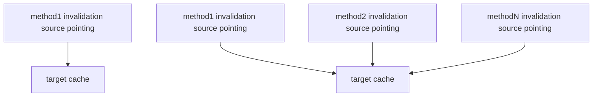

Automatic invalidation cache is to set the matching rules of the invalidation source method in the target cache. When the source method is successfully requested, the target cache will be automatically matched and invalidated, and there is no need to manually clear the cache. When the target cache and the invalidation source are one-to-one or one-to-many, it is very convenient to set the automatic invalidation rule.



## Usage scenarios

1. After editing a list item and submitting it successfully, the cache data of the list item is automatically invalidated.
2. On the server side, for example, the current cache needs to be invalidated after the user's personal information, configuration data, etc. are updated.

## Set automatic invalidation rules

It is very simple to set this rule. You can set the `hitSource` parameter for it when creating a Method instance with cache.

### Set the invalidation source to the method instance

Use a fixed method instance as the invalidation source. As long as the request of this method instance or its cloned instance succeeds, the target cache will be automatically cleared.

```javascript
alova.Get('/todo/1', {
  // ...
  hitSource: alova.Post('/todo', {})
});
```

### Match the invalidation source by method name

Like the method matcher, you can specify the method name in hitSource to match the invalidation source. Multiple invalidation sources can be set to the same name. When the method instance with this name is requested successfully, the target cache will be automatically cleared.

```javascript
const methodSubmitTodo = data =>
  alova.Post('/todo', data, {
    name: 'submitTodo'
  });

alova.Get('/todo/1', {
  // ...
  // Match the invalidation source whose method instance name is submitTodo
  hitSource: 'submitTodo'
});
```

### Match invalidation source by method name regular expression

If the method instance name is not fixed, you can specify a regular expression in hitSource to match the method name. When the matched method instance is requested successfully, the target cache will be automatically cleared.

```javascript
const methodSubmitTodo = data =>
  alova.Post('/todo', data, {
    name: 'prefix-submitTodo'
  });

alova.Get('/todo/1', {
  // ...
  // Match all instances of method instance name starting with prefix
  hitSource: /^prefix/
});
```

### Combining failure sources

If you want to use multiple rules above to match failure sources, you can specify hitSource as an array, where the array item is any of the above 3 rules, and method instances that meet any of the rules in the array will be matched.

```javascript
alova.Get('/todo/1', {
  // ...
  // When the method instance request that satisfies any matching rule in the array is successful, this cache will be invalidated
  hitSource: [alova.Post('/todo', {}), 'submitTodo', /^prefix/]
});
```

## Automatic invalidation scope

Automatic invalidation will search for caches under all alova instances by default. Too many invalidation targets may lead to poor performance. If you want to control the scope of automatic invalidation or turn it off, you can set it as follows.

```js
import { globalConfig } from 'alova';

globalConfig({
  /**
   * Automatic hit cache switch.
   * There are three options here:
   * - global: invalidate cache across alova instances.
   * - self: only invalidate caches from the same alova instance.
   * - close: no longer automatically invalidate cache.
   * Defaults to 'global'
   */
  autoHitCache: 'self'
});
```

## hitSource data type

```typescript
type hitSource = string | RegExp | Method | (string | RegExp | Method)[];
```
