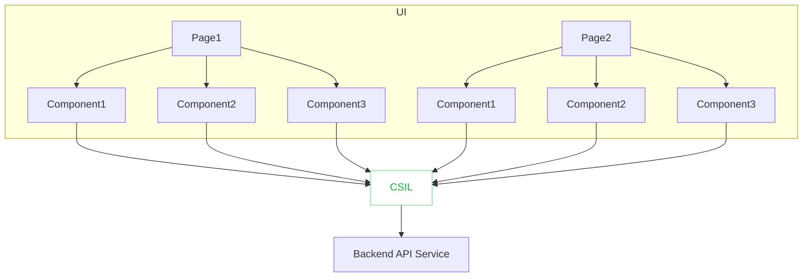
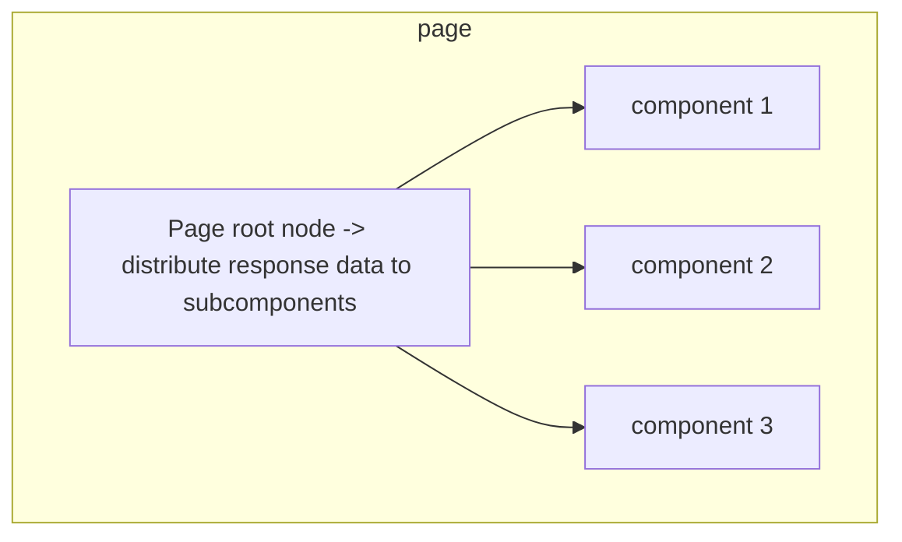
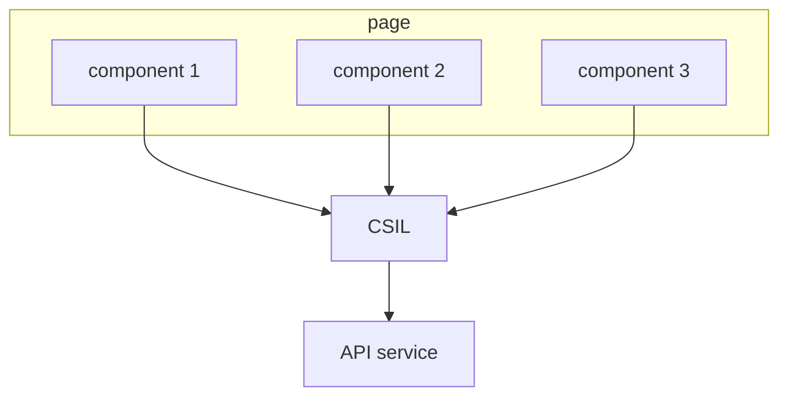

:::tip

This is a practical experience summarized by using alova in depth. Please make sure you have mastered the content of the [alova basics](/tutorial/getting-started/quick-start) section before reading. You can also watch the [5-minute quick start video](/video-tutorial).

:::

You can combine various features of alova to implement the Client-Server Interaction Layer(CSIL) of your application. The CSIL will manage your response data and the responsive states created by useHooks. They will establish a mapping relationship in the CSIL through method instances, thereby eliminating the limitation of component hierarchy. You can access, modify and refresh the data of the CSIL through method instances in any UI component, and call the actions of useHooks.



Let's see what benefits the CSIL can bring us.

## Request point separation

In traditional practice, when a page is divided into multiple components, we need to request data from the root node and distribute it to the subcomponents, which undoubtedly increases the complexity of data transmission.



Now, you can initiate the same request in different components, and the CSIL will merge the requests and distribute the data to these components.



Let's take a closer look at the sample code.

import Tabs from '@theme/Tabs';
import TabItem from '@theme/TabItem';

<Tabs groupId="framework">
<TabItem value="1" label="vue">

<Tabs className="file-tabs">
<TabItem value="1" label="PageRoot.vue">

```html
<template>
  <profile></profile>
  <assets></assets>
</template>

<script setup>
  import Profile from './component/profile.vue';
  import Assets from './component/assets.vue';
</script>
```

</TabItem>
<TabItem value="2" label="./component/profile.vue">

```html
<template>
  <div v-if="loading">loading...</div>
  <div v-else>
    <p>name: {{ data.name }}</p>
    <p>age: {{ data.age }}</p>
  </div>
</template>

<script setup>
  import { useRequest } from 'alova/client';
  const { loading, data } = useRequest(alova.Get('/api/user'));
</script>
```

</TabItem>
<TabItem value="3" label="./component/assets.vue">

```html
<template>
  <div>
    <div v-if="loading">loading...</div>
    <div v-else>
      <p>balance: {{ data.balance }}</p>
      <p>coins: {{ data.coins }}</p>
    </div>
  </div>
</template>

<script setup>
  import { useRequest } from 'alova/client';
  const { loading, data } = useRequest(alova.Get('/api/user'));
</script>
```

</TabItem>
</Tabs>

</TabItem>
<TabItem value="2" label="react">

<Tabs className="file-tabs">
<TabItem value="1" label="PageRoot.jsx">

```jsx
import Profile from './component/profile';
import Assets from './component/assets';

const App = () => {
  return (
    <>
      <Profile></Profile>
      <Assets></Assets>
    </>
  );
};
```

</TabItem>
<TabItem value="2" label="./component/profile.jsx">

```jsx
import { useRequest } from 'alova/client';

const Profile = () => {
  const { loading, data } = useRequest(alova.Get('/api/user'));
  return loading ? (
    <div>loading...</div>
  ) : (
    <div>
      <p>name: {data.name}</p>
      <p>age: {data.age}</p>
    </div>
  );
};
```

</TabItem>
<TabItem value="3" label="./component/assets.jsx">

```jsx
import { useRequest } from 'alova/client';

const Assets = () => {
  const { loading, data } = useRequest(alova.Get('/api/user'));
  return loading ? (
    <div>loading...</div>
  ) : (
    <div>
      <p>balance: {data.balance}</p>
      <p>coins: {data.coins}</p>
    </div>
  );
};
```

</TabItem>
</Tabs>

</TabItem>
<TabItem value="3" label="svelte">

<Tabs className="file-tabs">
<TabItem value="1" label="PageRoot.svelte">

```html
<script>
  import Profile from './component/profile.svelte';
  import Assets from './component/assets.svelte';
</script>

<profile></profile>
<assets></assets>
```

</TabItem>
<TabItem value="2" label="./component/profile.svelte">

```html
<script>
  import { useRequest } from 'alova/client';
  const { loading, data } = useRequest(alova.Get('/api/user'));
</script>

{#if $loading}
<div>loading...</div>
{#else}
<div>
  <p>name: {$data.name}</p>
  <p>age: {$data.age}</p>
</div>
{/if}
```

</TabItem>
<TabItem value="3" label="./component/assets.svelte">

```html
<script>
  import { useRequest } from 'alova/client';
  const { loading, data } = useRequest(alova.Get('/api/user'));
</script>

{#if $loading}
<div>loading...</div>
{#else}
<div>
  <p>balance: {$data.balance}</p>
  <p>coins: {$data.coins}</p>
</div>
{/if}
```

</TabItem>
</Tabs>

</TabItem>
</Tabs>

## Responsive states centralized management

Since responsive states is managed in the CSIL, you can quickly update or refresh them across components. For example, you can use it in the following scenarios:

- Update list after adding/editing list items
- Notify the previous page to refresh data in the App
- Refresh the menu bar after editing permissions

### Update states across components

Use [`updateState`](/tutorial/client/in-depth/update-across-components) and pass in a method instance to implement cross-component update responsive state. In addition, you can also let the CS interaction layer [manage custom states](/tutorial/client/in-depth/manage-extra-states) to allow custom states to support cross-component updates.

### Refresh data across components

There are two ways to refresh data across components.

- Pass in a method instance through [`useFetcher`](/tutorial/client/strategy/use-fetcher), which will re-request data and update the responsive states corresponding to this method instance.
- Cross-component triggering of useHooks actions to complete data refresh, please refer to [action delegation middleware](/tutorial/client/strategy/action-delegation-middleware) for details

## Centralized management of response data

When response data caching is enabled, the CSIL will cache response data according to certain rules, and the same request will reuse cached data to improve performance. For details, please refer to the [Response Cache](/tutorial/cache) section. In addition, you can also predict the data that the user will access next, use [`useFetcher`](/tutorial/client/strategy/use-fetcher) to pre-request the data and put it in the cache.

### Cache timeliness

There is a question that everyone is very concerned about, how to ensure the timeliness of the cache? Alova also provides a variety of ways to handle the timeliness of the cache.

- [Automatic Invalidation](/tutorial/cache/auto-invalidate): Automatically invalidate the specified cache by setting invalidation rules.
- [Cache Penetration](/tutorial/cache/force-request): For data with high timeliness, you can obtain the latest data through forced requests.
- [Scheduled update](/tutorial/client/strategy/use-auto-request): Use `useAutoRequest` to automatically update data in different scenarios.
- [Manual invalidation](/tutorial/cache/manually-invalidate): If none of the above methods are suitable, you can manually call the invalidation function.
