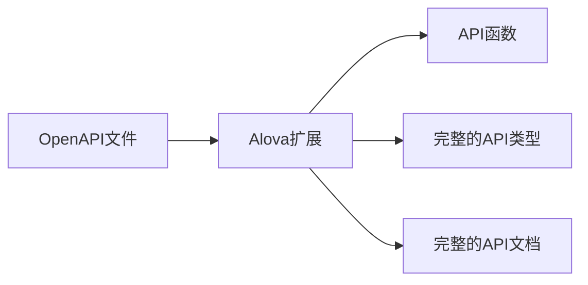

import Link from '@docusaurus/Link';
import NavCard from '@site/src/components/NavCard';
import Examples from '@site/src/components/Examples';
import SupportList from '@site/src/components/SupportList';
import tts from '@site/static/audio/tts.mp3';
import AudioPlayer from '@site/src/components/AudioPlayer';

## alova 是什么？

alova（读作`/əˈləʊva/`<AudioPlayer src={tts} />） 是一个流程简化的下一代请求工具，帮你极致地简化 API 集成工作流。


它可以将 API 集成工作流从 7 个步骤简化为 1 个步骤，你只需要选择 API 即可使用。

## 如何做的？

### 核心功能

alova 提供了基础的，与 axios 相似的基础请求能力，你可以配合 axios、fetch 等任何请求库使用，获得响应缓存、请求共享等开箱即用的特性，一个最简单的请求示例如下。

```js
const response = await alova.Get('/api/user');
```

### 请求策略

基于 alova 的核心功能，还提供了完整的应对复杂请求场景的方案，我们称之为**请求策略**，只需一行代码就能快速实现各种复杂的请求逻辑，不仅能帮你提升开发效率，还能帮你提升 App 的运行效率，降低服务端压力。

例如，`useRequest`可以自动管理请求状态，**`loading/error/data` 是响应式的数据**，在 react、vue、svelte 等 UI 框架中可以直接在视图中绑定它们，而且会根据请求状态自动维护这些响应式数据。

```javascript
const { loading, error, data } = useRequest(alova.Get('/api/user'));
```

再来一个分页请求策略，它包含响应式状态、操作函数、事件，并且**当`page/pageSize`等发生变化时会自动以不同参数触发请求**。

```javascript
const {
  // 响应式状态
  loading,
  error,
  data,
  page,
  pageSize,
  total,

  // 操作函数
  refresh,
  insert,
  replace,
  remove,
  reload

  // 事件
  onSuccess,
  onFetchSuccess,
  onError,
  onFetchError
} = usePagination((page, size) =>
  alova.Get('/api/user/list', {
    params: { page, size }
  })
);
```

alova 提供了 15+个基于[RSM](/about/RSM)规范的请求策略模块，它们以 useHook 或 function 的形式实现。

### 编辑器扩展

在 vscode 中使用 alova 扩展可以同时为你自动生成三项 API 信息，分别是 API 请求代码、对应的请求参数和响应数据类型、对应 API 的完整文档信息，无论是 ts 项目还是 js 项目，你都可以在编辑器中获得完整的 API 类型的智能提示，此外，还能在编辑器中快速查看 API 文档。



这个扩展也优化了 API 的使用流程，让你感受不一样的 API 集成体验，在过去，你需要先查询 API 文档，并不断地在 API 文档与编辑器切换来编写请求代码，使用 alova 扩展后，你可以不再需要离开编辑器，直接在编辑器中通过 API 的路径或描述关键字快速插入 API 并自动补全不要的请求参数。

> 关于 alova 扩展的详细介绍，请参考 [集成编辑器扩展](/tutorial/getting-started/extension-integration)。

## 有什么不同吗？

与其他请求库不同的是，alova 的目标是让请求变得非常简单，并且保持更高效的数据交互。

我们为开发者和 App 使用者双方考虑，对于开发者来说，alova 为他们提供了极致的使用体验，对于应用的用户来说，他们可以享受到 alova 的高性能数据交互带来的流畅体验。

此外，再从具体的特性来看看：

- 与 axios 相似的 api 设计，让使用者学习成本更低；
- 高性能的客户端和服务端请求策略，让应用更流畅；
- 灵活性高，alova 的适配器可以让 alova 在任何 js 环境下，与任何 UI 框架协作使用，并且提供了统一的使用体验和完美的代码迁移；
- 2 种缓存模式和请求共享机制，提升请求性能并降低服务端压力；
- api 代码的高聚合组织，每个 api 的请求参数、缓存行为、响应数据转换等都将聚集在相同的代码块中，这对于管理大量的 api 有很大的优势；

:::info 对比

你还可以查看请[与其他请求库比较](/about/comparison)详细了解 alova 的不同之处。

:::

## 在任何 JS 环境下运行

不仅如此，alova 的灵活性非常高，你可以在以下任意的 JS 环境下，配合不同的请求工具使用（灰色部分将在未来逐渐支持）。

<SupportList showStatus></SupportList>

## 示例

这里为你准备了丰富的示例，帮助你快速体验 alova 的各种功能。

<Examples />

## 迁移指南

- [从 v2 迁移到 v3](/tutorial/project/migration/v2-to-v3)
- [从 axios 低成本迁移到 alova 的指南](/tutorial/project/migration/from-axios)

## 脚手架推荐

<NavCard list={[
{
Image: ,
title: 'Uniapp 脚手架 - unibest',
desc: '集成了最新前端技术栈的跨端解决方案',
link: 'https://codercup.github.io/unibest-docs/',
target: '__blank'
}
]}></NavCard>

## 加入 alova 社区

import ImgDiscord from '@site/static/img/discord.svg';
import ImgX from '@site/static/img/x.svg';
import ImgWechat from '@site/static/img/wechat.svg';
import wechatQrcode from '@site/static/img/wechat_qrcode.jpg';

<NavCard list={[
{
Image: <ImgDiscord />,
title: 'Discord',
desc: '社区的 GPT 机器人为你解答',
link: 'https://discord.gg/S47QGJgkVb',
target: '__blank'
},
{
Image: <ImgWechat />,
title: '微信',
desc: '在群聊交流，更快获得回应',
link: wechatQrcode,
target: '__blank'
},
{
Image: <ImgX />,
title: 'X',
desc: '关注我们，持续获得最新动态',
link: 'https://x.com/alovajs',
target: '__blank'
}
]}></NavCard>

## 欢迎参与贡献

在参与贡献前，请务必详细阅读 [贡献指南](/contributing/overview)，以保证你的有效贡献。

## 让我们开始吧

接下来，我们将从最简单的请求开始，再到请求策略的讲解，了解 alova 如何简化你的工作，再深入到进阶指南，以及在实际项目中总结的最佳实践。

让我们开始学习 alova 吧！

<NavCard list={[
{
title: '5 分钟快速入门视频',
desc: '在 5 分钟内学会使用 alova',
link: '/video-tutorial'
},
{
title: '快速开始文档',
desc: '更详细地学习 alova，自由掌控学习时间',
link: '/tutorial/getting-started/quick-start'
}
]}></NavCard>
