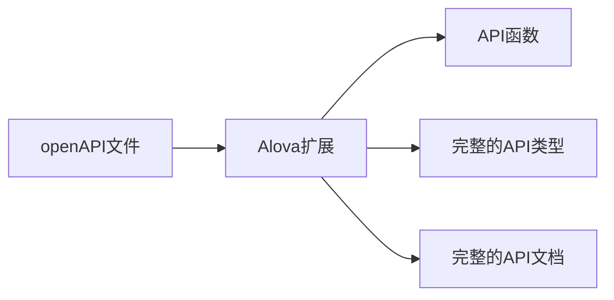
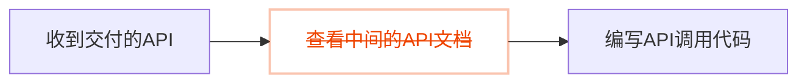

import Link from '@docusaurus/Link';
import NavCard from '@site/src/components/NavCard';
import Examples from '@site/src/components/Examples';
import SupportList from '@site/src/components/SupportList';
import tts from '@site/static/audio/tts.mp3';
import AudioPlayer from '@site/src/components/AudioPlayer';
import IconFont from '@site/src/components/IconFont';
import Tabs from '@theme/Tabs';
import TabItem from '@theme/TabItem';

## alova 是什么？

alova（读作`/əˈləʊva/`<AudioPlayer src={tts} />） 是一个请求工具集，帮助开发者极致高效地集成你的APIs，它完美兼容你最喜欢的HTTP client和UI框架，快速开发客户端和服务的应用的业务逻辑，同时让API信息与代码进行交互，像虫洞一样拉近后端协作距离。

你可以在 [为什么创造 alova](/about/faqs) 中了解背景故事，我们也提供了一份详细的 [对比与其他请求库](/about/comparison) 了解 alova 的差异。

## 特性

- 简单易用，[观看视频](/video-tutorial)5分钟上手。
- 完美兼容你最喜欢的技术栈。
- 20+ 高性能的业务模块，帮助你快速开发性能更好的应用。
- 更先进的 openAPI 解决方案，在代码中和API信息高效交互。
- 请求共享和响应缓存，提升应用性能。
- 类型安全。

alova兼容以下技术栈，灰色部分将在未来逐渐支持。

<SupportList showStatus></SupportList>

## 在线体验

这里为你准备了丰富的示例，帮助你快速体验 alova 的各种功能。

<Examples />

## 如何做的？

alova 提供了完整的应对复杂请求场景的方案，我们称之为**请求策略**，它们包含客户端请求策略和服务端请求策略。

### 客户端请求策略

在客户端，请求策略以 hooks、拦截器和中间件的形式实现，使用不同的请求策略应对不同场景下的请求，它们对每一个请求场景都提供了完整的状态化参数、事件和操作函数，只需一行代码就能快速实现各种复杂的请求逻辑，不仅能帮你提升开发效率，还能帮你提升 App 的运行效率，降低服务端压力。

以下是部分客户端请求策略的介绍和示例，请选择你感兴趣的展开查看。

<details>
<summary>监听请求策略</summary>

监听请求策略用于随数据变化而重新请求的场景，例如模糊搜索、tab 栏切换等。

```javascript
const {
  // 响应式状态
  loading,
  error,
  data,

  // 事件
  onSuccess,
  onError,
  onComplete,

  // 操作函数
  send,
  update

  // ...
} = useWatcher(
  () =>
    alova.Get('/api/user', {
      params: {
        type: activeTab
      }
    }),
  [activeTab]
);
```

前往[监听请求策略](/tutorial/client/strategy/use-watcher) 查看详情。

</details>

<details>
<summary>分页请求策略</summary>

分页请求策略帮助你快速实现包含翻页、条件查询、下一页数据预拉取、插入/替换/移除数据项、刷新和重置等完整的分页数据请求场景。

```javascript
const {
  // 响应式状态
  loading,
  error,
  data,
  page,
  pageSize,
  total,

  // 事件
  onSuccess,
  onFetchSuccess,
  onError,
  onFetchError,

  // 操作函数
  refresh,
  insert,
  replace,
  remove,
  reload,
  send,
  abort,
  update

  // ...
} = usePagination(
  (page, size) =>
    alova.Get('/api/user/list', {
      params: { page, size }
    }),
  {
    preloadNextPage: true,
    watchingStates: [username, sex],
    debounce: 500
  }
);
```

前往[分页请求策略](/tutorial/client/strategy/use-pagination) 查看详情。

</details>

<details>
<summary>Token身份认证策略</summary>

Token 身份认证策略提供全局的拦截器，它可以帮你统一维护 Token 身份认证的所有代码，包括登录、登出、token 附带、token 刷新等，并支持无感刷新 token。

```javascript
const { onAuthRequired, onResponseRefreshToken } = createServerTokenAuthentication({
  refreshTokenOnError: {
    isExpired: res => res.status === 401,
    refrshTokenOnError: async () => {
      const { token, refresh_token } = await refreshToken();
      localStorage.setItem('token', token);
      localStorage.setItem('refresh_token', refresh_token);
    }
  }
});
const alovaInstance = createAlova({
  beforeRequest: onAuthRequired(),
  responded: onResponseRefreshToken()
});
```

前往[Token 认证拦截器](/tutorial/client/strategy/token-authentication) 查看详情。

</details>

<details>
<summary>表单提交策略</summary>

通过表单提交策略，你可以快速实现表单草稿、多页面（多步骤）表单，除此以外还提供了表单重置等常用功能。

```javascript
const {
  // 响应式状态
  loading: submiting,
  error,
  form,

  // 事件
  onSuccess,
  onError,
  onComplete,

  // 操作函数
  send: submit,
  updateForm,
  abort

  // ...
} = useForm(formData => alova.Post('/user/profile', formData), {
  initialForm: {
    name: '',
    age: '',
    avatar: null
  },
  resetAfterSubmiting: true,
  store: true
});
```

前往[表单提交策略](/tutorial/client/strategy/use-form) 查看详情。

</details>

<details>
<summary>数据拉取策略</summary>

提前拉取数据必要的数据，用户不再需要等待数据加载的过程，从而提升用户体验。

```javascript
const {
  // 响应式状态
  loading,
  error,

  // 事件
  onSuccess,
  onError,
  onComplete,

  // 操作函数
  fetch,
  update,
  abort

  // ...
} = useFetcher();

const handleItemClick = itemId => {
  fetch(
    alova.Get('/api/user/detail', {
      params: {
        id: itemId
      }
    })
  );
};
```

前往[数据预拉取](/tutorial/client/strategy/use-fetcher) 查看详情。

</details>

<details>
<summary>无感数据交互策略</summary>

无感数据交互是指用户在与应用进行交互时，无需等待即可立即展示相关内容，或者提交信息时也无需等待即可展示操作结果，就像和本地数据交互一样，从而大幅提升应用的流畅性，它让用户感知不到数据传输带来的卡顿。

```javascript
const {
  // 响应式状态
  data,
  loading,
  error,

  // 事件
  onSuccess,
  onError,
  onComplete,
  onBeforePushQueue,
  onPushedQueue,
  onFallback,

  // 操作函数
  send: submit,
  abort,
  update

  // ...
} = useSQRequest(() => alova.Get('/api/todo/add'), {
  behavior: 'silent',
  queue: 'queue-demo',
  silentDefaultResponse: () => {
    return {
      id: '--'
    };
  }
});
```

前往[无感数据交互](/tutorial/client/strategy/seamless-data-interaction) 查看详情。

</details>

<details>
<summary>跨组件请求触发中间件</summary>

跨组件请求触发中间件可以帮你消除组件层级的限制，在任意组件中快速地触发任意请求的操作函数。

<Tabs className="file-tabs">
<TabItem value="1" label="ComponentA">

```javascript
useRequest(alova.Get('/api/todo/list'), {
  // ...
  middleware: actionDelegationMiddleware('action:todoList')
});
```

</TabItem>
<TabItem value="2" label="ComponentB">

```javascript
accessAction('action:todoList', delegatedActions => {
  delegatedActions.send();
  delegatedActions.abort();
});
```

</TabItem>
</Tabs>

前往[跨组件触发请求](/tutorial/client/strategy/action-delegation-middleware) 查看详情。

</details>

<details>
<summary>验证码策略</summary>

快速实现验证码发送。

```javascript
const mobile = ref('');
const {
  // 响应式状态
  loading: sending,
  countdown,
  error,

  // 事件
  onSuccess,
  onError,
  onComplete,

  // 操作函数
  send,
  abort,
  update

  // ...
} = useCaptcha(
  () =>
    alova.Post('/api/captcha', {
      mobile: mobile
    }),
  {
    initialCountdown: 60
  }
);
```

前往[验证码策略](/tutorial/client/strategy/use-captcha) 查看详情。

</details>

请前往 [请求策略列表](/tutorial/client/strategy) 查看全部客户端请求策略。

### 服务端请求策略

在服务端中例如`nodejs/deno/bun`，alova还提供了服务端的请求策略，称之为 **server hooks**，它们都支持集群模式。

以下是部分server hooks的介绍和示例，请选择你感兴趣的展开查看。

<details>
<summary>请求重试策略</summary>

请求失败时重新发起请求。

```javascript
const response = await retry(alova.Get('/api/user'), {
  retry: 5
});
```

前往[请求重试策略](/tutorial/server/strategy/retry) 查看详情。

</details>

<details>
<summary>请求速率限制策略</summary>

限制在一定时间的请求次数，支持集群模式。

```javascript
const limit = createRateLimiter({
  points: 4,
  duration: 60 * 1000
});
const orderRes = await limit(alova.Get('/api/order'));
```

前往[请求速率限制策略](/tutorial/server/strategy/rate-limit) 查看详情。

</details>

### 更先进的 openAPI 解决方案

1. alova 的开发工具能够同时生成 API 调用代码，以及每个 API 的 TypeScript 类型和详尽的 API 文档，即使在 JavaScript 项目中也能享受到完整的 API 类型提示。



2. 在过去，当后端开发者交付 API 给你后，你需要先打开中间的 API 文档查询并复制关键信息到你的项目里，你需要不断地在中间的 API 文档与编辑器切换，但现在，alova 的开发工具可以为你消除中间的 API 文档，像虫洞一样拉近前后端的协作距离。通过它你可以在编辑器中快速查找所需的 API 并展示这个 API 的完整文档，参照 API 参数表快速完成参数传递，让你感受不一样的 API 集成体验。



> 关于 alova 开发工具的详细介绍，请参考 [集成编辑器扩展](/tutorial/getting-started/extension-integration)。

## 构建 Client-Server 交互层

通过 alova 的各种特性，你还可以为你的项目构建 Client-Server 交互层（CS 交互层），CS 交互层将会以合并相同请求的方式分发响应数据到各个组件中，此外，CS 交互层还管理响应数据和 useHooks 所创建的响应式状态，你可以在任意的 UI 组件中访问和修改 CS 交互层的数据，以及刷新 CS 交互层数据。

> 如果你想要构建 CS 交互层，请参考[构建 Client-Server 交互层](/tutorial/project/best-practice/csil)

## 迁移指南

- [从 v2 迁移到 v3](/tutorial/project/migration/v2-to-v3)
- [从 axios 低成本迁移到 alova 的指南](/tutorial/project/migration/from-axios)

## 加入 alova 社区

import ImgDiscord from '@site/static/img/discord.svg';
import ImgX from '@site/static/img/x.svg';
import ImgWechat from '@site/static/img/wechat.svg';
import wechatQrcode from '@site/static/img/wechat_qrcode.jpg';

<NavCard list={[
{
Image: <ImgDiscord />,
title: 'Discord',
desc: '社区的 GPT 机器人为你解答',
link: 'https://discord.gg/S47QGJgkVb',
target: '__blank'
},
{
Image: <ImgWechat />,
title: '微信',
desc: '在群聊交流，更快获得回应',
link: wechatQrcode,
target: '__blank'
},
{
Image: <ImgX />,
title: 'X',
desc: '关注我们，持续获得最新动态',
link: 'https://x.com/alovajs',
target: '__blank'
}
]}></NavCard>

## 欢迎参与贡献

在参与贡献前，请务必详细阅读 [贡献指南](/contributing/overview)，以保证你的有效贡献。

## 让我们开始吧

接下来，我们将从最简单的请求开始，再到请求策略的讲解，了解 alova 如何简化你的工作，再深入到进阶指南，以及在实际项目中总结的最佳实践。

让我们开始学习 alova 吧！

<NavCard list={[
{
Image: <IconFont name="shipin" />,
title: '5 分钟快速入门视频',
desc: '在 5 分钟内学会使用 alova',
link: '/video-tutorial'
},
{
Image: <IconFont name="wenjian" />,
title: '快速开始文档',
desc: '更详细地学习 alova，自由掌控学习时间',
link: '/tutorial/getting-started/quick-start'
}
]}></NavCard>
