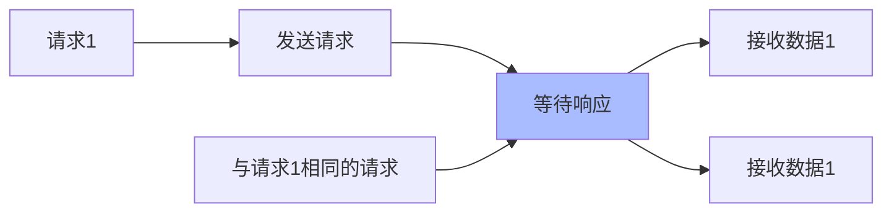

在上一个章节中我们尝试发送了请求，获取响应数据。实际上，`alovaInstance.Get(...)`并不是一个发起请求的函数，而是创建了一个 method 实例，它是一个 PromiseLike 实例，你可以通过`then、catch、finally`方法或`await`发送请求，就像 Promise 对象一样。

```javascript
const userMethodInstance = alovaInstance.Get('/api/user');

userMethodInstance.then(response => {
  // ...
});

userMethodInstance.catch(error => {
  // ...
});

userMethodInstance.finally(() => {
  // ...
});

try {
  await userMethodInstance;
} catch (error) {
  // ...
} finally {
  // ...
}
```

简便写法：

```javascript
const response = await alovaInstance.Get('/api/user');
```

每个 method 实例描述了每个请求的类型、请求 url、请求头、请求参数等。此外，你还可以在 method 实例上定义请求行为，来控制 method 以什么方式处理请求。

## 请求类型

alova 共提供了 GET、POST、PUT、DELETE、HEAD、OPTIONS、PATCH 7 种请求类型。

| 实例创建函数 | 参数                                          |
| ------------ | --------------------------------------------- |
| GET          | `alovaInstance.Get(url[, config])`            |
| POST         | `alovaInstance.Post(url[, data[, config]])`   |
| PUT          | `alovaInstance.Put(url[, data[, config]])`    |
| DELETE       | `alovaInstance.Delete(url[, data[, config]])` |
| HEAD         | `alovaInstance.Head(url[, config])`           |
| OPTIONS      | `alovaInstance.Options(url[, config])`        |
| PATCH        | `alovaInstance.Patch(url[, data[, config]])`  |

参数说明：

- `url`是请求路径；
- `data`为请求体数据；
- `config`为请求配置对象，其中包含了请求头、params 参数等、请求行为参数等配置；

你也可以自定义创建 method 实例，这在动态指定请求类型时很有用。

```javascript
import { Method } from 'alova';

const method = new Method('GET', alovaInstance, '/api/users', {
  params: {
    ID: 1
  }
});
```

接下来我们先来看下如何定义请求参数，你应该会觉得很熟悉。

## 请求参数

### URL 参数

通过 params 传入 URL 参数，params 参数会在 url 后面以?的形式拼接。

```javascript
alovaInstance.Get('/todo/list', {
  params: {
    userId: 1
  }
});
```

当然，你也可以直接拼接在 url 后面，效果是相同的。

```javascript
alovaInstance.Get('/todo/list?userId=1');
```

### 请求体

当发送 **POST、PUT、DELETE、PATCH 请求** 时可以通过请求体发送数据，此时第二个参数传入的是请求体，值得注意的是，POST 请求也可以传入 params 参数。

```javascript
alovaInstance.Post(
  '/todo',
  // 第二个参数是请求体
  {
    title: 'test todo',
    time: '12:00'
  },
  // 第三个参数是配置
  {
    params: {
      userId: 1
    }
  }
);
```

### 请求头

通过 headers 指定请求头。

```javascript
alovaInstance.Get('/user', {
  headers: {
    'Content-Type': 'application/json;charset=UTF-8'
  }
});
```

### 其他请求适配器支持的参数

除了请求头、params 参数等外，还支持配置对应请求适配器支持的参数，当使用`alova/fetch`作为 alova 的请求适配器时，就可以在 method 实例上配置任何`fetch API`支持的参数，这些参数会在请求时传给`fetch`函数。

```javascript
alovaInstance.Get('/todo/list', {
  // ...
  // highlight-start
  credentials: 'same-origin',
  referrerPolicy: 'no-referrer',
  mode: 'cors'
  // highlight-end
});
```

以上 method 实例在通过`fetch`发送请求时，将会以以下参数请求。

```javascript
fetch('/todo/list', {
  // ...
  // highlight-start
  credentials: 'same-origin',
  referrerPolicy: 'no-referrer',
  mode: 'cors'
  // highlight-end
});
```

> 详情请查看[fetch 适配器](/resource/request-adapter/fetch)。

如果你使用了其他的请求适配器，也可以传递它们支持的参数。

## 请求行为

在[RSM](/about/RSM)中，请求行为用于描述将以怎样的方式处理请求。

### 超时时间

设置请求超时时间。

```javascript
// 请求级别的请求超时时间
alovaInstance.Get('/todo/list', {
  // ...
  // highlight-start
  timeout: 10000
  // highlight-end
});
```

### 请求共享

我们总会遇到这种情况，当一个请求发出但还未响应时，又发起了相同请求，就造成了请求浪费，或者重复提交问题，例如以下三种场景：

1. 一个组件在创建时会获取初始化数据，当一个页面同时渲染多个此组件时，将会同时发出多次相同请求；
2. 提交按钮未被禁用，用户点击了多次提交按钮；
3. 当预加载还未完成时进入了预加载页面，将会发起多次相同请求；
4. 在 react 的 StrictMode 下防止重复发送请求；

共享请求就是用来解决这些问题的，它不仅可以提升应用流畅性，还能降低服务端压力。



请求共享默认开启，如果你希望在特定请求上关闭共享请求，可以这样做：

```javascript
alovaInst.Get('/todo', {
  // ...
  // highlight-start
  shareRequest: false
  // highlight-end
});
```

但需要注意的是，当 request body 是 FormData 时，将会被认为你是有意图和服务端通信的，在这种情况下不会触发请求共享。

:::warning 如何识别相同请求

通过 method 实例的请求方法、请求 url、请求头、url 参数、请求体组合作为唯一标识，标识相同即表示为相同请求，而不是对比 method 实例的引用地址。

:::

### 转换响应数据

有时候我们需要统一转换响应数据，我们可以为 method 实例设置`transform`函数将响应数据转换成需要的结构。

```javascript
alovaInstance.Get('/todo/list', {
  // 函数接受响应数据和响应头数据，并要求将转换后的数据返回。
  transform(rawData, headers) {
    return rawData.list.map(item => {
      return {
        ...item,
        statusText: item.done ? '已完成' : '进行中'
      };
    });
  }
});
```

### 响应缓存

响应缓存让你可以更好地多次利用服务端数据，而不需要每次请求时都发送请求获取数据。GET 请求将默认设置 5 分钟的内存缓存时间，如果你不需要可以通过以下方式关闭当前请求的缓存。

```ts
alovaInstance.Get('/todo/list', {
  // 设置为0或者null关闭默认的响应缓存
  cacheFor: 0
});
```

详细内容可参考[响应缓存](/tutorial/cache/mode)

## 中断请求

调用 method 实例的`abort`中断请求。

```javascript
const userMethod = alovaInstance.Get('/api/user');
userMethod.then(res => {
  // ...
});

const handleCancel = () => {
  // highlight-start
  userMethod.abort();
  // highlight-end
};
```

## 监听上传下载进度

通过 method 实例的`onUpload`绑定上传进度事件，`onDownload`绑定下载进度事件，它将返回解绑函数。

```javascript
const uploadMethod = alovaInstance.Post('/todo/uploadfile', formData);
const offUploadEvent = uploadMethod.onUpload(event => {
  console.log('文件大小：'，event.total);
  console.log('已上传：'，event.loaded);
});

uploadMethod.then(res => {
  // ...
});

// 解绑上传回调
const handleOffEvent = () => {
  offUploadEvent();
};
```

```javascript
const downloadMethod = alovaInstance.Get('/todo/downloadfile');
const offDownloadEvent = downloadMethod.onDownload(event => {
  console.log('文件大小：'，event.total);
  console.log('已下载：'，event.loaded);
});

downloadMethod.then(res => {
  // ...
});

// 解绑下载回调
const handleOffEvent = () => {
  offDownloadEvent();
};
```

:::warning 使用`alova/fetch`适配器需注意

因 fetch api 限制，alova 提供的 `alova/fetch` 适配器不支持上传进度，如果需要上传进度，请使用[XMLHttpRequest 适配器](/resource/request-adapter/xhr)或[axios 适配器](/resource/request-adapter/axios)。

也可以自行编写请求适配器，详见 [编写请求适配器](/tutorial/advanced/custom/http-adapter)。

:::

**上传/下载状态类型**

```typescript
type Progress = {
  /** 上传或下载的数据总数据量 */
  total: number;
  /** 已完成的数据 */
  loaded: number;
};
```
