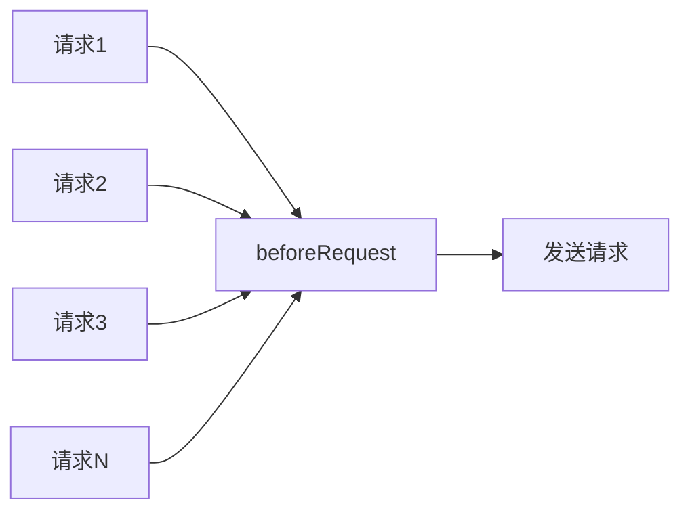
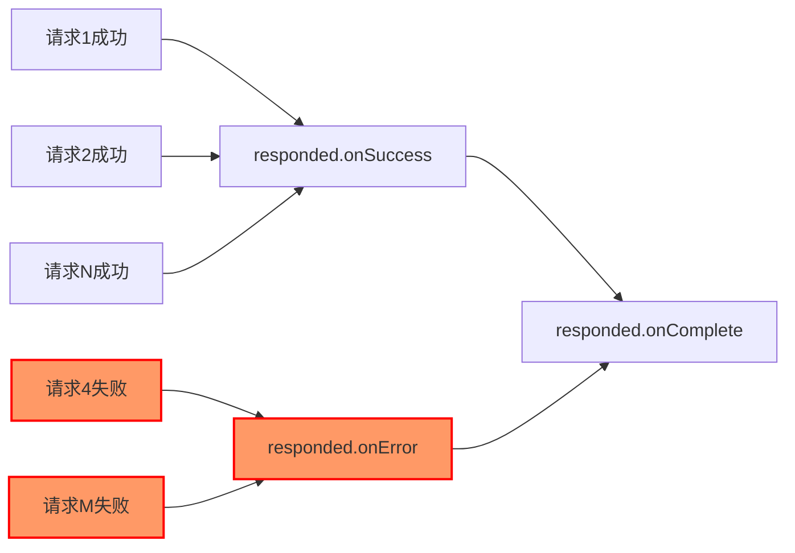

import Tabs from '@theme/Tabs';
import TabItem from '@theme/TabItem';

## 全局的请求拦截器

通常，我们需要让所有请求都用上相同的配置，例如添加 token、timestamp 到请求头，此时我们可以设置一个全局的请求拦截器，它将在所有请求前被触发，我们可以在此拦截器中统一设置请求参数。



```javascript
const alovaInstance = createAlova({
  // ...
  // 函数参数为一个method实例，包含如url、params、data、headers等请求数据
  // 你可以自由修改这些数据
  // highlight-start
  beforeRequest(method) {
    // 假设我们需要添加token到请求头
    method.config.headers.token = 'token';
  }
  // highlight-end
});
```

你也可以将 beforeRequest 设置为异步函数。

```javascript
const alovaInstance = createAlova({
  // ...
  // highlight-start
  async beforeRequest(method) {
    // 执行一些异步任务
    // ...
  }
  // highlight-end
});
```

## 全局的响应拦截器

当我们希望统一解析响应数据、统一处理错误，以及统一处理请求完成时，此时可以在创建 alova 实例时指定全局的响应拦截器，响应拦截器包括请求成功的拦截器、请求失败的拦截器，和请求完成的拦截器。



```javascript
const alovaInstance = createAlova({
  // ...
  // 使用 responded 对象分别指定请求成功的拦截器和请求失败的拦截器
  responded: {
    // highlight-start
    // 请求成功的拦截器
    // 当使用 `alova/fetch` 请求适配器时，第一个参数接收Response对象
    // 第二个参数为当前请求的method实例，你可以用它同步请求前后的配置信息
    onSuccess: async (response, method) => {
      if (response.status >= 400) {
        throw new Error(response.statusText);
      }
      const json = await response.json();
      if (json.code !== 200) {
        // 抛出错误或返回reject状态的Promise实例时，此请求将抛出错误
        throw new Error(json.message);
      }

      // 解析的响应数据将传给method实例的transform钩子函数，这些函数将在后续讲解
      return json.data;
    },
    // highlight-end

    // highlight-start
    // 请求失败的拦截器
    // 请求错误时将会进入该拦截器。
    // 第二个参数为当前请求的method实例，你可以用它同步请求前后的配置信息
    onError: (err, method) => {
      alert(err.message);
    },
    // highlight-end

    // highlight-start
    // 请求完成的拦截器
    // 当你需要在请求不论是成功、失败、还是命中缓存都需要执行的逻辑时，可以在创建alova实例时指定全局的`onComplete`拦截器，例如关闭请求 loading 状态。
    // 接收当前请求的method实例
    onComplete: async method => {
      // 处理请求完成逻辑
    }
    // highlight-end
  }
});
```

如果不需要设置请求失败或完成的拦截器，可以直接传入请求成功的拦截器函数，而不再需要通过对象来设置回调。

```javascript
const alovaInstance = createAlova({
  // ...
  // highlight-start
  async responded(response, method) {
    // 请求成功的拦截器
  }
  // highlight-end
});
```

:::info 拦截器触发说明

当你使用`alova/fetch`请求适配器时，由于`window.fetch`的特点，只有在连接超时或连接中断时才会触发`onError`拦截器，其他情况均会触发`onSuccess`拦截器，[详情请查看这边](https://developer.mozilla.org/docs/Web/API/fetch)

:::

:::warning 特别注意

1. `onSuccess`、`onError`和`onComplete`均可以设为同步函数和异步函数。
2. `onError` 回调是请求错误的捕获函数，`onSuccess` 中抛出错误不会触发 `onError`。当捕获错误但没有抛出错误或返回 reject 状态的 Promise 实例，将认为请求是成功的，且不会获得响应数据。

:::
