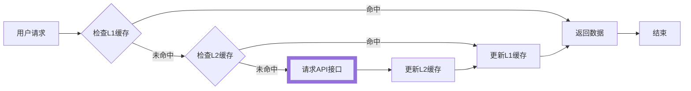

在前面的[快速开始](/tutorial/getting-started/quick-start)中已经介绍过，alova 可以在`nodejs/deno/bun`等服务端环境中使用，你可以在服务端使用除客户端请求策略外的所有功能，此外，alova 还针对服务端环境提供了很好的支持。

```js
import { createAlova } from 'alova';
import adapterFetch from 'alova/fetch';

const alovaInstance = createAlova({
  requestAdapter: adapterFetch()
});

alovaInstance.Get(...);
alovaInstance.Post(...);
```

## Server hooks

在服务端中，我们也有不同的请求场景，例如请求重试、调用 API 发送验证码等，我们称为`Server hooks`，它们是 method 实例的装饰函数，并且可以多个`Server hooks`组合使用。

以下是组合了`retry`和`sendCaptcha`的示例，它实现了以失败重试的方式发送验证码：

```js
const { retry, createCaptchaProvider } = require('alova/server');

const { sendCaptcha } = createCaptchaProvider({
  store: redisAdapter
});

// step1: 创建一个发送验证码的method实例
const createCaptchaMethod = (code, key) = > alovaInstance.Post('/api/captcha', {
  code,
  email: key,
});

// step2: 使用sendCaptcha hook包装createCaptchaMethod
const captchaMethod = sendCaptcha(createCaptchaMethod, {
  key: 'xxx@xxx.com'
});

// step3: 使用retry hook包装captchaMethod，并通过await发送请求并获取响应结果
const result = await retry(captchaMethod, {
  retry: 3,
  backoff: {
    delay: 2000
  }
});
```

你也可以直接使用多个`server hooks`包装 method 实例。

```javascript
const result = await retry(
  sendCaptcha(
    (code, key) =>
      alovaInstance.Post('/api/captcha', {
        email,
        content: 'captcha content'
      }),
    { key: 'xxx@xxx.com' }
  ),
  {
    retry: 3,
    backoff: {
      delay: 2000
    }
  }
);
```

> 了解更多`Server hooks`请移步[服务端策略](/tutorial/server/strategy)。

## 多级缓存

alova 提供了完整而简单的缓存功能，不仅如此，它还支持多级缓存来为你的服务端应用提供最快的请求体验。你可以自由选择单级缓存还是多级缓存使用，它们运行机制如下：



部分应用场景如下：

1. 高访问频率和低延迟需求：例如热门新闻、商品详情，可以进一步减少网络开销，在网络不稳定时也保持更快的响应。
2. 减轻下游服务器压力，例如有访问高峰期的服务，上层缓存可以有效减少对后端数据库和微服务的压力。
3. 整合多个下游服务器的数据合并和处理，多个串行请求可能导致更长的响应时间，也可能因复杂的数据转换消耗性能，可将转换后的数据进行缓存。
4. API 速率限制和计费，天气预报服务 API 每小时更新一次天气信息，地理位置数据 API 等。

默认情况下，alova 的一级缓存是简单的 object 以 key-value 的方式缓存，没有二级缓存，你可以自行为它配置，以下是一个使用使用进程间内存共享适配器加 lru cache 作为一级缓存，redis 作为二级缓存的示例：

```js
const { createPSCAdapter, NodeSyncAdapter } = require('@alova/psc');
const { LRUCache } = require('lru-cache');
const RedisStorageAdapter = require('./adapter-redis');

function lRUCache(options = {}) {
  const cache = new LRUCache(options);
  return {
    set(key, value) {
      return cache.set(key, value);
    },

    get(key) {
      return cache.get(key);
    },

    remove(key) {
      return cache.delete(key);
    },

    clear() {
      return cache.clear();
    }
  };
}

const alovaInstance = createAlova({
  baseURL: 'https://api.alovajs.dev',

  // 进程间共享缓存适配器
  l1Cache: createPSCAdapter(
    NodeSyncAdapter(),
    lRUCache({
      max: 1000,
      ttl: 1000 * 60 * 10
    })
  ),

  // redis缓存适配器
  l2Cache: new RedisStorageAdapter({
    host: 'localhost',
    port: 6379,
    username: 'default',
    password: 'my-top-secret',
    db: 0
  })
});
```

上文提到的 redis 适配器的源码参考[最佳实践 - l2 缓存适配器](/tutorial/project/best-practice/l2-storage)，进程间共享内存的适配器参考[这里](/resource/storage-adapter/psc)

> 了解更多响应缓存请参考[缓存详解](/tutorial/cache/mode)。
