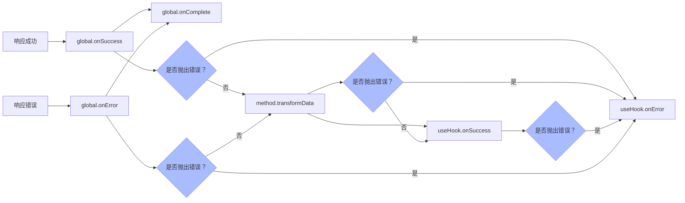

import Tabs from '@theme/Tabs';
import TabItem from '@theme/TabItem';
import CodeBlock from '@theme/CodeBlock';
import EmbedSandpack from "@site/src/components/EmbedSandpack";

import useRequestVue from '!!raw-loader!@site/codesandbox@3/01-getting-started/07-combine-framework/vueComposition-useRequest.zh.vue';
import useRequestReact from '!!raw-loader!@site/codesandbox@3/01-getting-started/07-combine-framework/react-useRequest.zh.jsx';
import useRequestSvelte from '!!raw-loader!@site/codesandbox@3/01-getting-started/07-combine-framework/svelte-useRequest.zh.svelte';

接下来，我们将学习如何与客户端的 UI 框架结合使用，这可以让 alova 发挥出真正的力量，在 UI 框架中使用时，不仅可以让 alova 自动管理响应式的请求状态，还能通过一定规则自动控制什么时候应该发送请求。

`alova`中提供了 10+个客户端的请求策略，它们帮助你以简单优雅的用法实现复杂的请求，让我们继续往下看吧！

## 设置 statesHook

在使用请求策略前，我们需要在 alova 实例上设置对应的 statesHook，它必须和项目使用的 UI 框架对应，这非常重要，它将告诉 alova 应该创建对应 UI 框架的响应式状态，目前支持以下框架：

<Tabs groupId="framework">
<TabItem value="1" label="vue composition">

```js
import { createAlova } from 'alova';
import VueHook from 'alova/vue';

export const alovaInstance = createAlova({
  // ...
  // highlight-start
  statesHook: VueHook
  // highlight-end
});
```

</TabItem>
<TabItem value="2" label="react">

```js
import { createAlova } from 'alova';
import ReactHook from 'alova/react';

export const alovaInstance = createAlova({
  // ...
  // highlight-start
  statesHook: ReactHook
  // highlight-end
});
```

</TabItem>
<TabItem value="3" label="svelte">

```js
import { createAlova } from 'alova';
import SvelteHook from 'alova/svelte';

export const alovaInstance = createAlova({
  // ...
  // highlight-start
  statesHook: SvelteHook
  // highlight-end
});
```

</TabItem>
</Tabs>

## 自动管理请求状态

`useRequest`是我们最常用的请求策略，它可以帮我们创建和维护请求的响应式状态，如`loading/data/error`等，你可以直接在视图中使用这些响应式状态，当它们更改时，视图也将随之变化。

useRequest 表示一次请求的发送，调用时默认将发送一次请求。

<Tabs groupId="framework">
<TabItem value="1" label="vue composition">

<EmbedSandpack template="vue" mainFile={useRequestVue} editorHeight={400} />

</TabItem>
<TabItem value="2" label="react">

<EmbedSandpack template="react" mainFile={useRequestReact} editorHeight={400} />

</TabItem>
<TabItem value="3" label="svelte">

<CodeBlock language="html">{useRequestSvelte}</CodeBlock>

</TabItem>
</Tabs>

[何时使用 useRequest ，何时通过`await alovaInstance.Get` 发送请求](/tutorial/best-practice/skills)。

:::warning useHook 使用规范

请注意，`useRequest`只能用于组件内发送请求，在组件外，你可以通过 method 实例直接发送请求，并且 `useRequest` 的使用需要符合 use hook 使用规则，即只能在函数最外层调用。

**❌❌❌ 不推荐在在循环、条件判断或者子函数中调用**，例如以下在 click 回调中的使用示例，在回调函数中使用时，虽然可以正常发起请求，但 use hook 返回的响应式数据无法在视图中使用，循环和条件判断中使用也是如此。

```javascript
// ❌ bad
const handleClick = () => {
  const { loading, data } = useRequest(getter);
};

// -------
// ✅ good
const { loading, data, send } = useRequest(getter, {
  immediate: false
});
const handleClick = () => {
  send();
};
```

:::

## 提交数据

当你需要提交一条新的 todo 项时，可以先关闭默认发送请求，转为手动触发请求，并在 useRequest 中接收`send`函数用于手动发送请求，`send`函数将返回带响应数据的 Promise 实例，它将在请求响应后改为 resolve 状态。

此时为了接收`send`函数传入参数，可以将`useRequest`的第一个参数设置为函数，我们称这个函数为 **method handler**。

```javascript
const {
  // ...
  // 手动发送器请求的函数，调用后发送请求
  send: addTodo

  // 在这边将会接收到 send 函数的参数
} = useRequest(newTodo => alovaInstance.Post('/todo', newTodo), {
  // 当immediate为false时，默认不发出
  immediate: false
});

// 手动发送请求
const handleAddTodo = () => {
  const newTodo = {
    title: '新的todo项',
    time: new Date().toLocaleString()
  };
  // send函数返回一个Promise对象，可接收响应数据
  addTodo(newTodo)
    .then(result => {
      console.log('新增todo项成功，响应数据为:', result);
    })
    .catch(error => {
      console.log('新增todo项失败，错误信息为:', error);
    });
};
```

`send`函数可以让你自由地重复发起请求。

> 在 react 中，send 函数使用了`useCallback`包裹，同时它也不受闭包陷阱限制，你可以直接在事件中使用它，不用担心引起性能问题。

## 处理响应

请求完成后，响应数据会经过多个流程的处理，最终才会在发送请求的位置获得最终数据，流程如下：



当没有抛出错误时，下一个节点会接收到上一个节点的返回值。

### 转换响应数据

在[method 详解](/tutorial/getting-started/method)中，我们已经了解过`transformData`了，这在 useHook 中使用也非常有用，它可以让 useHook 的 data 接收到转换后的数据，而不用再转换。

```javascript
const todoListGetter = alovaInstance.Get('/todo/list', {
  // 函数接受未加工的数据和响应头对象，并要求将转换后的数据返回，它将会被赋值给data状态。
  // 注意：rawData是全局响应拦截器（如果有设置）过滤后的数据，响应拦截器的配置可以参考[设置全局响应拦截器]章节。
  transformData(rawData, headers) {
    return rawData.list.map(item => ({
      ...item,
      statusText: item.done ? '已完成' : '进行中'
    });
  }
});
```

```javascript
const { data } = useRequest(todoListGetter);
```

data 值将接收到转换后的数据格式。

```typescript
type data = {
  // ...
  statusText: '已完成' | '进行中';
}[];
```

:::warning 注意

在 usehooks 中使用时，在`transformData`中抛出错误也会触发`onError`；

:::

### 绑定响应回调

如需设置请求回调，你还可以在 useHooks 的返回参数中接收回调的设置函数，如下：

```javascript
const {
  // ...

  // 成功回调绑定
  onSuccess,

  // 失败回调绑定
  onError,

  // 完成回调绑定，回调在成功或失败都会调用
  onComplete
} = useRequest(todoListGetter); // 也适用useWatcher
onSuccess(event => {
  console.log('请求成功，响应数据为:', event.data);
  console.log('本次请求的method实例为:', event.method);
  console.log('响应数据是否来自缓存:', event.fromCache);
});
onError(event => {
  console.log('请求失败，错误信息为:', event.error);
  console.log('本次请求的method实例为:', event.method);
});
onComplete(event => {
  // event.status在成功时为success，失败时为error
  console.log('请求完成，状态为：', event.status);
  console.log('本次请求的method实例为:', event.method);
  console.log('响应数据是否来自缓存:', event.fromCache);
  if (event.data) {
    console.log('请求数据：'，event.data)
  } else if (event.error) {
    console.log('错误信息：'，event.error)
  }
});
```

:::warning 注意
在`onSuccess`中抛出错误将会触发`onError`。

:::

## 结尾

以上是我们最常用的`useRequest`的基础使用，其他常用的请求策略还有：

1. useWatcher: 监听数据变化并自动请求
2. useForm: 表单数据数据提交与管理
3. useAutoRequest: 按定时轮询、浏览器聚焦、网络重连等规则自动请求
4. ...

了解完整使用或其他客户端请求策略，请移步[客户端策略](/xxx)查看 alova 提供的所有客户端请求策略。
