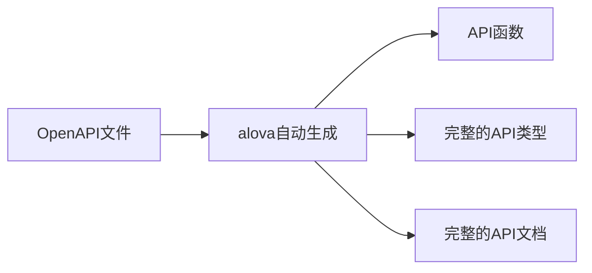
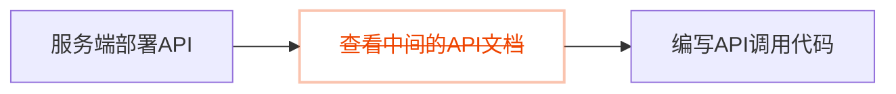

alova 的开发工具可以展现出它更强大的力量。

1. 自动生成请求代码和响应数据类型，在 js 项目中也能体验对接口数据的智能提示。
2. 将 api 文档嵌入代码中，在编辑器中直接查看每个 API 的详细信息。
3. 定时更新 api 并主动通知前端开发，不再依赖服务端开发人员通知。



这将打破过去的开发流程，在过去，当后端开发者交付 API 给你后，你需要先打开中间的 API 文档查询并复制关键信息到你的项目里，你需要不断地在中间的 API 文档与编辑器切换，但现在，alova 的开发工具可以为你消除中间的 API 文档，通过它你可以在编辑器中快速查找所需的 API 并展示这个 API 的完整文档，参照 API 参数表快速完成参数传递，像虫洞一样拉近前后端的协作距离。



## 演示视频

import vscodeDemoVideo from '@site/static/video/vscode-demo-video-chinese.mp4';

<video width="100%" controls controlsList="nodownload" src={vscodeDemoVideo} />

## 安装

安装`@alova/wormhole`和 vscode 扩展，`@alova/wormhole`提供自动生成特性，vscode 扩展可以快速调用`@alova/wormhole`的能力，并提供在编辑器中浏览 API 文档，并快速查找接口文档的快捷键。

<a className="button button--primary" style={{marginBottom: '20px'}} href="vscode:extension/Alova.alova-vscode-extension">安装 VSCode 扩展</a>

或者在扩展市场中搜索"alova"，支持 swagger-v2 和 openapi-v3 规范

import Tabs from '@theme/Tabs';
import TabItem from '@theme/TabItem';

<Tabs>
<TabItem value="1" label="npm">

```bash
npm install @alova/wormhole --save-dev
```

</TabItem>
<TabItem value="2" label="yarn">

```bash
yarn add @alova/wormhole --dev
```

</TabItem>
<TabItem value="3" label="pnpm">

```bash
pnpm add @alova/wormhole -D
```

</TabItem>
</Tabs>

:::info WebStorm 编辑器说明

WebStorm 等非 vscode 系列的编辑器暂不提供编辑器扩展，你可以通过 [@alova/wormhole 的命令](/api/wormhole#commands) 来自动生成 api 调用函数、api 的完整 TypeScript 类型和 api 文档信息。

:::

## 配置

使用扩展时，你需要指定从 openapi 文件的输入源和输出目录等，你可以在项目根目录下创建配置文件，它支持以下格式：

1. `alova.config.cjs`：commonjs 规范的配置文件，使用`module.exports`导出配置。
2. `alova.config.js`：ESModule 规范的配置文件，使用`export default`导出配置。
3. `alova.config.ts`：typescript 格式的配置文件，使用`export default`导出配置。

也可以通过`@alova/wormhole`开发工具提供的`alova init`命令快速创建配置文件模板。

具体的配置参数和解释如下，以 commonjs 为例。

```js
import { defineConfig } from '@alova/wormhole';
import { rename } from '@alova/wormhole/plugin';

module.exports = defineConfig({
  // api生成设置数组，每项代表一个自动生成的规则，包含生成的输入输出目录、规范文件地址等等
  generator: [
    // 服务器1
    {
      // input参数1：openapi的json文件url地址
      input: 'http://localhost:3000/openapi.json',

      // 配置一个或多个插件，每个generator项单独设置
      plugin: [
        rename({
          style: 'camelCase'
        })
      ],

      // input参数2：以当前项目为相对目录的本地地址
      // input: 'openapi/api.json'

      // input参数3：没有直接指向openapi文件时，是一个文档地址，必须配合platform参数指定文档类型
      // input: 'http://192.168.5.123:8080'

      // （可选）platform为支持openapi的平台，目前只支持swagger，默认为空
      // 当指定了此参数后，input字段只需要指定文档的地址而不需要指定到openapi文件
      platform: 'swagger',

      // 接口文件和类型文件的输出路径，多个generator不能重复的地址，否则生成的代码会相互覆盖
      output: 'src/api',

      // （可选）指定生成的响应数据的mediaType，以此数据类型来生成2xx状态码的响应ts格式，默认application/json
      responseMediaType: 'application/json',

      // （可选）指定生成的请求体数据的bodyMediaType，以此数据类型来生成请求体的ts格式，默认application/json
      bodyMediaType: 'application/json',

      // （可选）指定生成的api版本，默认为auto，会通过当前项目安装的alova版本判断当前项目的版本，如果生成不正确你也可以自定义指定版本
      version: 'auto',

      /**
       * （可选）生成代码的类型，可选值为auto/ts/typescript/module/commonjs，默认为auto，会通过一定规则判断当前项目的类型，如果生成不正确你也可以自定义指定类型：
       * ts/typescript：意思相同，表示生成ts类型文件
       * module：生成esModule规范文件
       * commonjs：表示生成commonjs规范文件
       */
      type: 'auto',

      /**
       * 全局导出的api名称，可通过此名称全局范围访问自动生成的api，默认为`Apis`，配置了多个generator时为必填，且不可以重复
       */
      global: 'Apis',

      /**
       * 全局api对象挂载的宿主对象，默认为 `globalThis`，在浏览器中代表 `window`，在nodejs中代表 `global`
       */
      globalHost: 'globalThis'

      /**
       * （可选）过滤或转换生成的api接口函数，返回一个新的apiDescriptor来生成api调用函数，未指定此函数时则不转换apiDescripor对象
       *
       * `apiDescriptor` 的类型和 openapi 文件的 api 项相同。
       * @see https://spec.openapis.org/oas/v3.1.0.html#operation-object
       */
      handleApi: apiDescriptor => {
        // 返回falsy值表示过滤此api
        if (!apiDescriptor.path.startsWith('/user')) {
          return;
        }

        apiDescriptor.parameters = (apiDescriptor.parameters || []).filter(
          param => param.in === 'header' && param.name === 'token'
        );
        delete apiDescriptor.requestBody.id;
        apiDescriptor.url = apiDescriptor.url.replace('/user', '');
        return apiDescriptor;
      }
    },

    // 服务器2
    {
      // ...
    }
  ],

  // （可选）是否自动更新接口，默认开启，每5分钟检查一次，false时关闭
  autoUpdate: true

  /* 也可以配置更详细的参数
  autoUpdate: {
    // 编辑器开启时更新，默认false
    launchEditor: true,
    // 自动更新间隔，单位毫秒
    interval: 5 * 60 * 1000
  }
  */
});
```

## handleApi钩子函数

需要注意的是，`handleApi`钩子函数可以自定义修改任意的API配置，例如修改API的参数名称、类型和返回值类型等，这将在OpenAPI文件错误或不详细的时候非常有用。

它将在生成每个api前被调用，接收`apiDescription`并返回修改后的`apiDescription`，它包含对应openapi文件中的每个api信息，具体参数可参考 [OpenAPI Spec Operation Object](https://spec.openapis.org/oas/v3.1.0.html#operation-object)

以下是几个示例。

### 修改api函数名

```javascript
// 将下划线命名改为驼峰
const handleApi = apiDescription => {
  apiDescription.operationId = apiDescription.operationId.replace(
    /_([a-z])/g,
    function (match, group) {
      return group.toUpperCase();
    }
  );
  return apiDescription;
};
```

### 修改tag

```javascript
const handleApi = apiDescription => {
  if (apiDescription.url.includes('/user')) {
    apiDescription.tags = ['userTag'];
  }
  return apiDescription;
};
```

### 修改response数据生成

生成`response.data`对应的类型。

```javascript
const handleApi = apiDescription => {
  apiDescriptor.responses = apiDescriptor.responses?.properties?.data;
  return apiDescriptor;
};
```

## 插件

为了简化生成数据的修改逻辑，alova 开发工具还支持配置`plugin`，目前提供了以下预设插件。

1. [rename](/resource/devtool-plugins/rename): 重命名api调用函数和参数名，支持驼峰和下划线命名，也支持自定义修改。
2. [tagModifier](/resource/devtool-plugins/tag-modifier): 修改api的tag名称。
3. [payloadModifier](/resource/devtool-plugins/payload-modifier): 增加、删除和修改api的参数类型。
4. [filterApi](/resource/devtool-plugins/filter-api): 根据url和tag匹配过滤api。
5. [apifox](/resource/devtool-plugins/apifox): 自动导入apifox中的项目，不需要再每次手动导出。
6. [importType](/resource/devtool-plugins/import-type): 用来排除需要自定义的类型，改用用户自定义的类型。

你可以在`generator`中配置`plugin`来使用插件，它们将会按配置顺序执行。

```javascript
export default defineConfig({
  generator: [
    {
      // ...
      plugin: [
        rename(...),
        tagModifier(...),
      ]
    }
  ]
})
```

如果需要自定义创建插件，请查看 [插件开发指南](/resource/devtool-plugins)。

## 使用

生成的 API 代码可通过`Apis`变量访问，可在配置文件中的`global`自定义变量名，你可以在编辑器中快速查看每个 API 的信息。


其中`pet`是 API 的 tag，API 名称对应`operationId`。


你可以通过两种方式访问`Apis`

### 全局挂载（默认）

可以在`main.[js/ts]`入口文件中引入自动生成目录下的`index.[js/ts]`。

```js title="main.js"
import './your-generating-api-folder';
```

### 导入

在需要使用的文件中导入`Apis`变量。

```js
import { Apis } from './your-generating-api-folder';
```

此时你需要在`your-generating-api-folder/index.[js/ts]`文件中删除`mountApis(Apis)`，避免它被全局挂载。

### 访问 API

在使用接口时，可以通过`params/pathParams/data/headers`来指定请求参数，它将会智能提示此接口需要的参数。此外，你还可以指定 method 实例的其他 config 参数。

```js
useRequest(() =>
  Apis.user.changeProfile({
    // （可选）query参数
    params: {
      id: 12
    },
    // （可选）path参数
    pathParams: {
      id2: 20
    },
    // （可选）body参数
    data: {
      name: 'alova',
      age: 18
    },
    // （可选）header参数
    headers: {
      'Content-Type': 'application/json'
    },

    // 其他method支持的config配置项
    cacheFor: 100 * 1000,
    transform: response => response.detail
  })
);
```

## 快速查找 API

你可以通过目标 API 的`description`或 `url` 关键词快速定位到对应的 API，通过快捷键`ctrl+alt+p`唤起API搜索框，或者使用触发词 **`a->`** 触发快速定位。

### 通过 url 查找


### 通过描述查找


### 对照接口参数表指定参数

默认情况下，通过 **`a->`** 快捷访问 API 函数时将会自动提供这个 API 必要的参数，当你调用 API 函数传参时，vscode 编辑器也会自动弹出 API 文档让你对照参数表填写参数。


如果你不小心关闭了 API 的文档弹框，你可以将光标放在 API 函数上并通过快捷键`shift+ctrl+space`再次唤起它，mac 为`shift+command+space`。

## 设置 alova 参数

通常我们会在`createAlova`中设置全局参数，在自动生成的代码中，你可以进入`${output}/index.[js/ts]`中进行设置，`${output}`是你在配置文件中指定的`output`目录。当重新生成代码时，此文件不会被覆盖。

`index`文件内容如下：

```js
import { createAlova } from 'alova';
import GlobalFetch from 'alova/GlobalFetch';
import VueHook from 'alova/vue';
import { createApis, withConfigType, mountApis } from './createApis';

// 当前api对应的alova实例，你可以在此修改参数。
export const alovaInstance = createAlova({
  baseURL: 'openapi文件中的server参数',
  statesHook: VueHook,
  requestAdapter: GlobalFetch(),
  beforeRequest: method => {},
  responded: res => {
    return res.json();
  }
});

// 可复用的method参数配置
export const $$userConfigMap = withConfigType({});

/**
 * @type {APIS}
 */
const Apis = createApis(alovaInstance, $$userConfigMap);
mountApis(Apis);

export default Apis;
```

你可以在`createAlova`中像往常一样编写拦截器，更换请求适配器。

有一点需要注意，由于 method 实例是自动生成的，你不能直接在创建 method 时设置`transform/cacheFor`等 method 参数，需要达到相同的效果，你可以在`withConfigType({})`中指定对应参数。

以下是一个对比的例子。

```js
// 手动定义调用函数
export const useProfile = () =>
  alovaInstance.Get('/user/profile', {
    cacheFor: 100 * 1000,
    transform(data) {
      return data.detail;
    }
  });
```

```js
// 为自动生成的代码设置method参数
export const $$userConfigMap = withConfigType({
  'user.profile': {
    cacheFor: 100 * 1000,
    transform(data) {
      return data.detail;
    }
  }
});
```

user 为 tag，profile 为 operationId，具体你可以打开`${output}/apiDefinitions.[js/ts]`中查看所有的 api 接口路径。

## 旧项目迁移

如果你希望在已经使用了 alova 的项目中集成 vscode 扩展，你需要按以下步骤进行：

1. 先根据 openapi 规范文件生成代码。

2. 将`${output}/index.[js/ts]`中的 alova 实例用原 alova 实例代码替换。

3. 在项目中已经定义好的 api 调用函数中，修改 alova 实例的引入路径为`${output}/index.[js/ts]`。

这样，你可以在不改变原始代码的情况下集成自动生成的代码。

## 注意事项

1. 在 ts 项目中，如果发现 vscode 无法正确智能提示，请在`tsconfig.json`中设置`"strictNullChecks": true`。
2. 有时候 api 会提示为`any`类型，你可以按以下方式尝试解决：
   - 第一步，确认此 api 是否在入口文件中引入。
   - 第二步，重启 vscode
