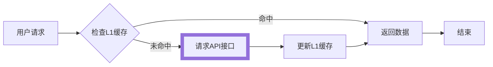
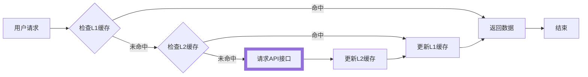

import MemoryCache from '@site/example-links/MemoryCache';
import StoragePlaceholder from '@site/example-links/StoragePlaceholder';
import StorageRestore from '@site/example-links/StorageRestore';

缓存模式可在全局或请求级等不同粒度下设置。全局设置时，所有由相同 alova 实例创建的 method 实例都会继承该设置。

:::info 注意

是否使用缓存模式，以及使用哪种缓存模式需要根据场景而定，下面在单独介绍不同缓存模式时将会提及它们的使用场景。

:::

## 内存模式（默认）

内存模式属于单级缓存(L1 缓存)模式，默认将缓存放在内存中，是最常用的缓存模式。



在默认情况下，GET 请求有 300000ms(5 分钟)的内存缓存时间，开发者也可以自定义设置缓存，请继续往下看。

### 客户端

在客户端中，刷新页面缓存即失效，内存模式一般用于解决短时间内（几分钟或几秒钟）频繁请求相同数据带来的性能消耗，例如当你在写 todo 详情页的时候，你可能会想到用户会频繁在 todo 列表中点击查看详情，如果用户重复查看某条详情时不再重复请求接口，并且能立即返回数据，提升了响应速度的同时也减小了服务器压力。此时我们就可以为某个 todo 详情 method 实例设置响应数据缓存。

```javascript
alovaInstance.GET('/todo/list', {
  // ...
  // highlight-start
  cacheFor: {
    // 设置缓存模式为内存模式
    mode: 'memory',

    // 单位为毫秒
    // 当设置为`Infinity`，表示数据永不过期，设置为0或负数时表示不缓存
    expire: 60 * 10 * 1000
  }
  // highlight-end
});
```

内存模式为默认模式，你可以这样简写

```javascript
alovaInstance.GET('/todo/list', {
  // ...
  // highlight-start
  cacheFor: 60 * 10 * 1000
  // highlight-end
});
```

### 服务端

在服务中通常在接口需要高访问频率和低延迟场景中使用，减轻下游服务器压力，使用方法与客户端相同。

在服务端中使用时需要注意：

1. 过多的缓存会一直消耗服务器内存，你可以改用[lru-cache](https://www.npmjs.com/package/lru-cache)控制内存消耗。
2. 如果需要在单机的 nodejs 集群环境中共享缓存，可以使用[@alova/psc](https://www.npmjs.com/package/@alova/psc)创建进程间共享内存的缓存方案。

```js
const { createPSCAdapter, NodeSyncAdapter } = require('@alova/psc');
const { LRUCache } = require('lru-cache');

function lRUCache(options = {}) {
  const cache = new LRUCache(options);
  return {
    set(key, value) {
      return cache.set(key, value);
    },

    get(key) {
      return cache.get(key);
    },

    remove(key) {
      return cache.delete(key);
    },

    clear() {
      return cache.clear();
    }
  };
}

const alovaInstance = createAlova({
  baseURL: 'https://api.alovajs.dev',

  // 进程间共享缓存适配器
  l1Cache: createPSCAdapter(
    NodeSyncAdapter(),
    lRUCache({
      max: 1000,
      ttl: 1000 * 60 * 10
    })
  )
});
```

内存缓存模式对应 l1 cache，在此我们更换了缓存适配器为进程间共享的 lru-cache，你也可以[自定义存储适配器](/tutorial/custom/custom-storage-adapter)，例如当你只需要单级缓存时，你也可以直接将 l1 cache 设置为 redis 适配器。

## 恢复模式

恢复模式对应多级缓存，分别为 L1 和 L2 缓存。开启恢复模式后，响应数据会同时存储在 L1 和 L2 缓存中，当 L1 缓存失效时，会从 L2 缓存中读取数据，然后更新 L1 缓存，当 L2 缓存也失效时才会再次请求接口。



### 客户端

在客户端中，当还未过期的缓存即使刷新页面缓存也不会失效，它一般用于一些需要服务端管理，但基本不变的数据，如每年的节假日具体日期有所不同，但不会再变动，这种场景下我们只需设置缓存过期时间为今年的最后一刻即可。

客户端中使用 alova 时默认使用`localStorage`作为 L2 存储适配器，你也可以[自定义存储适配器](/tutorial/custom/custom-storage-adapter)。

在 method 实例上设置：

```javascript
const todoListGetter = alovaInstance.Get('/todo/list', {
  // ...
  // highlight-start
  cacheFor: {
    // 设置缓存模式为持久化模式
    mode: 'restore',
    // 缓存时间
    expire: 60 * 10 * 1000
  }
  // highlight-end
});
```

#### 数据有变怎么办？

当设置了恢复模式的 method 实例，可能由于接口数据变动，或前端处理响应数据的逻辑变动，此时需要在发布应用后让用户重新缓存变动后的数据，此时你可以通过`tag`属性设置缓存标签，每一份持久化数据都包含一个`tag`标识，当`tag`改变后原有的持久化数据将会失效，并重新获取新的数据，并用新的`tag`进行标识。

```javascript
const todoListGetter = alovaInstance.Get('/todo/list', {
  // ...
  cacheFor: {
    mode: 'restore',
    expire: 60 * 10 * 1000,

    // highlight-start
    // 新增或修改tag参数，已缓存的数据将失效
    // 建议使用版本号的形式管理
    tag: 'v1'
    // highlight-end
  }
});
```

### 服务端

一般用于多级缓存，使用 L1 作为内存缓存，L2 作为持久化缓存，例如 redis、memcached。

部分应用场景如下：

1. 高访问频率和低延迟需求：例如热门新闻、商品详情，可以进一步减少网络开销，在网络不稳定时也保持更快的响应。
2. 减轻下游服务器压力，例如有访问高峰期的服务，上层缓存可以有效减少对后端数据库和微服务的压力。
3. 整合多个下游服务器的数据合并和处理，多个串行请求可能导致更长的响应时间，也可能因复杂的数据转换消耗性能，可将转换后的数据进行缓存。
4. API 速率限制和计费，天气预报服务 API 每小时更新一次天气信息，地理位置数据 API 等。

在服务端使用 alova 时默认没有 L2 存储适配器，在[服务端 L2 存储实践](/tutorial/best-practice/l2-storage)中分别提供了文件存储适配器和 redis 适配器的实现。你也可以[自定义存储适配器](/tutorial/custom/custom-storage-adapter)，例如将 MongoDB、mysql 等数据库作为响应数据的存储适配器。

:::warning 注意

当 request body 是**FormData**、**Blob**、**ArrayBuffer**、**URLSearchParams**、**ReadableStream**等特殊数据时，将会被认为你是有意图和服务端通信的，在这种情况下不会进行缓存。

:::

## 设置 alova id

每个缓存 key 中都带有 alova 实例的命名空间，格式如下：

```
cacheKey = [prefix][alova-id][method-json-string]
```

默认情况下[alova-id]按 alova 创建顺序递增，在服务端环境下使用了持久化缓存时，强烈建议设置 alova id 固定缓存 key 的命名空间，**这个尤为重要**，否则可能因为多个 alova 实例创建的顺序变动，而导致而无法匹配对应的缓存。

```js
const userAlova = createAlova({
  // ...
  id: 'user'
});

const orderAlova = createAlova({
  // ...
  id: 'order'
});
```

## 全局设置缓存模式

如果你需要全局设置缓存模式，可以按如下方式做：

```javascript
const alovaInstance = createAlova({
  // ...
  // highlight-start
  cacheFor: {
    // 统一设置POST的缓存模式
    POST: {
      mode: 'restore',
      expire: 60 * 10 * 1000
    },
    // 统一设置HEAD请求的缓存模式
    HEAD: 60 * 10 * 1000
  }
  // highlight-end
});
```

此后，通过`alovaInstance`实例创建的 method 实例，都将默认使用这份缓存设置，同时也可以在 method 实例中覆盖它。

## 全局关闭缓存模式

如果在你的项目中不希望使用任何请求缓存，可以在全局将它关闭，如果希望只在特定的几个请求中使用，也可以全局关闭它，并在指定的 method 实例中设置即可。

```javascript
const alovaInstance = createAlova({
  // ...
  // highlight-start
  // 设置为null即可全局关闭全部请求缓存
  cacheFor: null
  // highlight-end
});
```

## 设置不同的过期时间

在恢复模式下，你还可以对 L1 和 L2 缓存设置不同的过期时间。将`expire`设置为函数，它将会在设置 L1 和 L2 缓存时分别被调用。

以下是设置单个请求的不同过期时间的示例。

```js
alovaInst.Get('/user/profile', {
  // ...
  cacheFor: {
    mode: 'restore',
    expire: ({ method, mode }) => {
      // 在l1缓存设置5分钟缓存，在l2缓存设置1天缓存
      return mode === 'memory' ? 5 * 60 : 24 * 60 * 60;
    }
  }
});
```

以下是全局设置 GET 请求的不同过期时间的示例，当 method 的元数据带有`setDiffExpire`标识时设置不同的过期时间。

```js
const alovaInst = createAlova({
  // ...
  cacheFor: {
    GET: {
      mode: 'restore',
      expire: ({ method, mode }) => {
        if (method.meta.setDiffExpire) {
          // 在l1缓存设置5分钟缓存，在l2缓存设置1天缓存
          return mode === 'memory' ? 5 * 60 : 24 * 60 * 60;
        }
        return 5 * 60;
      }
    }
  }
});
```

## 过期时间类型

过期时间有两种类型可供选择，分别为 **相对时间** 和 **绝对时间**

### 相对时间

即在保存缓存数据时开始，过期的时长，以 **毫秒** 为单位，以上示例均为此类型。

```javascript
cacheFor: 60 * 10 * 1000;
```

```javascript
cacheFor: {
  expire: 60 * 10 * 1000,
}
```

### 绝对时间

以一个具体时间点为过期时间，缓存将在设定的时间点过期

```javascript
cacheFor: new Date('2030-01-01');
```

```javascript
cacheFor: {
  expire: new Date('2030-01-01');
}
```

## 响应自动维护说明

响应数据缓存的 key 是由 method 实例的请求方法(method)、请求地址(url)、请求头参数(headers)、url 参数(params)、请求体参数(requestBody)组合作为唯一标识，任意一个信息或位置不同都将被当做不同的 key，如果要自定义缓存 key，可以参考[自定义 method key](/tutorial/advanced/custom-method-key)。
