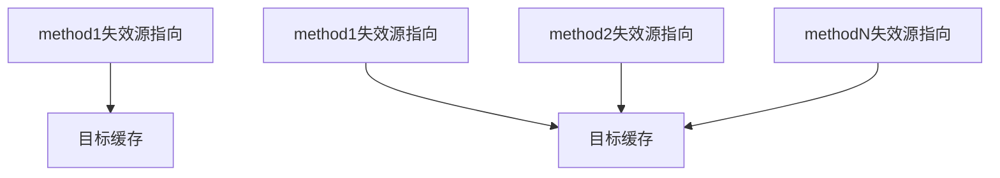

自动失效缓存是在目标缓存中设置失效源 method 的匹配规则，当源 method 在请求成功后，将自动匹配并失效目标缓存，不需要再手动清除缓存。当目标缓存与失效源是一对一或一对多时，设置自动失效规则会很方便。



## 使用场景

1. 编辑列表项并提交成功后，自动对列表项缓存数据失效。
2. 在服务端，例如用户个人信息、配置数据等更新后需要失效当前缓存。

## 设置自动失效规则

设置这个规则很简单，你可以在创建一个带缓存的 Method 实例时，为它设置`hitSource`参数即可。

### 失效源设置为 method 实例

以一个固定的 method 实例作为失效源，只要此 method 实例或它的克隆实例请求成功，目标缓存将被自动清除。

```javascript
alova.Get('/todo/1', {
  // ...
  hitSource: alova.Post('/todo', {})
});
```

### 通过 method 名称匹配失效源

和 method 匹配器一样，你可以在 hitSource 中指定 method 的名称来匹配失效源，多个失效源可以设置为同一个名称，带有这个名称的 method 实例请求成功时，目标缓存将被自动清除。

```javascript
const methodSubmitTodo = data =>
  alova.Post('/todo', data, {
    name: 'submitTodo'
  });

alova.Get('/todo/1', {
  // ...
  // 匹配method实例名称为submitTodo的失效源
  hitSource: 'submitTodo'
});
```

### 通过 method 名称正则表达式匹配失效源

如果 method 实例名称不固定时，你可以在 hitSource 中指定一个正则表达式来匹配 method 名称，被匹配的 method 实例在请求成功时，目标缓存将被自动清除。

```javascript
const methodSubmitTodo = data =>
  alova.Post('/todo', data, {
    name: 'prefix-submitTodo'
  });

alova.Get('/todo/1', {
  // ...
  // 匹配method实例名称为prefix开头的所有实例
  hitSource: /^prefix/
});
```

### 组合设置失效源

如果你希望使用以上的多种规则匹配失效源，可以将 hitSource 指定为一个数组，数组项为以上 3 种规则的任意一种，满足数组任意一项规则的 method 实例将被匹配。

```javascript
alova.Get('/todo/1', {
  // ...
  // 满足数组中任意一项匹配规则的method实例请求成功时，此缓存将失效
  hitSource: [alova.Post('/todo', {}), 'submitTodo', /^prefix/]
});
```

## 自动失效范围

自动失效默认会查找所有 alova 实例下的缓存，太多的失效目标目标可能会导致性能降低，你希望控制自动失效的查找范围或关闭它，你可以按以下方式设置。

```js
import { globalConfig } from 'alova';

globalConfig({
  /**
   * 自动命中缓存开关。
   * 这里有三个选项：
   * - global：跨 alova 实例使缓存无效。
   * - self：仅使来自同一 alova 实例的缓存无效。
   * - close：不再自动使缓存无效。
   * 默认为'global'
   */
  autoHitCache: 'self'
});
```

## hitSource 数据类型

```typescript
type hitSource = string | RegExp | Method | (string | RegExp | Method)[];
```
