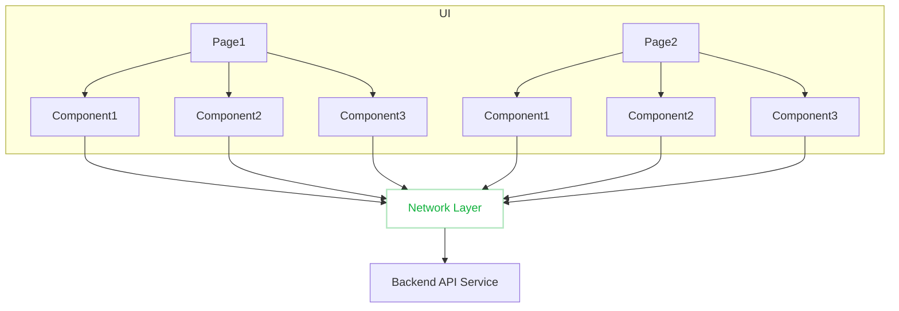
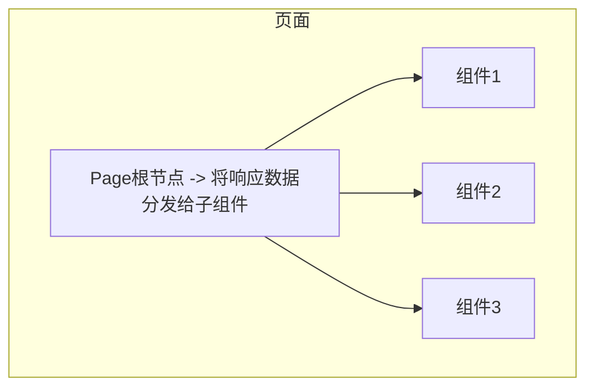
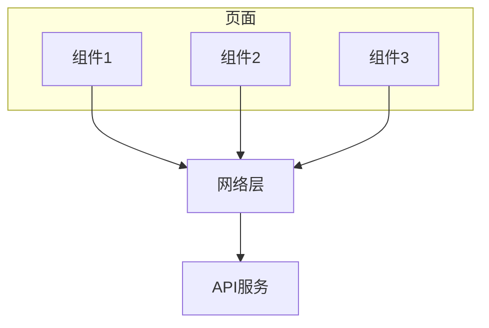

:::tip

这是一个深入使用 alova 总结的实践经验，阅读前请确保已经掌握了[alova 基础](/tutorial/getting-started/quick-start)部分的内容，你也可以观看[5 分钟快速入门视频](/video-tutorial)。

:::

你可以组合 alova 的各种特性实现应用的网络层，网络层将会管理你的响应数据和 useHooks 所创建的响应式状态，它们将会在网络层中通过 method 实例建立映射关系，从而消除组件层级的限制，你可以在任意的 UI 组件中通过 method 实例来访问、修改和刷新网络层的数据，以及调用 useHooks 的 actions。



让我们来看看网络层可以带来哪些好处。

## 请求点分离

在传统做法中，当一个页面被切分成了多个组件时，我们需要从根节点请求数据并分发到子组件中，这样无疑提高了数据传递的复杂度。



现在，你可以在不同组件中发起相同的请求，网络层中将会合并请求，并将数据分发到这些组件中。



让我们来具体看看示例代码。

import Tabs from '@theme/Tabs';
import TabItem from '@theme/TabItem';

<Tabs groupId="framework">
<TabItem value="1" label="vue">

<Tabs className="file-tabs">
<TabItem value="1" label="PageRoot.vue">

```html
<template>
  <profile></profile>
  <assets></assets>
</template>

<script setup>
  import Profile from './component/profile.vue';
  import Assets from './component/assets.vue';
</script>
```

</TabItem>
<TabItem value="2" label="./component/profile.vue">

```html
<template>
  <div v-if="loading">loading...</div>
  <div v-else>
    <p>name: {{ data.name }}</p>
    <p>age: {{ data.age }}</p>
  </div>
</template>

<script setup>
  import { useRequest } from 'alova/client';
  const { loading, data } = useRequest(alova.Get('/api/user'));
</script>
```

</TabItem>
<TabItem value="3" label="./component/assets.vue">

```html
<template>
  <div>
    <div v-if="loading">loading...</div>
    <div v-else>
      <p>balance: {{ data.balance }}</p>
      <p>coins: {{ data.coins }}</p>
    </div>
  </div>
</template>

<script setup>
  import { useRequest } from 'alova/client';
  const { loading, data } = useRequest(alova.Get('/api/user'));
</script>
```

</TabItem>
</Tabs>

</TabItem>
<TabItem value="2" label="react">

<Tabs className="file-tabs">
<TabItem value="1" label="PageRoot.jsx">

```jsx
import Profile from './component/profile';
import Assets from './component/assets';

const App = () => {
  return (
    <>
      <profile></profile>
      <assets></assets>
    </>
  );
};
```

</TabItem>
<TabItem value="2" label="./component/profile.jsx">

```jsx
import { useRequest } from 'alova/client';

const Profile = () => {
  const { loading, data } = useRequest(alova.Get('/api/user'));
  return loading ? (
    <div>loading...</div>
  ) : (
    <div>
      <p>name: {data.name}</p>
      <p>age: {data.age}</p>
    </div>
  );
};
```

</TabItem>
<TabItem value="3" label="./component/assets.jsx">

```jsx
import { useRequest } from 'alova/client';

const Assets = () => {
  const { loading, data } = useRequest(alova.Get('/api/user'));
  return loading ? (
    <div>loading...</div>
  ) : (
    <div>
      <p>balance: {data.balance}</p>
      <p>coins: {data.coins}</p>
    </div>
  );
};
```

</TabItem>
</Tabs>

</TabItem>
<TabItem value="3" label="svelte">

<Tabs className="file-tabs">
<TabItem value="1" label="PageRoot.svelte">

```html
<script>
  import Profile from './component/profile.svelte';
  import Assets from './component/assets.svelte';
</script>

<profile></profile>
<assets></assets>
```

</TabItem>
<TabItem value="2" label="./component/profile.svelte">

```html
<script>
  import { useRequest } from 'alova/client';
  const { loading, data } = useRequest(alova.Get('/api/user'));
</script>

{#if $loading}
<div>loading...</div>
{#else}
<div>
  <p>name: {$data.name}</p>
  <p>age: {$data.age}</p>
</div>
{/if}
```

</TabItem>
<TabItem value="3" label="./component/assets.svelte">

```html
<script>
  import { useRequest } from 'alova/client';
  const { loading, data } = useRequest(alova.Get('/api/user'));
</script>

{#if $loading}
<div>loading...</div>
{#else}
<div>
  <p>balance: {$data.balance}</p>
  <p>coins: {$data.coins}</p>
</div>
{/if}
```

</TabItem>
</Tabs>

</TabItem>
</Tabs>

## 响应式状态集中管理

由于响应式状态在网络层管理，你可以快速实现跨组件更新状态和刷新刷新数据。

### 跨组件更新状态数据

通过 [`updateState`](/tutorial/client/in-depth/update-across-components) 并传入 method 实例实现跨组件的更新响应式状态。

### 跨组件刷新数据

有两种方式可以实现跨组件刷新数据。

- 通过 [`useFetcher`](/tutorial/client/strategy/use-fetcher) 并传入 method 实例，它将会重新请求数据并更新这个 method 实例对应的响应式状态。
- 跨组件触发 useHooks 的 actions 完成数据的刷新，具体请参考[action 委托中间件](/tutorial/client/strategy/action-delegation-middleware)

## 响应数据集中管理

当开启了响应数据缓存后，网络层将会按一定规则缓存响应数据，相同请求将会复用缓存数据来提升性能，具体请参考[响应缓存](/tutorial/cache)章节。此外，你还可以预测用户接下来将要访问的数据，使用 [`useFetcher`](/tutorial/client/strategy/use-fetcher) 预先请求数据并放在缓存中。

### 缓存时效性

有一个大家很关心的问题，如何保证缓存的时效性呢？alova 也提供了多种方式来处理缓存的时效性。

- [自动失效](/tutorial/cache/auto-invalidate)：通过设置失效规则来自动失效指定的缓存。
- [缓存穿透](/tutorial/cache/force-request)：对于时效性较高的数据，你可以通过强制请求来获得最新数据。
- [定时更新](/tutorial/client/strategy/use-auto-request)：通过`useAutoRequest`来实现不同场景下的自动更新数据。
- [手动失效](/tutorial/cache/manually-invalidate)：如果以上方法都不适合的情况下，你可以手动调用失效函数。
