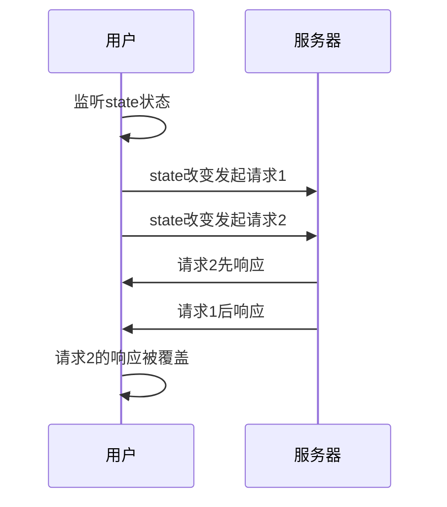

import Tabs from '@theme/Tabs';
import TabItem from '@theme/TabItem';
import EmbedSandpack from "@site/src/components/EmbedSandpack";
import CodeBlock from '@theme/CodeBlock';
import useWatcherSearchVue from '!!raw-loader!@site/codesandbox/03-learning/04-use-watcher/vueComposition-search.zh.vue';
import useWatcherSearchReact from '!!raw-loader!@site/codesandbox/03-learning/04-use-watcher/react-search.zh.jsx';
import useWatcherSearchSvelte from '!!raw-loader!@site/codesandbox/03-learning/04-use-watcher/svelte-search.zh.svelte';
import useWatcherSearchVueOptions from '!!raw-loader!@site/codesandbox/03-learning/04-use-watcher/vueOptions-search.zh.vue';

在一些需要随数据变化而重新请求的场景下，如分页、数据筛选、模糊搜索，可以使用`useWatcher` 来监听指定的状态变化时立即发送请求。

:::info 提醒

在使用 useWatcher 前，请确保已[设置 statesHook](/tutorial/combine-framework)。

:::

## 关键字搜索

接下来我们以搜索 todo 项为例，尝试改变选择框中的选项，看看 todo 列表是如何变化的。
<Tabs groupId="framework">
<TabItem value="1" label="vue">

<EmbedSandpack template="vue" mainFile={useWatcherSearchVue} editorHeight={800} />

</TabItem>
<TabItem value="2" label="react">

<EmbedSandpack template="react" mainFile={useWatcherSearchReact} editorHeight={800} />

</TabItem>
<TabItem value="3" label="svelte">

<CodeBlock language="html">{useWatcherSearchSvelte}</CodeBlock>

</TabItem>
<TabItem value="4" label="vue options">

<EmbedSandpack template="vue" style="options" mainFile={useWatcherSearchVueOptions} editorHeight={800} />

</TabItem>
</Tabs>

## 分页

以 todo 列表分页请求为例，你可以这样做。

<Tabs groupId="framework">
<TabItem value="1" label="vue">

```html
<template>
  <!-- ... -->
</template>

<script setup>
  // method实例创建函数
  const getTodoList = currentPage => {
    return alovaInstance.Get('/todo/list', {
      params: {
        currentPage,
        pageSize: 10
      }
    });
  };

  const currentPage = ref(1);
  const { loading, data, error } = useWatcher(
    // 第一个参数为返回method实例的函数，而非method实例本身
    () => getTodoList(currentPage.value),
    // 被监听的状态数组，这些状态变化将会触发一次请求
    [currentPage],
    {
      // ⚠️调用useWatcher默认不触发，注意和useRequest的区别
      // 手动设置immediate为true可以初始获取第1页数据
      immediate: true
    }
  );
</script>
```

</TabItem>
<TabItem value="2" label="react">

```jsx
import { useState } from 'react';

// method实例创建函数
const getTodoList = currentPage => {
  return alovaInstance.Get('/todo/list', {
    params: {
      currentPage,
      pageSize: 10
    }
  });
};

const App = () => {
  const [currentPage, setCurrentPage] = useState(1);
  const {
    loading,
    data,
    error

    // 第一个参数为返回method实例的函数，而非method实例本身
  } = useWatcher(
    () => getTodoList(currentPage),
    // 被监听的状态数组，这些状态变化将会触发一次请求
    [currentPage],
    {
      // ⚠️调用useWatcher默认不触发，注意和useRequest的区别
      // 手动设置immediate为true可以初始获取第1页数据
      immediate: true
    }
  );

  return {
    /* ... */
  };
};
```

</TabItem>
<TabItem value="3" label="svelte">

```html
<script>
  import { writable } from 'svelte/store';

  // method实例创建函数
  const getTodoList = currentPage => {
    return alovaInstance.Get('/todo/list', {
      params: {
        currentPage,
        pageSize: 10
      }
    });
  };

  const currentPage = writable(1);
  const {
    loading,
    data,
    error

    // 第一个参数为返回method实例的函数，而非method实例本身
  } = useWatcher(
    () => getTodoList($currentPage),
    // 被监听的状态数组，这些状态变化将会触发一次请求
    [currentPage],
    {
      // ⚠️调用useWatcher默认不触发，注意和useRequest的区别
      // 手动设置immediate为true可以初始获取第1页数据
      immediate: true
    }
  );
</script>

<!-- ... -->
```

</TabItem>
<TabItem value="4" label="vue options">

```html
<template>
  <!-- ... -->
</template>

<script>
  import { mapAlovaHook } from '@alovajs/vue-options';

  // method实例创建函数
  const getTodoList = currentPage => {
    return alovaInstance.Get('/todo/list', {
      params: {
        currentPage,
        pageSize: 10
      }
    });
  };

  export default {
    mixins: mapAlovaHook(function () {
      paging: useWatcher(
        () => getTodoList(this.currentPage),

        // 被监听的状态数组，这些状态变化将会触发一次请求
        ['currentPage'],
        {
          // ⚠️调用useWatcher默认不触发，注意和useRequest的区别
          // 手动设置immediate为true可以初始获取第1页数据
          immediate: true
        }
      );
    }),
    data() {
      return {
        currentPage: 1
      };
    }
  };
</script>
```

</TabItem>
</Tabs>

## 立即发送请求

与`useRequest`不同的是，`useWatcher`的`immediate`属性默认是`false`。

```javascript
const { send } = useWatcher(() => getTodoList(currentPage), [currentPage], {
  // highlight-start
  immediate: true
  // highlight-end
});
send();
```

## 请求防抖

通常我们都会在频繁触发的事件层面编写防抖代码，这次我们在请求层面实现了防抖功能，这意味着你再也不用在模糊搜索功能中自己实现防抖了，用法也非常简单。

:::info 什么是防抖

防抖（debounce），就是指触发事件后，在 n 秒内函数只能执行一次，如果触发事件后在 n 秒内又触发了事件，则会重新计算函数延执行时间（在这里和节流区分一下，节流是在触发完事件之后的一段时间之内不能再次触发事件）

:::

### 设置所有监听状态的防抖时间

```javascript
const { loading, data, error } = useWatcher(
  () => filterTodoList(keyword, date),
  [keyword, date],
  {
    // highlight-start
    // 设置debounce为数字时表示为所有监听状态的防抖时间，单位为毫秒
    // 如这边表示当状态keyword、date的一个或多个变化时，将在500ms后才发送请求
    debounce: 500
    // highlight-end
  }
);
```

### 为单个监听状态设置防抖时间

很多场景下，我们只需要对某几个频繁变化的监听状态进行防抖，如文本框的`onInput`触发的状态变化，可以这样做：

```javascript
const { loading, data, error } = useWatcher(
  () => filterTodoList(keyword, date),
  [keyword, date],
  {
    // highlight-start
    // 以监听状态的数组顺序分别设置防抖时间，0或不传表示不防抖
    // 这边监听状态的顺序是[keyword, date]，防抖数组设置的是[500, 0]，表示只对keyword单独设置防抖
    debounce: [500, 0]
    // 也可以这么按如下设置:
    // debounce: [500],
    // highlight-end
  }
);
```

## 状态改变时阻止请求

有时候你希望在监听的状态改变时不发送请求，你可以通过 Hook 配置中的 sendable 属性来控制监听的状态改变时是否发送请求，sendable 属性为一个函数，它的参数为`AlovaEvent`事件对象，包含`send`函数传入的参数所组成的数组`sendArgs`，以及当前请求的 method 实例，并且该函数返回一个`truthy/falsy`值来判断本次状态改变时是否需要触发请求（默认为`true`），**抛出错误也表示不触发请求**。

```javascript
useWatcher(
  () => getTodoList($currentPage),
  // 被监听的状态数组，这些状态变化将会触发一次请求
  [state],
  {
    // highlight-start
    sendable: ({ sendArgs, method }) => {
      // do something
      // 仅当 state 为 1 时发送请求
      return state === 1;
    }
    // highlight-end
  }
);
```

## 请求时序

有时候当`useWatcher`监听的状态发生连续的改变导致连续的请求的发起时，后一次的请求先于前一次的请求获得响应，但是当前一次请求获得响应时，会覆盖后一次请求的响应，导致获取到与状态不匹配的响应；例如说有个状态`state`改变后发出了请求`1`，然后在请求`1`还未响应时又改变了`state`值，并发出了请求`2`，如果请求`1`后于请求`2`返回，最终的响应数据会维持在请求`1`。
所以我们设计了`abortLast`参数，它用于标记当下一次请求发出时，是否中断上一次的未响应请求，默认为`true`，这样`useWatcher`所发出的请求只有最后一次有效。



```javascript
useWatcher(
  () => getTodoList($currentPage),
  // 被监听的状态数组，这些状态变化将会触发一次请求
  [state],
  {
    // highlight-start
    abortLast: true // 是否中断上一次的未响应请求，默认为true
    // highlight-end
  }
);
```

:::warning 注意事项

`abortLast`默认为`true`，在正常情况下你不需要关注这个参数，如果修改为`false`，可能会导致状态与响应不匹配的问题。

:::

## API

完整的 API 文档请查看[核心 useHooks](/api/core-hooks#usewatcher)。
