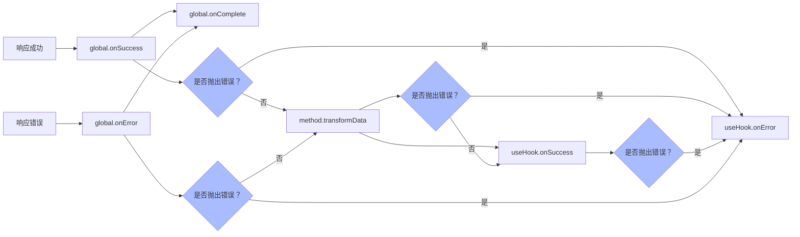

import Tabs from '@theme/Tabs';
import TabItem from '@theme/TabItem';

请求完成后，响应数据会经过多个流程的处理，最终才会在发送请求的位置获得最终数据，流程如下：



当没有抛出错误时，下一个节点会接收到上一个节点的返回值。

## 转换响应数据

在[method 详解](/v2/tutorial/getting-started/method)中，我们已经了解过`transformData`了，这在 useHook 中使用也非常有用，它可以让 useHook 的 data 接收到转换后的数据，而不用再转换。

```javascript
const todoListGetter = alovaInstance.Get('/todo/list', {
  // 函数接受未加工的数据和响应头对象，并要求将转换后的数据返回，它将会被赋值给data状态。
  // 注意：rawData是全局响应拦截器（如果有设置）过滤后的数据，响应拦截器的配置可以参考[设置全局响应拦截器]章节。
  transformData(rawData, headers) {
    return rawData.list.map(item => ({
      ...item,
      statusText: item.done ? '已完成' : '进行中'
    });
  }
});
```

```javascript
const { data } = useRequest(todoListGetter);
const { data } = useWatcher(() => todoListGetter, [userInfo]);
```

data 值将接收到转换后的数据格式。

```typescript
type data = {
  // ...
  statusText: '已完成' | '进行中';
}[];
```

:::warning 注意

在 usehooks 中使用时，在`transformData`中抛出错误也会触发`onError`；

:::

## 绑定响应回调

如需设置请求回调，你还可以在 useHooks 的返回参数中接收回调的设置函数，如下：

```javascript
const {
  // ...

  // 成功回调绑定
  onSuccess,

  // 失败回调绑定
  onError,

  // 完成回调绑定，回调在成功或失败都会调用
  onComplete
} = useRequest(todoListGetter); // 也适用useWatcher
onSuccess(event => {
  console.log('请求成功，响应数据为:', event.data);
  console.log('本次请求的method实例为:', event.method);
  console.log('响应数据是否来自缓存:', event.fromCache);
});
onError(event => {
  console.log('请求失败，错误信息为:', event.error);
  console.log('本次请求的method实例为:', event.method);
});
onComplete(event => {
  // event.status在成功时为success，失败时为error
  console.log('请求完成，状态为：', event.status);
  console.log('本次请求的method实例为:', event.method);
  console.log('响应数据是否来自缓存:', event.fromCache);
  if (event.data) {
    console.log('请求数据：'，event.data)
  } else if (event.error) {
    console.log('错误信息：'，event.error)
  }
});
```

:::warning 注意
在`onSuccess`中抛出错误将会触发`onError`。

:::
