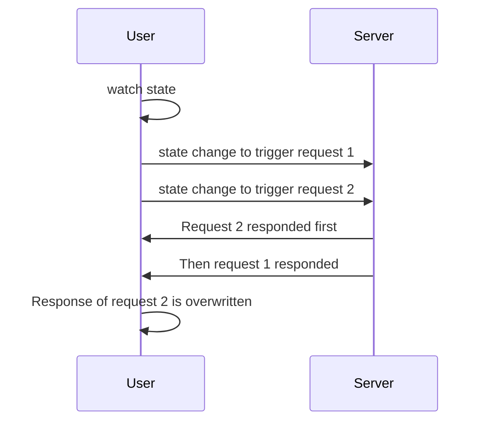

import Tabs from '@theme/Tabs';
import TabItem from '@theme/TabItem';
import EmbedSandpack from "@site/src/components/EmbedSandpackV2";
import CodeBlock from '@theme/CodeBlock';
import useWatcherSearchVue from '!!raw-loader!@site/codesandbox/03-learning/04-use-watcher/vueComposition-search.en.vue';
import useWatcherSearchReact from '!!raw-loader!@site/codesandbox/03-learning/04-use-watcher/react-search.en.jsx';
import useWatcherSearchSvelte from '!!raw-loader!@site/codesandbox/03-learning/04-use-watcher/svelte-search.en.svelte';
import useWatcherSearchVueOptions from '!!raw-loader!@site/codesandbox/03-learning/04-use-watcher/vueOptions-search.en.vue';

In some scenarios that require re-requesting as data changes, such as paging, data filtering, and fuzzy search, you can use `useWatcher` to monitor the specified states change and send a request immediately.

## Keyword search

Next we take searching for todo items as an example. Try to change options in the search box and see how the todo list changes.

<Tabs groupId="framework">
<TabItem value="1" label="vue">

<EmbedSandpack template="vue" mainFile={useWatcherSearchVue} editorHeight={800} />

</TabItem>
<TabItem value="2" label="react">

<EmbedSandpack template="react" mainFile={useWatcherSearchReact} editorHeight={800} />

</TabItem>
<TabItem value="3" label="svelte">

<CodeBlock language="html">{useWatcherSearchSvelte}</CodeBlock>

</TabItem>
<TabItem value="4" label="vue options">

<EmbedSandpack template="vue" style="options" mainFile={useWatcherSearchVueOptions} editorHeight={800} />

</TabItem>
</Tabs>

## Pagination

Taking the todo list pagination request as an example, you can do this.

<Tabs groupId="framework">
<TabItem value="1" label="vue">

```html
<template>
  <!-- ... -->
</template>

<script setup>
  //method instance creation function
  const getTodoList = currentPage => {
    return alovaInstance.Get('/todo/list', {
      params: {
        currentPage,
        pageSize: 10
      }
    });
  };

  const currentPage = ref(1);
  const { loading, data, error } = useWatcher(
    // The first parameter is the function that returns the method instance, not the method instance itself
    () => getTodoList(currentPage.value),
    // The watched states array, these states changes will trigger a request
    [currentPage],
    {
      // ⚠️Calling useWatcher is not triggered by default. Please note the difference from useRequest.
      // Manually set immediate to true to initially obtain the data on page 1
      immediate: true
    }
  );
</script>
```

</TabItem>
<TabItem value="2" label="react">

```jsx
import { useState } from 'react';

//method instance creation function
const getTodoList = currentPage => {
  return alovaInstance.Get('/todo/list', {
    params: {
      currentPage,
      pageSize: 10
    }
  });
};

const App = () => {
  const [currentPage, setCurrentPage] = useState(1);
  const {
    loading,
    data,
    error

    // The first parameter is the function that returns the method instance, not the method instance itself
  } = useWatcher(
    () => getTodoList(currentPage),
    // The watched states array, these states changes will trigger a request
    [currentPage],
    {
      // ⚠️Calling useWatcher is not triggered by default. Please note the difference from useRequest.
      // Manually set immediate to true to initially obtain the data on page 1
      immediate: true
    }
  );

  return {
    /* ... */
  };
};
```

</TabItem>
<TabItem value="3" label="svelte">

```html
<script>
  import { writable } from 'svelte/store';

  //method instance creation function
  const getTodoList = currentPage => {
    return alovaInstance.Get('/todo/list', {
      params: {
        currentPage,
        pageSize: 10
      }
    });
  };

  const currentPage = writable(1);
  const {
    loading,
    data,
    error

    // The first parameter is the function that returns the method instance, not the method instance itself
  } = useWatcher(
    () => getTodoList($currentPage),
    // The watched states array, these states changes will trigger a request
    [currentPage],
    {
      // ⚠️Calling useWatcher is not triggered by default. Please note the difference from useRequest.
      // Manually set immediate to true to initially obtain the data on page 1
      immediate: true
    }
  );
</script>

<!-- ... -->
```

</TabItem>
<TabItem value="4" label="vue options">

```html
<template>
  <!-- ... -->
</template>

<script>
  import { mapAlovaHook } from '@alovajs/vue-options';

  //method instance creation function
  const getTodoList = currentPage => {
    return alovaInstance.Get('/todo/list', {
      params: {
        currentPage,
        pageSize: 10
      }
    });
  };

  export default {
    mixins: mapAlovaHook(function () {
      paging: useWatcher(
        () => getTodoList(this.currentPage),

        // The watched states array, these states changes will trigger a request
        ['currentPage'],
        {
          // ⚠️Calling useWatcher is not triggered by default. Please note the difference from useRequest.
          // Manually set immediate to true to initially obtain the data on page 1
          immediate: true
        }
      );
    }),
    data() {
      return {
        currentPage: 1
      };
    }
  };
</script>
```

</TabItem>
</Tabs>

## Send request immediately

`useWatcher` can also send the request immediately, but it should be noted that the `immediate` attribute of `useWatcher` defaults to `false`.

```javascript
const { send } = useWatcher(() => getTodoList(currentPage), [currentPage], {
  // highlight-start
  immediate: true
  // highlight-end
});
send();
```

## Request debounce

Usually we write debounce code at the level of frequently triggered events. This time we implemented the debounce function at the request level, which means you no longer have to implement debounce yourself in the fuzzy search function, and the usage is also very simple.

:::info Tips: What is debounce?

Debounce means that after an event is triggered, the function can only be executed once within n seconds. If an event is triggered again within n seconds after the event is triggered, the function delay execution time will be recalculated (here to distinguish between throttling, throttling means that the event cannot be triggered again within a period of time after the event is triggered)

:::

### Set debounce time of all watching states

```javascript
const { loading, data, error } = useWatcher(
  () => filterTodoList(keyword, date),
  [keyword, date],
  {
    // highlight-start
    // When debounce is set to a number, it represents the anti-bounce time of all watching states, in milliseconds.
    // This means that when one or more of the states keyword and date change, the request will be sent after 500ms.beg
    debounce: 500
    // highlight-end
  }
);
```

### Set debounce time for a single watching state

In many scenarios, we only need to debounce certain frequently changing watching states, such as state changes triggered by `onInput` of a text box. You can do this:

```javascript
const { loading, data, error } = useWatcher(
  () => filterTodoList(keyword, date),
  [keyword, date],
  {
    // highlight-start
    // Set debounce time in the order of the array of watching states. 0 or not passed means no debounce.
    // The order of the watching states here is [keyword, date], and the debounce array setting is [500, 0], which means that only the debounce is set separately for the keyword.
    Debounce: [500, 0]
    // You can also set it as follows:
    // debounce: [500],
    // highlight-end
  }
);
```

## Block request when the states changes

Sometimes you want not to send a request when the watched state changes. You can use the sendable attribute in the Hook configuration to control whether to send a request when the watched state changes. The sendable attribute is a function whose parameter is the `AlovaEvent` event object. Contains the array `sendArgs` composed of the parameters passed in by the `send` function, and the `method` instance of the current request, and the function returns a `truthy/falsy` value to determine whether the request needs to be triggered when the states changes (default is `true`), **throwing an error also means not triggering the request**.

```javascript
useWatcher(
  () => getTodoList($currentPage),
  // The watched states array, these states changes will trigger a request
  [state],
  {
    // highlight-start
    sendable: ({ sendArgs, method }) => {
      // do something
      // Only send request when state is 1
      return state === 1;
    }
    // highlight-end
  }
);
```

## Request timing

Sometimes when the states watched by `useWatcher` changes continuously resulting in the initiation of consecutive requests, the latter request gets a response before the previous request, but when the previous request gets a response, it will overwrite the response of the latter request. Resulting in getting a response that does not match the state; for example, if the state `state` changes, a request `1` is issued, and then when the request `1` has not responded, the value of `state` is changed and a request` is issued. 2`, if request `1` is returned after request `2`, the final response data will remain at request `1`.
So we designed the `abortLast` parameter, which is used to mark whether to abort the last unresponsive request when the next request is issued. The default is `true`, so that the request issued by `useWatcher` is only valid for the last time.



```javascript
useWatcher(
  () => getTodoList($currentPage),
  // The watched states array, these states changes will trigger a request
  [state],
  {
    // highlight-start
    abortLast: true // Whether to abort the last unresponsive request, the default is true
    // highlight-end
  }
);
```

:::warning Notes

`abortLast` defaults to `true`. If it is changed to `false`, it may cause the problem of states and response mismatch.

:::
