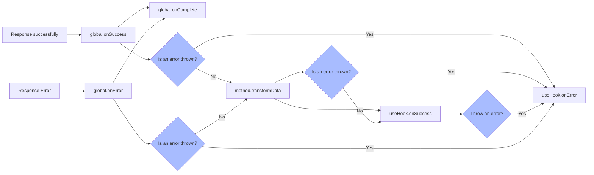

import Tabs from '@theme/Tabs';
import TabItem from '@theme/TabItem';

After the request is completed, the response data will be processed through multiple processes before the final data is obtained at the location where the request was sent. The process is as follows:



When no error is thrown, the next node receives the return value of the previous node.

## Transform response data

In [method detailed explanation](/v2/tutorial/getting-started/method), we have already learned about `transformData`, which is also very useful when used in useHook. It allows useHook's data to receive the transformed data without transform again.

```javascript
const todoListGetter = alovaInstance.Get('/todo/list', {
   // The function accepts raw data and response header objects, and requires the transformed data to be returned, which will be assigned to the data state.
   // Note: rawData is the data filtered by the global response interceptor (if it is set). For the configuration of the response interceptor, please refer to the [Setting the Global Response Interceptor] chapter.
   transformData(rawData, headers) {
     return rawData.list.map(item => ({
       ...item,
       statusText: item.done ? 'Completed' : 'In progress'
     });
   }
});
```

```javascript
const { data } = useRequest(todoListGetter);
const { data } = useWatcher(() => todoListGetter, [userInfo]);
```

The data value will receive the transformed data format.

```typescript
type data = {
  // ...
  statusText: 'Completed' | 'In progress';
}[];
```

:::warning note

When used in usehooks, throwing an error in `transformData` will also trigger `onError`;

:::

## Bind response callback

If you need to set a request callback, you can also receive the callback setting function in the return parameter of useHooks, as follows:

```javascript
const {
  // ...

  //Successful callback binding
  onSuccess,

  // Failure callback binding
  onError,

  // Complete the callback binding, the callback will be called on success or failure
  onComplete
} = useRequest(todoListGetter); // Also applicable to useWatcher
onSuccess(event => {
  console.log('The request was successful, the response data is:', event.data);
  console.log('The method instance of this request is:', event.method);
  console.log('Whether the response data comes from the cache:', event.fromCache);
});
onError(event => {
  console.log('The request failed, the error message is:', event.error);
  console.log('The method instance of this request is:', event.method);
});
onComplete(event => {
  // event.status is success when it succeeds and error when it fails.
  console.log('The request is completed, the status is: ', event.status);
  console.log('The method instance of this request is:', event.method);
  console.log('Whether the response data comes from the cache:', event.fromCache);
  if (event.data) {
    console.log('Request data:', event.data);
  } else if (event.error) {
    console.log('Error message:', event.error);
  }
});
```

:::note Hint

Throwing an error in `onSuccess` will trigger `onError`.

:::
