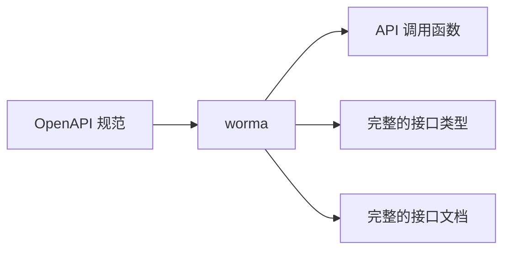
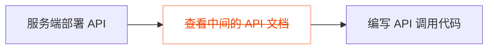

## alova 是什么？

alova（读作`/əˈləʊva/`）是 JavaScript 的**请求策略层**。分页、表单、上传、重试这些逻辑你已经手写过无数遍，现在只需直接使用 20+ 个开箱即用的请求策略，最多可减少 70% 的请求代码。它完美兼容你最喜欢的 HTTP client 和 UI 框架，让你在客户端和服务端都能专心写业务逻辑。

你不必扔掉已经用惯的 axios 或 fetch。alova 直接架在你现有的请求库之上，接管那些你每次都要重写一遍的请求逻辑。同一套 API 横跨 React、Vue、Svelte、Solid、小程序与服务端，一次学会，处处都能用。

你可以在 [为什么创造 alova](/about/faqs) 中了解背景故事，我们也提供了一份详细的 [对比与其他请求库](/about/comparison) 了解 alova 的差异。

## 特性

与其罗列 alova“是什么”，不如看它“替你解决什么”——每个场景都对应到具体收益：

| 你已经写腻的场景 | alova 给你的 |
| --- | --- |
| 反复手写分页、表单、上传、SSE 状态 | `usePagination` / `useForm` / `useUploader` / `useSSE`——最多减少 70% 样板 |
| 服务端限流与重试（含分布式） | `alova/server`——React Query / SWR 完全不覆盖的能力 |
| 每个框架都要重写一遍相同逻辑 | 同一套 API 横跨 React / Vue / Svelte / Solid / 小程序 |
| 手动维护缓存失效 | 多级缓存（L1/L2）+ 基于 `hitSource` 的声明式自动失效 |
| 在文档与编辑器之间复制粘贴 API 信息 | [worma](https://worma.js.org)——接口提示与文档直接出现在编辑器里 |

当然还有：简单易用（[观看 5 分钟视频](/video-tutorial)）、完美兼容你最喜欢的技术栈、请求共享、响应缓存以及端到端的类型安全。

alova 兼容以下技术栈，灰色部分将在未来逐渐支持。


## 什么时候该用 alova？

alova 会坦诚地告诉你它在哪里出彩，以及在哪里更简单的工具就已足够：

| 你的场景 | 建议 |
| --- | --- |
| 简单 CRUD + 缓存 | React Query / SWR 就够了 |
| 复杂中后台 / 表单 / 分页 / 上传 | ✅ alova 明显领先一档 |
| 跨端（Web + 小程序 / uni-app / Taro） | ✅ 同一套 API 全通吃 |
| 服务端请求治理（限流 / 重试 / 分布式） | ✅ alova 几乎是唯一选择 |
| OpenAPI → 类型安全代码 + AI 友好的接口知识 | ✅ 搭配 [worma](https://worma.js.org)（对 alova 开箱即用） |

## worma：写一份接口规范，剩下的交给它

你一定经历过：后端交付了接口，你却要在中间文档和编辑器之间反复横跳，复制粘贴参数、手写调用代码。worma 要解决的正是这件事。

它读取你的一份 OpenAPI 规范，一次性帮你产出：类型安全的调用代码、每个接口的 TypeScript 类型、完整的接口文档，以及**能让 AI 编码助手直接读懂的接口知识**——你的 Agent 不再靠猜，而是能直接找到需要的接口。



过去，你拿到接口后要打开中间文档、查参数、再回到编辑器手写代码；现在 worma 帮你消掉了中间的文档环节。在编辑器里你就能直接找到需要的接口、查看它的完整文档、照着参数表快速填参，前后端协作像穿过一条虫洞。



如果你用的是 alova，这件事更简单：worma 对它开箱即用。装上之后，你就能在编辑器里直接拿到接口提示、悬浮查看文档、一键插入调用代码，不用再做任何额外接入。

> 前往 [worma.js.org](https://worma.js.org) 了解更多，或在 [集成 OpenAPI](/tutorial/getting-started/openapi-integration) 指南中查看如何接入。

## 在线体验

这里为你准备了丰富的示例，帮助你快速体验 alova 的各种功能。


## 请求策略实战

下面挑几个最常用的请求策略，让你感受一下实际写法——点开任意一项即可。

### 客户端请求策略

以下是部分客户端请求策略的介绍和示例，请选择你感兴趣的展开查看。

### 监听请求策略

随数据变化自动重新请求，例如模糊搜索、tab 栏切换等。

```javascript
const {
  // 响应式状态
  loading,
  error,
  data,

  // 事件
  onSuccess,
  onError,
  onComplete,

  // 操作函数
  send,
  update

  // ...
} = useWatcher(
  () =>
    alova.Get('/api/user', {
      params: {
        type: activeTab
      }
    }),
  [activeTab]
);
```

前往[监听请求策略](/tutorial/client/strategy/use-watcher) 查看详情。

### 分页请求策略

完整的分页场景：翻页、条件查询、下一页预拉取、插入/替换/移除数据项、刷新和重置。

```javascript
const {
  // 响应式状态
  loading,
  error,
  data,
  page,
  pageSize,
  total,

  // 事件
  onSuccess,
  onFetchSuccess,
  onError,
  onFetchError,

  // 操作函数
  refresh,
  insert,
  replace,
  remove,
  reload,
  send,
  abort,
  update

  // ...
} = usePagination(
  (page, size) =>
    alova.Get('/api/user/list', {
      params: { page, size }
    }),
  {
    preloadNextPage: true,
    watchingStates: [username, sex],
    debounce: 500
  }
);
```

前往[分页请求策略](/tutorial/client/strategy/use-pagination) 查看详情。

### Token身份认证策略

全局拦截器，统一维护登录、登出、token 附带与无感刷新等认证逻辑。

```javascript
const { onAuthRequired, onResponseRefreshToken } = createServerTokenAuthentication({
  refreshTokenOnError: {
    isExpired: res => res.status === 401,
    handler: async () => {
      const { token, refresh_token } = await refreshToken();
      localStorage.setItem('token', token);
      localStorage.setItem('refresh_token', refresh_token);
    }
  }
});
const alovaInstance = createAlova({
  beforeRequest: onAuthRequired(),
  responded: onResponseRefreshToken()
});
```

前往[Token 认证拦截器](/tutorial/client/strategy/token-authentication) 查看详情。

### 表单提交策略

快速实现表单草稿、多步骤表单，并内置表单重置等常用功能。

```javascript
const {
  // 响应式状态
  loading: submiting,
  error,
  form,

  // 事件
  onSuccess,
  onError,
  onComplete,

  // 操作函数
  send: submit,
  updateForm,
  abort

  // ...
} = useForm(formData => alova.Post('/user/profile', formData), {
  initialForm: {
    name: '',
    age: '',
    avatar: null
  },
  resetAfterSubmiting: true,
  store: true
});
```

前往[表单提交策略](/tutorial/client/strategy/use-form) 查看详情。

### 数据拉取策略

提前拉取数据，用户无需等待加载，提升体验。

```javascript
const {
  // 响应式状态
  loading,
  error,

  // 事件
  onSuccess,
  onError,
  onComplete,

  // 操作函数
  fetch,
  update,
  abort

  // ...
} = useFetcher();

const handleItemClick = itemId => {
  fetch(
    alova.Get('/api/user/detail', {
      params: {
        id: itemId
      }
    })
  );
};
```

前往[数据预拉取](/tutorial/client/strategy/use-fetcher) 查看详情。

### 无感数据交互策略

像操作本地数据一样即时响应，提交与展示均无需等待，大幅提升流畅度。

```javascript
const {
  // 响应式状态
  data,
  loading,
  error,

  // 事件
  onSuccess,
  onError,
  onComplete,
  onBeforePushQueue,
  onPushedQueue,
  onFallback,

  // 操作函数
  send: submit,
  abort,
  update

  // ...
} = useSQRequest(() => alova.Get('/api/todo/add'), {
  behavior: 'silent',
  queue: 'queue-demo',
  silentDefaultResponse: () => {
    return {
      id: '--'
    };
  }
});
```

前往[无感数据交互](/tutorial/client/strategy/seamless-data-interaction) 查看详情。

### 跨组件请求触发中间件

打破组件层级限制，在任意组件中触发任意请求的操作函数。

**ComponentA:**

```javascript
useRequest(alova.Get('/api/todo/list'), {
  // ...
  middleware: actionDelegationMiddleware('action:todoList')
});
```


---

**ComponentB:**

```javascript
accessAction('action:todoList', delegatedActions => {
  delegatedActions.send();
  delegatedActions.abort();
});
```


前往[跨组件触发请求](/tutorial/client/strategy/action-delegation-middleware) 查看详情。

### 验证码策略

快速实现验证码发送。

```javascript
const mobile = ref('');
const {
  // 响应式状态
  loading: sending,
  countdown,
  error,

  // 事件
  onSuccess,
  onError,
  onComplete,

  // 操作函数
  send,
  abort,
  update

  // ...
} = useCaptcha(
  () =>
    alova.Post('/api/captcha', {
      mobile: mobile
    }),
  {
    initialCountdown: 60
  }
);
```

前往[验证码策略](/tutorial/client/strategy/use-captcha) 查看详情。

请前往 [请求策略列表](/tutorial/client/strategy) 查看全部客户端请求策略。

### 服务端请求策略

在服务端（nodejs/deno/bun）中，alova 同样提供了服务端请求策略，称为 **server hooks**，均支持集群模式。

以下是部分server hooks的介绍和示例，请选择你感兴趣的展开查看。

### 多进程原子化请求

集群模式下请求时，保证同一时间只有一个进程发起请求。

```javascript
const tokenRes = await atomize(alova.Get('/api/access_token'));
```

前往[原子化请求](/tutorial/server/strategy/atomize) 查看详情。

### 请求重试策略

请求失败时重新发起请求。

```javascript
const response = await retry(alova.Get('/api/user'), {
  retry: 5
});
```

前往[请求重试策略](/tutorial/server/strategy/retry) 查看详情。

### 请求速率限制策略

限制在一定时间的请求次数，支持集群模式。

```javascript
const limit = createRateLimiter({
  points: 4,
  duration: 60 * 1000
});
const orderRes = await limit(alova.Get('/api/order'));
```

前往[请求速率限制策略](/tutorial/server/strategy/rate-limit) 查看详情。

## 用 AI Agent 写 alova（Agent Skills）

用 AI 编码助手开发？安装 alova 的 [Agent Skills](/tutorial/getting-started/agent-skills)，让 Agent 按官方最佳实践帮你写代码。

## 构建 Client-Server 交互层

通过 alova 的各种特性，你还可以为你的项目构建 Client-Server 交互层（CS 交互层），CS 交互层将会以合并相同请求的方式分发响应数据到各个组件中，此外，CS 交互层还管理响应数据和 useHooks 所创建的响应式状态，你可以在任意的 UI 组件中访问和修改 CS 交互层的数据，以及刷新 CS 交互层数据。

> 如果你想要构建 CS 交互层，请参考[构建 Client-Server 交互层](/tutorial/project/best-practice/csil)

## 迁移指南

- [从 v2 迁移到 v3](/tutorial/project/migration/v2-to-v3)
- [从 axios 低成本迁移到 alova 的指南](/tutorial/project/migration/from-axios)

## 加入 alova 社区


,
title: 'Discord',
desc: '社区的 GPT 机器人为你解答',
link: 'https://discord.gg/S47QGJgkVb',
target: '__blank'
},
{
Image: ,
title: '微信',
desc: '在群聊交流，更快获得回应',
link: wechatQrcode,
target: '__blank'
},
{
Image: ,
title: 'X',
desc: '关注我们，持续获得最新动态',
link: 'https://x.com/alovajs',
target: '__blank'
}
]}></NavCard>


## 欢迎参与贡献

在参与贡献前，请务必详细阅读 [贡献指南](/contributing/overview)，以保证你的有效贡献。

## 让我们开始吧

接下来，我们将从最简单的请求开始，再到请求策略的讲解，了解 alova 如何简化你的工作，再深入到进阶指南，以及在实际项目中总结的最佳实践。

让我们开始学习 alova 吧！

,
title: '5 分钟快速入门视频',
desc: '在 5 分钟内学会使用 alova',
link: '/video-tutorial'
},
{
Image: ,
title: '快速开始文档',
desc: '更详细地学习 alova，自由掌控学习时间',
link: '/tutorial/getting-started/quick-start'
}
]}></NavCard>
